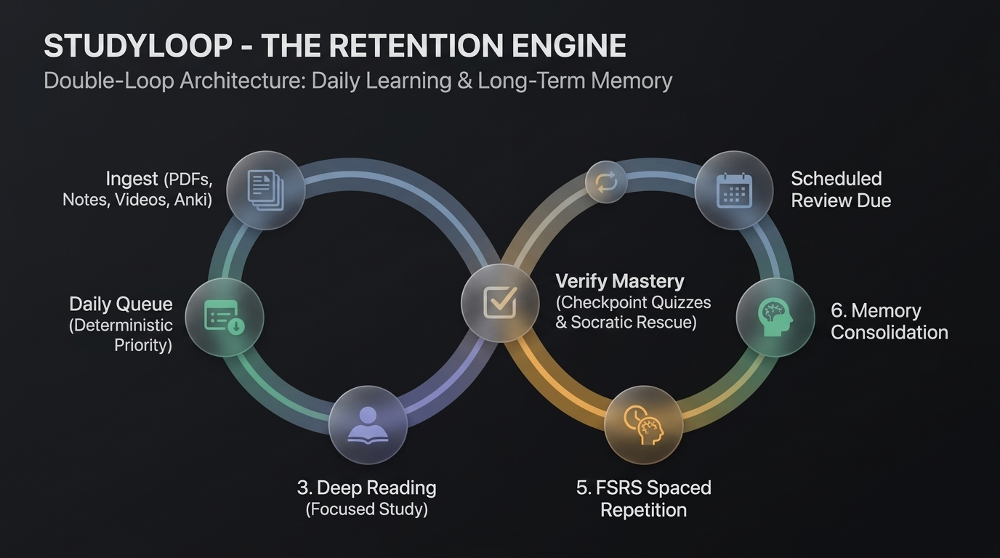

# StudyLoop

## **You shouldn't look at your notes 6 months from now and ask "What was that?"**

Most AI study tools give you the illusion of learning. You upload a 300-page textbook or lecture slides, chat with an AI sandbox, generate a neat summary, and feel productive. But passive consumption doesn't build retention. Six months later, when exams hit or you need the knowledge in production, it's completely gone.

**StudyLoop is a local-first active learning and long-term retention engine.**  
Unlike passive document viewers and conversational chatbots built solely for reference, StudyLoop turns your study materials into a deterministic daily queue powered by cognitive science: forced active recall, 2-strike Socratic intervention, long-form written assessments, and FSRS spaced repetition.

---

## The Knowledge Intake & Retention Loop

StudyLoop transforms passive source material (textbooks, PDFs, community Anki decks, video lectures, markdown notes) into a structured daily mastery loop:

<p align="center">
  
</p>

> **The Core Difference:** Document chatbots are built for *referencing* materials. StudyLoop is built for *encoding knowledge into your long-term memory*.

---

## See StudyLoop in Action (2-Minute Tour)

https://github.com/user-attachments/assets/f6a4e039-4ac8-4096-91a1-471ca3e43237

---

## Why StudyLoop?

| Dimension | Document Chatbots / Sandboxes | Traditional Flashcard Apps | **StudyLoop** |
| :--- | :--- | :--- | :--- |
| **Primary Goal** | Passive Q&A / Summarization | Rote card memorization | **End-to-End Deep Comprehension & Long-Term Retention** |
| **Supported Sources** | PDFs / Docs | Manual card entry | **PDFs (OCR), Markdown (`.md`), YouTube Lectures, Anki Decks (`.apkg`/`.colpkg`)** |
| **Learning Workflow** | Open-ended conversational chat | Isolated flashcard reviews | **Deterministic Loop (Read ➔ Quiz ➔ Socratic Rescue ➔ Examiner ➔ FSRS)** |
| **Synthesis & Judgment** | Unguided freeform chat | None | **Examiner Mode (Open-ended written synthesis graded with rubrics)** |
| **Failure Intervention** | Gives you answers immediately | Manual card reset | **2-Strike Socratic Rescue (Walks you through conceptual flaws)** |
| **Spaced Repetition** | None | Legacy SM-2 (default) / manual | **Native FSRS-4 (Free Spaced Repetition Scheduler)** |
| **Data Sovereignty** | Proprietary cloud lock-in | Local files / sync plugins | **Local-First (SQLite + Local ONNX Vector Index + OS Keyring)** |

---

## Core Pillars & Capabilities

### 1. Multi-Source Knowledge Ingestion & Anki Import
- **Textbooks & PDFs:** Standard layout extraction plus Deep Structured OCR (`deep_pdf`) with heading and structure preservation.
- **Anki Decks (`.apkg` / `.colpkg`):** Import existing community decks with Cloze deletions (`{{c1::...}}`), image/audio media extraction, and direct seeding into the FSRS schedule without false reading tasks.
- **Markdown Notes (`.md`):** Ingest raw markdown documentation, Obsidian notes, or course notes with table and code-block integrity.
- **YouTube Video Lectures:** Extract timestamped chapters, synchronized transcripts, and offline cached playback via `yt-dlp`.

### 2. Dual-Layer Assessment: Recall & Deep Synthesis
- **Atomic Checkpoint Quizzes:** Immediate AI-generated multiple-choice questions after reading sessions to verify initial comprehension.
- **Examiner Mode (Written Assessment):** Designed for complex technical subjects (e.g. system design trade-offs in *DDIA*) and analytical exams (e.g. *UPSC Mains*). Generates open-ended scenario and essay questions across chapter page ranges and grades long-form student answers with detailed rubrics.
- **2-Strike Socratic Rescue:** If you fail a checkpoint quiz twice, the queue blocks progression and launches an interactive Socratic dialogue to isolate and repair the underlying conceptual flaw.

### 3. Algorithmic Spaced Repetition (FSRS-4 Engine)
- **Modern Spaced Repetition:** Powered by the state-of-the-art **FSRS-4** algorithm (Free Spaced Repetition Scheduler), outperforming legacy SM-2 with fewer reviews and higher retention.
- **Automatic & Manual Decks:** Generate targeted flashcard decks automatically from ingested reading blocks, or import your own custom decks.
- **In-Card AI Deep-Dives:** Instant Socratic explanations for any card concept you struggle with during review.

### 4. Deterministic Study Queue
- **Zero Decision Fatigue:** The SQLite-backed `study_queue` serves your next highest-priority task automatically.
- **Multi-Notebook Priorities:** Balance multiple subjects with configurable notebook weights (1–10).
- **Starvation Protection:** Ensures new reading tasks never get indefinitely buried beneath heavy review loads.

---

## Architecture, Privacy & AI Flexibility

StudyLoop is built on a **Local-First, BYOK (Bring Your Own Key)** architecture:

* **Your Data Stays on Your Machine:** All notes, PDFs, vector embeddings (`sqlite-vec`), FSRS flashcard schedules, and reading history live in local SQLite (`Studyloop.db`).
* **Local Embeddings:** Semantic vector search runs 100% locally via ONNX Runtime INT8 models on your CPU/GPU.
* **Flexible AI Inference:** Connect any OpenAI-compatible provider (Groq, Google AI Studio, OpenRouter, OpenAI) or run completely local with **Ollama** or **LM Studio**. API keys are stored securely in your OS native keyring (Windows Credential Manager / macOS Keychain / Linux Secret Service).
* **Minimal Anonymous Heartbeat:** Sends a lightweight launch ping (`installation_id`, `platform`, `app_version`, `architecture`) on startup for OS support metrics. Detailed study analytics are strictly opt-in (Tier 2). See [PRIVACY.md](PRIVACY.md).

---

## Offline vs Online Behavior

| Feature | Offline Availability | Notes |
| :--- | :--- | :--- |
| **Reading & Notes** | Available Offline | Reads local PDFs, Markdown files, and cached YouTube lecture transcripts |
| **FSRS Flashcard Reviews** | Available Offline | Full FSRS algorithm, deck review, and interval scheduling run locally |
| **Semantic Vector Search** | Available Offline | Local ONNX INT8 embedding inference via `sqlite-vec` |
| **Deterministic Queue** | Available Offline | Queue transitions, pacing, and notebook management run in SQLite |
| **AI Quizzes & Examiner** | Requires Endpoint | Connects to configured cloud LLM API or local Ollama instance |
| **Socratic Rescue Dialogues** | Requires Endpoint | Multi-turn reasoning via configured LLM endpoint |

---

## Installation & Quick Start

### Option A: Pre-built Windows Installer (Recommended)

1. Download the latest `StudyLoop-Setup.exe` from [Releases](https://github.com/Vishnuj-n/studyloop/releases).
2. Run the installer and launch StudyLoop.
3. Add your preferred AI endpoint in **Settings** (or connect a local Ollama instance).

### Option B: Build from Source

#### Prerequisites
- Go 1.26+
- Node.js 20+
- Wails CLI (`go install github.com/wailsapp/wails/v2/cmd/wails@latest`)

#### Setup & Asset Download
```bash
# macOS / Linux
./scripts/sync-deps.sh

# Windows (pure Go build, no CGO required)
./scripts/windows-sync-deps.ps1
```

#### Run Development Mode
```bash
wails dev -tags sqlite_extension
```

#### Production Build
```bash
wails build -tags sqlite_extension
```

---

## Documentation & Contributing

- Contributing Guide: [CONTRIBUTING.md](CONTRIBUTING.md)
- Developer Onboarding & Handover: [doc/DEVELOPER_ONBOARDING.md](doc/DEVELOPER_ONBOARDING.md)
- System design & Invariants: [doc/ARCHITECTURE.md](doc/ARCHITECTURE.md)
- App flow and user interactions: [doc/APP_FLOW.md](doc/APP_FLOW.md)
- Database schema: [doc/SCHEMA.md](doc/SCHEMA.md)
- Source structure: [doc/PROJECT_STRUCTURE.md](doc/PROJECT_STRUCTURE.md)
- API contracts: [doc/DATA_API.md](doc/DATA_API.md)
- Module responsibilities: [doc/AGENT_MAP.md](doc/AGENT_MAP.md)
- Retrieval pipeline & RAG: [doc/RAG.md](doc/RAG.md)
- Privacy Policy & Telemetry Details: [PRIVACY.md](PRIVACY.md)

---

## Open-Source Credits & Acknowledgments

- **yt-dlp**: Video metadata and transcript extraction powered by [yt-dlp](https://github.com/yt-dlp/yt-dlp).
- **sqlite-vec**: Fast local vector search by [sqlite-vec](https://github.com/asg017/sqlite-vec).
- **FSRS**: Modern spaced repetition scheduling via [go-fsrs](https://github.com/open-spaced-repetition/go-fsrs).
- **ONNX Runtime**: Local INT8 vector embedding inference via [onnxruntime](https://github.com/microsoft/onnxruntime).
