<!-- AUTO-GENERATED FILE: DO NOT EDIT DIRECTLY -->
<!-- Generated by: python scripts/analyze_api_dependency_graph.py --output doc/api_dependency_report.md -->
<!-- Any manual changes will be overwritten. To update, re-run the generator script. -->

# API & Function Dependency Report
This report lists unused API endpoints, dead Go backend code, and reachability stats.

## 1. Frontend API (`appApi.js`) Usages
Lists functions defined in `appApi.js` and their usage count in the frontend.
| JS Function | Calls Wails Method | Usage Count | Status |
| --- | --- | --- | --- |
| `activateTask` | `ActivateTask` | 4 | Active |
| `aiCleanupNotebookSyllabus` | `AICleanupNotebookSyllabus` | 1 | Active |
| `askReaderAI` | `AskReaderAI` | 1 | Active |
| `askSocratic` | `AskSocratic` | 1 | Active |
| `assignNotebookToProfile` | `AssignNotebookToProfile` | 1 | Active |
| `buyStreakFreeze` | `BuyStreakFreeze` | 1 | Active |
| `cancelExtensionSetup` | `CancelExtensionSetup` | 1 | Active |
| `checkExtensionReadiness` | `CheckExtensionReadiness` | 1 | Active |
| `checkForUpdates` | `CheckForUpdates` | 2 | Active |
| `claimLootBox` | `ClaimLootBox` | 1 | Active |
| `clearSession` | `ClearSession` | 1 | Active |
| `completeMilestoneExam` | `CompleteMilestoneExam` | 1 | Active |
| `completeReading` | `CompleteReading` | 1 | Active |
| `completeReviewSession` | `CompleteReviewSession` | 1 | Active |
| `completeSocraticRescue` | `CompleteSocraticRescue` | 2 | Active |
| `confirmNotebookSyllabus` | `ConfirmNotebookSyllabus` | 1 | Active |
| `createProfile` | `CreateProfile` | 2 | Active |
| `deleteLLMAPIKey` | `DeleteLLMAPIKey` | 1 | Active |
| `deleteNotebook` | `DeleteNotebook` | 1 | Active |
| `deleteProfile` | `DeleteProfile` | 1 | Active |
| `draftNotebookSyllabus` | `DraftNotebookSyllabus` | 1 | Active |
| `generateComprehensiveExam` | `GenerateComprehensiveExam` | 1 | Active |
| `generateFlashcardsForQuizTask` | `GenerateFlashcardsForQuizTask` | 1 | Active |
| `generateManualFlashcards` | `GenerateManualFlashcards` | 1 | Active |
| `generateQuizForPageRange` | `GenerateQuizForPageRange` | 1 | Active |
| `getAppEnv` | `GetAppEnv` | 1 | Active |
| `getAvailableTopics` | `GetAvailableTopics` | 1 | Active |
| `getCloudConfig` | `GetCloudConfig` | 1 | Active |
| `getDashboardOverview` | `GetDashboardOverview` | 1 | Active |
| `getExtensionConfig` | `GetExtensionConfig` | 1 | Active |
| `getFlashcardDueTimeline` | `GetFlashcardDueTimeline` | 1 | Active |
| `getGamificationState` | `GetGamificationState` | 2 | Active |
| `getLLMProviderPreset` | `GetLLMProviderPreset` | 2 | Active |
| `getLLMSettings` | `GetLLMSettings` | 1 | Active |
| `getNotebookTopicTree` | `GetNotebookTopicTree` | 2 | Active |
| `getNotebooks` | `GetNotebooks` | 5 | Active |
| `getProfileDailyPace` | `GetProfileDailyPace` | 1 | Active |
| `getProfiles` | `GetProfiles` | 1 | Active |
| `getReaderTopicBundle` | `GetReaderTopicBundle` | 1 | Active |
| `getReviewSession` | `GetReviewSession` | 1 | Active |
| `getTask` | `GetTask` | 1 | Active |
| `getTaskContext` | `GetTaskContext` | 2 | Active |
| `getTodayPlan` | `GetTodayPlan` | 1 | Active |
| `getTopicSectionsContent` | `GetTopicSectionsContent` | 3 | Active |
| `getUserSettings` | `GetUserSettings` | 9 | Active |
| `importAnkiDeck` | `ImportAnkiDeck` | 1 | Active |
| `initializeRAG` | `InitializeRAG` | 2 | Active |
| `initializeReadingSession` | `InitializeReadingSession` | 1 | Active |
| `isOnboarded` | `IsOnboarded` | 1 | Active |
| `listExtensions` | `ListExtensions` | 2 | Active |
| `logFrontendEvent` | `LogFrontendEvent` | 4 | Active |
| `loginStudent` | `LoginStudent` | 1 | Active |
| `logoutStudent` | `LogoutStudent` | 1 | Active |
| `openRepoURL` | `OpenRepoURL` | 2 | Active |
| `openURLInBrowser` | `OpenURLInBrowser` | 5 | Active |
| `recordCardReview` | `RecordCardReview` | 1 | Active |
| `restoreSession` | `RestoreSession` | 1 | Active |
| `retryFlashcardGeneration` | `RetryFlashcardGeneration` | 2 | Active |
| `runExtension` | `RunExtension` | 1 | Active |
| `saveExtensionConfig` | `SaveExtensionConfig` | 1 | Active |
| `saveLLMAPIKey` | `SaveLLMAPIKey` | 2 | Active |
| `scoreShortAnswer` | `ScoreShortAnswer` | 1 | Active |
| `selectAndUploadDeepStructuredPDF` | `SelectAndUploadDeepStructuredPDF` | 1 | Active |
| `selectAnkiFile` | `SelectAnkiFile` | 1 | Active |
| `setupExtension` | `SetupExtension` | 1 | Active |
| `signUpStudent` | `SignUpStudent` | 1 | Active |
| `simplifyReadingContent` | `SimplifyReadingContent` | 1 | Active |
| `startBrowserAuth` | `StartBrowserAuth` | 1 | Active |
| `startTopicAudioOverview` | `StartTopicAudioOverview` | 1 | Active |
| `stopTopicAudioOverview` | `StopTopicAudioOverview` | 1 | Active |
| `submitQuizAttempt` | `SubmitQuizAttempt` | 1 | Active |
| `suspendFlashcard` | `SuspendFlashcard` | 1 | Active |
| `testLLMConnection` | `TestLLMConnection` | 1 | Active |
| `trackAnalyticsEvent` | `TrackAnalyticsEvent` | 2 | Active |
| `triggerCloudSync` | `TriggerCloudSync` | 2 | Active |
| `updateLLMSettings` | `UpdateLLMSettings` | 2 | Active |
| `updateNotebookPriority` | `UpdateNotebookPriority` | 1 | Active |
| `updateNotebookStudyStatus` | `UpdateNotebookStudyStatus` | 1 | Active |
| `updateNotebookTitle` | `UpdateNotebookTitle` | 1 | Active |
| `updateProfile` | `UpdateProfile` | 1 | Active |
| `updateUserSettings` | `UpdateUserSettings` | 4 | Active |
| `upgradeNotebookToDeepPDF` | `UpgradeNotebookToDeepPDF` | 1 | Active |
| `uploadNotebook` | `UploadNotebook` | 1 | Active |
| `uploadYouTubeNotebook` | `UploadYouTubeNotebook` | 1 | Active |

<!-- DO NOT EDIT: Auto-generated from Go App struct inspection -->
## 2. Go Wails `App` API Endpoints
Lists exported API endpoints defined on `App` in the backend and whether they are invoked by `appApi.js` (excluding standard Wails lifecycle methods).
| Wails Method | Reachable from Frontend or main.go |
| --- | --- |
| `AICleanupNotebookSyllabus` | Yes |
| `ActivateTask` | Yes |
| `AskReaderAI` | Yes |
| `AskSocratic` | Yes |
| `AssignNotebookToProfile` | Yes |
| `BuyStreakFreeze` | Yes |
| `CancelExtensionSetup` | Yes |
| `CheckExtensionReadiness` | Yes |
| `CheckForUpdates` | Yes |
| `ClaimLootBox` | Yes |
| `ClearSession` | Yes |
| `CompleteMilestoneExam` | Yes |
| `CompleteReading` | Yes |
| `CompleteReviewSession` | Yes |
| `CompleteSocraticRescue` | Yes |
| `ConfirmNotebookSyllabus` | Yes |
| `CreateProfile` | Yes |
| `DeleteLLMAPIKey` | Yes |
| `DeleteNotebook` | Yes |
| `DeleteProfile` | Yes |
| `DraftNotebookSyllabus` | Yes |
| `GenerateComprehensiveExam` | Yes |
| `GenerateFlashcardsForQuizTask` | Yes |
| `GenerateManualFlashcards` | Yes |
| `GenerateQuizForPageRange` | Yes |
| `GetAppEnv` | Yes |
| `GetAvailableTopics` | Yes |
| `GetCloudConfig` | Yes |
| `GetCtx` | Yes |
| `GetDashboardOverview` | Yes |
| `GetExtensionConfig` | Yes |
| `GetFlashcardDueTimeline` | Yes |
| `GetGamificationState` | Yes |
| `GetLLMProviderPreset` | Yes |
| `GetLLMSettings` | Yes |
| `GetNotebookTopicTree` | Yes |
| `GetNotebookUploadDir` | Yes |
| `GetNotebooks` | Yes |
| `GetProfileDailyPace` | Yes |
| `GetProfiles` | Yes |
| `GetReaderTopicBundle` | Yes |
| `GetReviewSession` | Yes |
| `GetTask` | Yes |
| `GetTaskContext` | Yes |
| `GetTodayPlan` | Yes |
| `GetTopicSectionsContent` | Yes |
| `GetUserSession` | No (Unused API) |
| `GetUserSettings` | Yes |
| `ImportAnkiDeck` | Yes |
| `InitializeRAG` | Yes |
| `InitializeReadingSession` | Yes |
| `IsOnboarded` | Yes |
| `IsProUser` | No (Unused API) |
| `ListExtensions` | Yes |
| `LogFrontendEvent` | Yes |
| `LoginStudent` | Yes |
| `LogoutStudent` | Yes |
| `OpenRepoURL` | Yes |
| `OpenURLInBrowser` | Yes |
| `PomodoroCheckResumeSession` | No (Unused API) |
| `PomodoroDeleteProfile` | No (Unused API) |
| `PomodoroGetAudioState` | No (Unused API) |
| `PomodoroGetProfileByID` | No (Unused API) |
| `PomodoroGetSettings` | No (Unused API) |
| `PomodoroGetStats` | No (Unused API) |
| `PomodoroGetTimerState` | No (Unused API) |
| `PomodoroLoadProfiles` | No (Unused API) |
| `PomodoroPauseTimer` | No (Unused API) |
| `PomodoroPickMusicFile` | No (Unused API) |
| `PomodoroPickMusicFolder` | No (Unused API) |
| `PomodoroPlayChime` | No (Unused API) |
| `PomodoroPlayLooping` | No (Unused API) |
| `PomodoroPlayShuffleFolder` | No (Unused API) |
| `PomodoroRecordSessionComplete` | No (Unused API) |
| `PomodoroResumeTimer` | No (Unused API) |
| `PomodoroSaveProfile` | No (Unused API) |
| `PomodoroSaveSettings` | No (Unused API) |
| `PomodoroSetVolume` | No (Unused API) |
| `PomodoroStartTimer` | No (Unused API) |
| `PomodoroStopAudio` | No (Unused API) |
| `PomodoroStopTimer` | No (Unused API) |
| `RecordCardReview` | Yes |
| `RestoreSession` | Yes |
| `RetryFlashcardGeneration` | Yes |
| `RunExtension` | Yes |
| `SaveExtensionConfig` | Yes |
| `SaveLLMAPIKey` | Yes |
| `ScoreShortAnswer` | Yes |
| `SelectAndUploadDeepStructuredPDF` | Yes |
| `SelectAnkiFile` | Yes |
| `SetSession` | No (Unused API) |
| `SetupExtension` | Yes |
| `SignUpStudent` | Yes |
| `SimplifyReadingContent` | Yes |
| `StartBrowserAuth` | Yes |
| `StartTopicAudioOverview` | Yes |
| `StopTopicAudioOverview` | Yes |
| `SubmitQuizAttempt` | Yes |
| `SuspendFlashcard` | Yes |
| `TestLLMConnection` | Yes |
| `TrackAnalyticsEvent` | Yes |
| `TriggerCloudSync` | Yes |
| `UpdateLLMSettings` | Yes |
| `UpdateNotebookPriority` | Yes |
| `UpdateNotebookStudyStatus` | Yes |
| `UpdateNotebookTitle` | Yes |
| `UpdateProfile` | Yes |
| `UpdateUserSettings` | Yes |
| `UpgradeNotebookToDeepPDF` | Yes |
| `UploadNotebook` | Yes |
| `UploadYouTubeNotebook` | Yes |

<!-- DO NOT EDIT: Auto-generated from AST reachability analysis -->
## 3. Go Internal Reachability Analysis
Lists internal Go functions/methods and unexported `App` helpers that are **not reachable** from any active frontend API or lifecycle entry point (excluding tests).
| Function/Method | File | Receiver | Type |
| --- | --- | --- | --- |
| `BuildTopicGroupsFromChapters` | `internal\notebook\ingestion.go:14` | None | `function` |
| `CheckReadiness` | `internal\extension\checker.go:32` | None | `function` |
| `CreateReviewSession` | `internal\db\review_session_repo.go:172` | `Repository` | `method` |
| `DefaultSettings` | `internal\pomodoro\domain\settings.go:15` | None | `function` |
| `DeleteAPIKey` | `internal\llm\keyring.go:37` | None | `function` |
| `DownloadYouTubeVideo` | `internal\notebook\youtube.go:106` | `Service` | `method` |
| `DraftSyllabusChapters` | `internal\notebook\syllabus.go:32` | `Service` | `method` |
| `ExtractFullPDFCPUBookmarkNodes` | `internal\notebook\pdfcpu.go:63` | None | `function` |
| `ExtractSyllabusChaptersFromMarkdown` | `internal\notebook\markdown_chunker.go:195` | None | `function` |
| `GetEffectiveTier` | `internal\extension\tiers.go:18` | None | `function` |
| `GetYouTubeSegmentTimestamps` | `internal\notebook\youtube.go:139` | `Service` | `method` |
| `IngestDeepPDF` | `internal\notebook\deep_pdf.go:34` | `Service` | `method` |
| `IngestDeepPDFWithProgress` | `internal\notebook\deep_pdf.go:39` | `Service` | `method` |
| `IngestYouTubeVideo` | `internal\notebook\youtube.go:32` | `Service` | `method` |
| `InstallZip` | `internal\extension\installer.go:45` | `Manager` | `method` |
| `MarkLLMKeyStored` | `internal\db\store.go:606` | `Repository` | `method` |
| `NormalizeSyllabusChapters` | `internal\notebook\syllabus.go:276` | None | `function` |
| `ParsePDFCPUBookmarkDraftFromJSON` | `internal\notebook\pdfcpu.go:75` | None | `function` |
| `PlayChime` | `internal\pomodoro\services\audio\service.go:168` | `Service` | `method` |
| `PlayLooping` | `internal\pomodoro\services\audio\service.go:60` | `Service` | `method` |
| `PlayShuffleFolder` | `internal\pomodoro\services\audio\service.go:86` | `Service` | `method` |
| `RollTaskRewards` | `internal\study\rewards.go:12` | None | `function` |
| `RunSmokeTest` | `internal\extension\checker.go:92` | None | `function` |
| `SaveAPIKey` | `internal\llm\keyring.go:21` | None | `function` |
| `SeedDemoDataForTests` | `internal\db\testhelper.go:7` | `Repository` | `method` |
| `SetChimeData` | `internal\pomodoro\services\audio\service.go:46` | `Service` | `method` |
| `SetVolume` | `internal\pomodoro\services\audio\service.go:141` | `Service` | `method` |
| `SetupExtensionEnv` | `internal\extension\checker.go:125` | None | `function` |
| `SplitMarkdownIntoChunks` | `internal\notebook\markdown_chunker.go:30` | None | `function` |
| `TransitionTask` | `internal\study\queue_transition.go:53` | `StudyService` | `method` |
| `Uninstall` | `internal\extension\installer.go:15` | `Manager` | `method` |
| `activateReadingSessionTask` | `internal/app/app.go` | `App` | `AppHelper` |
| `aggregateQueueTasks` | `internal\app\app_study.go:53` | None | `function` |
| `appendFailedQuestionsSection` | `internal\app\app_study_cards.go:142` | None | `function` |
| `awardCompletionRewards` | `internal\study\queue_transition.go:268` | `StudyService` | `method` |
| `bookmarkNodesToDraft` | `internal\notebook\pdfcpu.go:33` | None | `function` |
| `buildInputValues` | `internal\embeddings\onnx.go:337` | `OnnxEmbedder` | `method` |
| `buildPageSample` | `internal\notebook\syllabus.go:358` | None | `function` |
| `buildReviewTaskForPlan` | `internal\app\app_study.go:254` | None | `function` |
| `buildSocraticRemedialPrompt` | `internal\app\app_study_cards.go:91` | None | `function` |
| `buildTokenArrays` | `internal\embeddings\onnx.go:286` | None | `function` |
| `calculateDailyStudyMinutes` | `internal\app\app_study.go:21` | None | `function` |
| `calculateFlashcardBudgets` | `internal\app\app_study.go:40` | None | `function` |
| `chapterIndexForPage` | `internal\notebook\ingestion.go:83` | None | `function` |
| `checkAndInsertMilestoneExam` | `internal\app\app_study_cards.go:265` | None | `function` |
| `computeCurrentStreak` | `internal\app\app_study.go:115` | None | `function` |
| `computeLongestStreak` | `internal\app\app_study.go:85` | None | `function` |
| `copyPomoFile` | `internal\app\app_pomodoro.go:292` | None | `function` |
| `destroyValues` | `internal\embeddings\onnx.go:536` | None | `function` |
| `embedBatchInternal` | `internal\embeddings\onnx.go:210` | `OnnxEmbedder` | `method` |
| `embedInternal` | `internal\embeddings\onnx.go:199` | `OnnxEmbedder` | `method` |
| `emitIngestionProgress` | `internal\app\notebook_endpoints.go:1038` | None | `function` |
| `emitState` | `internal\pomodoro\services\audio\service.go:273` | `Service` | `method` |
| `envHasLLMAPIKey` | `internal\app\app_settings.go:321` | None | `function` |
| `extractBatchEmbedding` | `internal\embeddings\onnx.go:385` | None | `function` |
| `extractIONames` | `internal\embeddings\onnx.go:496` | None | `function` |
| `finalizeDeepStructuredPDFUpload` | `internal/app/app.go` | `App` | `AppHelper` |
| `finalizeNotebookUpload` | `internal/app/app.go` | `App` | `AppHelper` |
| `findPDFCPUExecutable` | `internal\notebook\pdfcpu.go:219` | None | `function` |
| `firstInt` | `internal\notebook\pdfcpu.go:281` | None | `function` |
| `firstN` | `internal\notebook\syllabus.go:398` | None | `function` |
| `firstString` | `internal\notebook\pdfcpu.go:266` | None | `function` |
| `generateLootBox` | `internal\study\rewards.go:58` | None | `function` |
| `getAppVersion` | `internal\app\app_update.go:17` | None | `function` |
| `getNotebookAndRepo` | `internal/app/app.go` | `App` | `AppHelper` |
| `getStreakState` | `internal/app/app.go` | `App` | `AppHelper` |
| `inferMaxSeqLen` | `internal\embeddings\onnx.go:524` | None | `function` |
| `insertMilestoneForAttempts` | `internal\app\app_study_cards.go:284` | None | `function` |
| `isTableRow` | `internal\notebook\markdown_chunker.go:190` | None | `function` |
| `linearToLog` | `internal\pomodoro\services\audio\service.go:266` | None | `function` |
| `mapTaskError` | `internal\app\app_study.go:138` | None | `function` |
| `maxPage` | `internal\notebook\syllabus.go:390` | None | `function` |
| `normalizeL2` | `internal\embeddings\onnx.go:477` | None | `function` |
| `normalizeLLMTierForApp` | `internal\app\app_settings.go:311` | None | `function` |
| `parseBookmarkNode` | `internal\notebook\pdfcpu.go:23` | None | `function` |
| `parseMarkdownBlocks` | `internal\notebook\markdown_chunker.go:96` | None | `function` |
| `parseSyllabusDraft` | `internal\notebook\syllabus.go:257` | None | `function` |
| `persistSyllabusDraft` | `internal\app\notebook_endpoints.go:519` | None | `function` |
| `pickInputSource` | `internal\embeddings\onnx.go:504` | None | `function` |
| `playChimeAsync` | `internal\pomodoro\services\audio\service.go:172` | `Service` | `method` |
| `playFile` | `internal\pomodoro\services\audio\service.go:210` | `Service` | `method` |
| `queueTaskToScheduledTask` | `internal\app\app_study.go:285` | None | `function` |
| `reconcileConfirmedNotebookTask` | `internal/app/app.go` | `App` | `AppHelper` |
| `reloadLLMProviders` | `internal/app/app.go` | `App` | `AppHelper` |
| `requireRepo` | `internal\app\app_study.go:156` | None | `function` |
| `resolveExplicitActiveProfileID` | `internal/app/app.go` | `App` | `AppHelper` |
| `resolveRetryTopicAndBounds` | `internal\app\app_study_cards.go:506` | None | `function` |
| `resolveRuntimeLibraryPath` | `internal\embeddings\onnx.go:544` | None | `function` |
| `runDeepPDFExtraction` | `internal/app/app.go` | `App` | `AppHelper` |
| `runPDFCPUBookmarksExport` | `internal\notebook\pdfcpu.go:117` | None | `function` |
| `sameLLMSettingsForUI` | `internal\app\app_settings.go:335` | None | `function` |
| `scanMP3s` | `internal\pomodoro\services\audio\service.go:282` | None | `function` |
| `shuffleStrings` | `internal\pomodoro\services\audio\service.go:296` | None | `function` |
| `tensorFromInputData` | `internal\embeddings\onnx.go:362` | None | `function` |
| `validatePDFCPUInputFilePath` | `internal\notebook\pdfcpu.go:179` | None | `function` |
| `walkBookmarkNode` | `internal\notebook\pdfcpu.go:44` | None | `function` |

## 4. Mermaid Flowchart (Active Core API)

```mermaid
flowchart TD
    subgraph Frontend
        F_activateTask[activateTask]
        F_aiCleanupNotebookSyllabus[aiCleanupNotebookSyllabus]
        F_askReaderAI[askReaderAI]
        F_askSocratic[askSocratic]
        F_assignNotebookToProfile[assignNotebookToProfile]
        F_buyStreakFreeze[buyStreakFreeze]
        F_cancelExtensionSetup[cancelExtensionSetup]
        F_checkExtensionReadiness[checkExtensionReadiness]
        F_checkForUpdates[checkForUpdates]
        F_claimLootBox[claimLootBox]
        F_clearSession[clearSession]
        F_completeMilestoneExam[completeMilestoneExam]
        F_completeReading[completeReading]
        F_completeReviewSession[completeReviewSession]
        F_completeSocraticRescue[completeSocraticRescue]
    end
    subgraph Go_Wails_Bridge
        G_AICleanupNotebookSyllabus[App.AICleanupNotebookSyllabus]
        G_ActivateTask[App.ActivateTask]
        G_AskReaderAI[App.AskReaderAI]
        G_AskSocratic[App.AskSocratic]
        G_AssignNotebookToProfile[App.AssignNotebookToProfile]
        G_BuyStreakFreeze[App.BuyStreakFreeze]
        G_CancelExtensionSetup[App.CancelExtensionSetup]
        G_CheckExtensionReadiness[App.CheckExtensionReadiness]
        G_CheckForUpdates[App.CheckForUpdates]
        G_ClaimLootBox[App.ClaimLootBox]
        G_ClearSession[App.ClearSession]
        G_CompleteMilestoneExam[App.CompleteMilestoneExam]
        G_CompleteReading[App.CompleteReading]
        G_CompleteReviewSession[App.CompleteReviewSession]
        G_CompleteSocraticRescue[App.CompleteSocraticRescue]
    end
        F_activateTask --> G_ActivateTask
        F_aiCleanupNotebookSyllabus --> G_AICleanupNotebookSyllabus
        F_askReaderAI --> G_AskReaderAI
        F_askSocratic --> G_AskSocratic
        F_assignNotebookToProfile --> G_AssignNotebookToProfile
        F_buyStreakFreeze --> G_BuyStreakFreeze
        F_cancelExtensionSetup --> G_CancelExtensionSetup
        F_checkExtensionReadiness --> G_CheckExtensionReadiness
        F_checkForUpdates --> G_CheckForUpdates
        F_claimLootBox --> G_ClaimLootBox
        F_clearSession --> G_ClearSession
        F_completeMilestoneExam --> G_CompleteMilestoneExam
        F_completeReading --> G_CompleteReading
        F_completeReviewSession --> G_CompleteReviewSession
        F_completeSocraticRescue --> G_CompleteSocraticRescue
```

*Note: The Mermaid flowchart is capped to the first 15 active endpoints for visual clarity.*

<!-- END OF AUTO-GENERATED REPORT - DO NOT EDIT MANUALLY -->