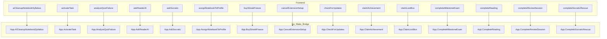

<!-- AUTO-GENERATED FILE: DO NOT EDIT DIRECTLY -->
<!-- Generated by: python scripts/analyze_api_dependency_graph.py --output doc/api_dependency_report.md -->
<!-- Any manual changes will be overwritten. To update, re-run the generator script. -->

# API & Function Dependency Report
This report lists unused API endpoints, dead Go backend code, and reachability stats.

## 1. Frontend API (`services/*.js`) Usages
Lists functions defined in frontend service bridge files and their usage count in the frontend.
| JS Function | Calls Wails Method | Usage Count | Status |
| --- | --- | --- | --- |
| `activateTask` | `ActivateTask` | 4 | Active |
| `aiCleanupNotebookSyllabus` | `AICleanupNotebookSyllabus` | 1 | Active |
| `analyzeQuizFailure` | `AnalyzeQuizFailure` | 1 | Active |
| `askReaderAI` | `AskReaderAI` | 1 | Active |
| `askSocratic` | `AskSocratic` | 1 | Active |
| `assignNotebookToProfile` | `AssignNotebookToProfile` | 1 | Active |
| `buyStreakFreeze` | `BuyStreakFreeze` | 1 | Active |
| `cancelExtensionSetup` | `CancelExtensionSetup` | 1 | Active |
| `checkExtensionReadiness` | `CheckExtensionReadiness` | 0 | Unused |
| `checkForUpdates` | `CheckForUpdates` | 2 | Active |
| `claimAchievement` | `ClaimAchievement` | 1 | Active |
| `claimLootBox` | `ClaimLootBox` | 1 | Active |
| `clearSession` | `ClearSession` | 0 | Unused |
| `completeMilestoneExam` | `CompleteMilestoneExam` | 1 | Active |
| `completeReading` | `CompleteReading` | 1 | Active |
| `completeReviewSession` | `CompleteReviewSession` | 1 | Active |
| `completeSocraticRescue` | `CompleteSocraticRescue` | 2 | Active |
| `confirmNotebookSyllabus` | `ConfirmNotebookSyllabus` | 1 | Active |
| `createProfile` | `CreateProfile` | 2 | Active |
| `deleteFlashcard` | `DeleteFlashcard` | 1 | Active |
| `deleteLLMAPIKey` | `DeleteLLMAPIKey` | 1 | Active |
| `deleteNotebook` | `DeleteNotebook` | 1 | Active |
| `deletePomodoroProfile` | - | 0 | Unused |
| `deleteProfile` | `DeleteProfile` | 1 | Active |
| `downloadAndApplyUpdate` | `DownloadAndApplyUpdate` | 2 | Active |
| `downloadRoutineICS` | - | 2 | Active |
| `draftNotebookSyllabus` | `DraftNotebookSyllabus` | 1 | Active |
| `escapeICSText` | - | 0 | Unused |
| `generateComprehensiveExam` | `GenerateVivaExam` | 1 | Active |
| `generateFlashcardsForQuizTask` | `GenerateFlashcardsForQuizTask` | 3 | Active |
| `generateManualFlashcards` | `GenerateManualFlashcards` | 1 | Active |
| `generateQuizForPageRange` | `GenerateQuizForPageRange` | 1 | Active |
| `generateRoutineICS` | - | 0 | Unused |
| `generateTopicStudyNote` | `GenerateTopicStudyNote` | 2 | Active |
| `generateTopicStudyNoteForRange` | `GenerateTopicStudyNoteForRange` | 2 | Active |
| `getAppEnv` | `GetAppEnv` | 1 | Active |
| `getAvailableImporters` | - | 1 | Active |
| `getAvailableTopics` | `GetAvailableTopics` | 2 | Active |
| `getCloudConfig` | `GetCloudConfig` | 1 | Active |
| `getDashboardOverview` | `GetDashboardOverview` | 1 | Active |
| `getExtensionConfig` | `GetExtensionConfig` | 1 | Active |
| `getFlashcardDueTimeline` | `GetFlashcardDueTimeline` | 1 | Active |
| `getFlashcardsDeckOverview` | `GetFlashcardsDeckOverview` | 1 | Active |
| `getGamificationState` | `GetGamificationState` | 4 | Active |
| `getGamificationStore` | `GetGamificationStore` | 2 | Active |
| `getGoogleCalendarUrl` | - | 2 | Active |
| `getLLMPromptLogging` | `GetLLMPromptLogging` | 1 | Active |
| `getLLMProviderPreset` | `GetLLMProviderPreset` | 2 | Active |
| `getLLMSettings` | `GetLLMSettings` | 1 | Active |
| `getLogLevel` | `GetLogLevel` | 1 | Active |
| `getNotebookCertificateStats` | `GetNotebookCertificateStats` | 1 | Active |
| `getNotebookTopicTree` | `GetNotebookTopicTree` | 3 | Active |
| `getNotebooks` | `GetNotebooks` | 6 | Active |
| `getNotesByNotebook` | `GetNotesByNotebook` | 1 | Active |
| `getOutlookCalendarUrl` | - | 2 | Active |
| `getPomodoroAudioState` | `PomodoroGetAudioState` | 0 | Unused |
| `getPomodoroSettings` | - | 2 | Active |
| `getPomodoroTimerState` | `PomodoroGetTimerState` | 0 | Unused |
| `getProfileDailyPace` | `GetProfileDailyPace` | 1 | Active |
| `getProfiles` | `GetProfiles` | 1 | Active |
| `getReaderTopicBundle` | `GetReaderTopicBundle` | 1 | Active |
| `getReadingTaskHistory` | `GetReadingTaskHistory` | 1 | Active |
| `getReleaseNotes` | `GetReleaseNotes` | 2 | Active |
| `getReviewSession` | `GetReviewSession` | 1 | Active |
| `getStudyNotesSettings` | `GetStudyNotesSettings` | 1 | Active |
| `getTask` | `GetTask` | 1 | Active |
| `getTaskContext` | `GetTaskContext` | 2 | Active |
| `getTodayPlan` | `GetTodayPlan` | 1 | Active |
| `getTopicCompressionStats` | `GetTopicCompressionStats` | 1 | Active |
| `getTopicSectionsContent` | `GetTopicSectionsContent` | 3 | Active |
| `getTopicStudyNote` | `GetTopicStudyNote` | 1 | Active |
| `getTopicStudyNoteForRange` | `GetTopicStudyNoteForRange` | 1 | Active |
| `getTopicStudyNoteSlots` | `GetTopicStudyNoteSlots` | 3 | Active |
| `getUserSession` | `GetUserSession` | 0 | Unused |
| `getUserSettings` | `GetUserSettings` | 11 | Active |
| `importAnkiDeck` | `ImportAnkiDeck` | 1 | Active |
| `initAudioContext` | - | 0 | Unused |
| `initClerk` | - | 1 | Active |
| `initializeRAG` | `InitializeRAG` | 2 | Active |
| `initializeReadingSession` | `InitializeReadingSession` | 1 | Active |
| `isOnboarded` | `IsOnboarded` | 1 | Active |
| `listExtensions` | `ListExtensions` | 2 | Active |
| `loadPomodoroProfiles` | `PomodoroLoadProfiles` | 2 | Active |
| `logFrontendEvent` | `LogFrontendEvent` | 4 | Active |
| `loginStudent` | `LoginStudent` | 1 | Active |
| `logoutStudent` | `LogoutStudent` | 1 | Active |
| `markTopicReviewed` | `MarkTopicReviewed` | 2 | Active |
| `openDataDirectory` | `OpenDataDirectory` | 1 | Active |
| `openNotesFolder` | `OpenNotesFolder` | 1 | Active |
| `openRepoURL` | `OpenRepoURL` | 2 | Active |
| `openURLInBrowser` | `OpenURLInBrowser` | 7 | Active |
| `pausePomodoroTimer` | `PomodoroPauseTimer` | 1 | Active |
| `pickPomodoroMusicFile` | `PomodoroPickMusicFile` | 1 | Active |
| `pickPomodoroMusicFolder` | `PomodoroPickMusicFolder` | 1 | Active |
| `playPomodoroChime` | `PomodoroPlayChime` | 0 | Unused |
| `playPomodoroLooping` | `PomodoroPlayLooping` | 1 | Active |
| `playPomodoroShuffleFolder` | `PomodoroPlayShuffleFolder` | 1 | Active |
| `playStudyChime` | - | 3 | Active |
| `recordCardReview` | `RecordCardReview` | 1 | Active |
| `renderMarkdown` | - | 8 | Active |
| `resolveNoteAssetSrc` | - | 0 | Unused |
| `restoreSession` | `RestoreSession` | 0 | Unused |
| `resumePomodoroTimer` | `PomodoroResumeTimer` | 1 | Active |
| `retryFlashcardGeneration` | `RetryFlashcardGeneration` | 2 | Active |
| `revertReadingTaskSession` | `RevertReadingTaskSession` | 1 | Active |
| `runExtension` | `RunExtension` | 1 | Active |
| `saveExtensionConfig` | `SaveExtensionConfig` | 1 | Active |
| `saveLLMAPIKey` | `SaveLLMAPIKey` | 2 | Active |
| `saveNoteImage` | `SaveNoteImage` | 2 | Active |
| `savePomodoroProfile` | `PomodoroSaveProfile` | 1 | Active |
| `savePomodoroSettings` | - | 1 | Active |
| `scoreShortAnswer` | `ScoreShortAnswer` | 1 | Active |
| `selectAndUploadDeepStructuredPDF` | `SelectAndUploadDeepStructuredPDF` | 1 | Active |
| `selectAnkiFile` | `SelectAnkiFile` | 1 | Active |
| `setActiveProfileID` | `SetActiveProfileID` | 1 | Active |
| `setLLMPromptLogging` | `SetLLMPromptLogging` | 1 | Active |
| `setLogLevel` | `SetLogLevel` | 1 | Active |
| `setPomodoroVolume` | `PomodoroSetVolume` | 1 | Active |
| `setStudyNotesSettings` | `SetStudyNotesSettings` | 2 | Active |
| `setupExtension` | `SetupExtension` | 1 | Active |
| `signUpStudent` | `SignUpStudent` | 1 | Active |
| `simplifyReadingContent` | `SimplifyReadingContent` | 1 | Active |
| `skipReadingTask` | `SkipReadingTask` | 1 | Active |
| `startBrowserAuth` | `StartBrowserAuth` | 0 | Unused |
| `startPomodoroTimer` | `PomodoroStartTimer` | 1 | Active |
| `startTopicAudioOverview` | `StartTopicAudioOverview` | 2 | Active |
| `stopPomodoroAudio` | `PomodoroStopAudio` | 1 | Active |
| `stopPomodoroTimer` | `PomodoroStopTimer` | 1 | Active |
| `stopTopicAudioOverview` | `StopTopicAudioOverview` | 1 | Active |
| `submitQuizAttempt` | `SubmitQuizAttempt` | 1 | Active |
| `suspendFlashcard` | `SuspendFlashcard` | 1 | Active |
| `testLLMConnection` | `TestLLMConnection` | 2 | Active |
| `testLLMLimits` | `TestLLMLimits` | 1 | Active |
| `toggleCardSuspension` | `ToggleCardSuspension` | 1 | Active |
| `toggleNotebookCardsSuspension` | `ToggleNotebookCardsSuspension` | 1 | Active |
| `trackAnalyticsEvent` | `TrackAnalyticsEvent` | 2 | Active |
| `triggerCloudSync` | `TriggerCloudSync` | 2 | Active |
| `unlockCosmeticItem` | `UnlockCosmeticItem` | 2 | Active |
| `updateFlashcardContent` | `UpdateFlashcardContent` | 1 | Active |
| `updateLLMSettings` | `UpdateLLMSettings` | 2 | Active |
| `updateNotebookPriority` | `UpdateNotebookPriority` | 1 | Active |
| `updateNotebookStudyStatus` | `UpdateNotebookStudyStatus` | 1 | Active |
| `updateNotebookTitle` | `UpdateNotebookTitle` | 1 | Active |
| `updateProfile` | `UpdateProfile` | 1 | Active |
| `updateTopicStudyNote` | `UpdateTopicStudyNote` | 2 | Active |
| `updateUserSettings` | `UpdateUserSettings` | 6 | Active |
| `upgradeNotebookToDeepPDF` | `UpgradeNotebookToDeepPDF` | 1 | Active |
| `uploadNotebook` | `UploadNotebook` | 1 | Active |
| `uploadYouTubeNotebook` | `UploadYouTubeNotebook` | 1 | Active |
| `useClerkAuth` | - | 5 | Active |

<!-- DO NOT EDIT: Auto-generated from Go App struct inspection -->
## 2. Go Wails `App` API Endpoints
Lists exported API endpoints defined on `App` in the backend and whether they are invoked by frontend services (excluding standard Wails lifecycle methods).
| Wails Method | Reachable from Frontend or main.go |
| --- | --- |
| `AICleanupNotebookSyllabus` | Yes |
| `ActivateTask` | Yes |
| `AnalyzeQuizFailure` | Yes |
| `AskReaderAI` | Yes |
| `AskSocratic` | Yes |
| `AssignNotebookToProfile` | Yes |
| `BuyStreakFreeze` | Yes |
| `CancelExtensionSetup` | Yes |
| `CheckExtensionReadiness` | No (Unused API) |
| `CheckForUpdates` | Yes |
| `ClaimAchievement` | Yes |
| `ClaimLootBox` | Yes |
| `ClearSession` | No (Unused API) |
| `CompleteMilestoneExam` | Yes |
| `CompleteReading` | Yes |
| `CompleteReviewSession` | Yes |
| `CompleteSocraticRescue` | Yes |
| `ConfirmNotebookSyllabus` | Yes |
| `CreateProfile` | Yes |
| `DeleteFlashcard` | Yes |
| `DeleteLLMAPIKey` | Yes |
| `DeleteNotebook` | Yes |
| `DeleteProfile` | Yes |
| `DownloadAndApplyUpdate` | Yes |
| `DraftNotebookSyllabus` | Yes |
| `GenerateComprehensiveExam` | No (Unused API) |
| `GenerateFlashcardsForQuizTask` | Yes |
| `GenerateManualFlashcards` | Yes |
| `GenerateQuizForPageRange` | Yes |
| `GenerateTopicStudyNote` | Yes |
| `GenerateTopicStudyNoteForRange` | Yes |
| `GenerateVivaExam` | Yes |
| `GetAppEnv` | Yes |
| `GetAvailableTopics` | Yes |
| `GetCloudConfig` | Yes |
| `GetCtx` | Yes |
| `GetDashboardOverview` | Yes |
| `GetExtensionConfig` | Yes |
| `GetFlashcardDueTimeline` | Yes |
| `GetFlashcardsDeckOverview` | Yes |
| `GetGamificationState` | Yes |
| `GetGamificationStore` | Yes |
| `GetLLMPromptLogging` | Yes |
| `GetLLMProviderPreset` | Yes |
| `GetLLMSettings` | Yes |
| `GetLogLevel` | Yes |
| `GetNotebookCertificateStats` | Yes |
| `GetNotebookTopicTree` | Yes |
| `GetNotebookUploadDir` | Yes |
| `GetNotebooks` | Yes |
| `GetNotesByNotebook` | Yes |
| `GetNotesDir` | Yes |
| `GetProfileDailyPace` | Yes |
| `GetProfiles` | Yes |
| `GetReaderTopicBundle` | Yes |
| `GetReadingTaskHistory` | Yes |
| `GetReleaseNotes` | Yes |
| `GetReviewSession` | Yes |
| `GetStudyNotesSettings` | Yes |
| `GetTask` | Yes |
| `GetTaskContext` | Yes |
| `GetTodayPlan` | Yes |
| `GetTopicCompressionStats` | Yes |
| `GetTopicSectionsContent` | Yes |
| `GetTopicStudyNote` | Yes |
| `GetTopicStudyNoteForRange` | Yes |
| `GetTopicStudyNoteSlots` | Yes |
| `GetUserSession` | No (Unused API) |
| `GetUserSettings` | Yes |
| `ImportAnkiDeck` | Yes |
| `InitializeRAG` | Yes |
| `InitializeReadingSession` | Yes |
| `IsOnboarded` | Yes |
| `IsProUser` | No (Unused API) |
| `ListExtensions` | Yes |
| `LogFrontendEvent` | Yes |
| `LoginStudent` | Yes |
| `LogoutStudent` | Yes |
| `MarkTopicReviewed` | Yes |
| `OpenDataDirectory` | Yes |
| `OpenNotesFolder` | Yes |
| `OpenRepoURL` | Yes |
| `OpenURLInBrowser` | Yes |
| `PomodoroGetAudioState` | No (Unused API) |
| `PomodoroGetProfileByID` | No (Unused API) |
| `PomodoroGetTimerState` | No (Unused API) |
| `PomodoroLoadProfiles` | Yes |
| `PomodoroPauseTimer` | Yes |
| `PomodoroPickMusicFile` | Yes |
| `PomodoroPickMusicFolder` | Yes |
| `PomodoroPlayChime` | No (Unused API) |
| `PomodoroPlayLooping` | Yes |
| `PomodoroPlayShuffleFolder` | Yes |
| `PomodoroResumeTimer` | Yes |
| `PomodoroSaveProfile` | Yes |
| `PomodoroSetVolume` | Yes |
| `PomodoroStartTimer` | Yes |
| `PomodoroStopAudio` | Yes |
| `PomodoroStopTimer` | Yes |
| `RecordCardReview` | Yes |
| `RestoreDatabaseFromBackup` | No (Unused API) |
| `RestoreSession` | No (Unused API) |
| `RetryFlashcardGeneration` | Yes |
| `RevertReadingTaskSession` | Yes |
| `RunExtension` | Yes |
| `SaveExtensionConfig` | Yes |
| `SaveLLMAPIKey` | Yes |
| `SaveNoteImage` | Yes |
| `ScoreShortAnswer` | Yes |
| `SelectAndUploadDeepStructuredPDF` | Yes |
| `SelectAnkiFile` | Yes |
| `SetActiveProfileID` | Yes |
| `SetLLMPromptLogging` | Yes |
| `SetLogLevel` | Yes |
| `SetStudyNotesSettings` | Yes |
| `SetupExtension` | Yes |
| `SignUpStudent` | Yes |
| `SimplifyReadingContent` | Yes |
| `SkipReadingTask` | Yes |
| `StartBrowserAuth` | No (Unused API) |
| `StartTopicAudioOverview` | Yes |
| `StopTopicAudioOverview` | Yes |
| `SubmitQuizAttempt` | Yes |
| `SuspendFlashcard` | Yes |
| `TestLLMConnection` | Yes |
| `TestLLMLimits` | Yes |
| `ToggleCardSuspension` | Yes |
| `ToggleNotebookCardsSuspension` | Yes |
| `TrackAnalyticsEvent` | Yes |
| `TriggerCloudSync` | Yes |
| `UnlockCosmeticItem` | Yes |
| `UpdateFlashcardContent` | Yes |
| `UpdateLLMSettings` | Yes |
| `UpdateNotebookPriority` | Yes |
| `UpdateNotebookStudyStatus` | Yes |
| `UpdateNotebookTitle` | Yes |
| `UpdateProfile` | Yes |
| `UpdateProfileFull` | No (Unused API) |
| `UpdateTopicStudyNote` | Yes |
| `UpdateUserSettings` | Yes |
| `UpgradeNotebookToDeepPDF` | Yes |
| `UploadNotebook` | Yes |
| `UploadYouTubeNotebook` | Yes |

<!-- DO NOT EDIT: Auto-generated from AST reachability analysis -->
## 3. Go Internal Reachability Analysis
Lists internal Go functions/methods and unexported `App` helpers that are **not reachable** from any active frontend API or lifecycle entry point (excluding tests).
| Function/Method | File | Receiver | Type |
| --- | --- | --- | --- |
| `AcquireAssets` | `internal/runtime/asset_manager.go:312` | `AssetManager` | `method` |
| `ActivateTaskTx` | `internal/db/study_queue_repo.go:62` | `Repository` | `method` |
| `AddChunk` | `internal/retrieval/engine.go:105` | `Engine` | `method` |
| `AddDevCoins` | `internal/db/gamification_repo.go:697` | `Repository` | `method` |
| `AddXPAndCoins` | `internal/db/gamification_repo.go:150` | `Repository` | `method` |
| `AnswerReaderQuestion` | `internal/study/reader_ai.go:29` | `StudyService` | `method` |
| `AttachAuthEnv` | `internal/extension/runner.go:19` | None | `function` |
| `AwardTaskRewardsTx` | `internal/db/gamification_repo.go:233` | `Repository` | `method` |
| `BackupDatabase` | `internal/db/backup.go:23` | None | `function` |
| `Begin` | `internal/db/store.go:49` | `Repository` | `method` |
| `Bootstrap` | `internal/runtime/boot.go:171` | None | `function` |
| `BudgetChunksToLimit` | `internal/study/prompt_budget.go:131` | None | `function` |
| `BudgetContextBlocks` | `internal/study/prompt_budget.go:214` | None | `function` |
| `BudgetConversationHistory` | `internal/study/prompt_budget.go:163` | None | `function` |
| `BudgetTextSample` | `internal/study/prompt_budget.go:195` | None | `function` |
| `BuildAudioOverviewPrompt` | `internal/study/audio_overview.go:100` | None | `function` |
| `BuildDownloadURL` | `internal/runtime/asset_manager.go:64` | None | `function` |
| `BuildTodayPlan` | `internal/scheduler/service.go:93` | `service` | `method` |
| `BuildTopicGroupsFromChapters` | `internal/notebook/ingestion.go:14` | None | `function` |
| `CalculateAvailableContextBudget` | `internal/study/prompt_budget.go:112` | None | `function` |
| `CalculateNextIntervals` | `internal/scheduler/fsrs.go:108` | None | `function` |
| `CardToFlashcardState` | `internal/models/models.go:536` | None | `function` |
| `CheckAssets` | `internal/runtime/asset_manager.go:162` | `AssetManager` | `method` |
| `CheckReadiness` | `internal/extension/checker.go:33` | None | `function` |
| `CleanOverviewText` | `internal/study/audio_overview.go:43` | None | `function` |
| `CleanTopicTitle` | `internal/utils/hash.go:35` | None | `function` |
| `CloseMultiFileLogger` | `internal/utils/logging.go:197` | None | `function` |
| `CompileMilestonePayload` | `internal/study/milestone.go:53` | None | `function` |
| `CompleteReadingWithGeneratedQuiz` | `internal/db/study_queue_repo.go:363` | `Repository` | `method` |
| `CompleteTask` | `internal/db/study_queue_repo.go:239` | `Repository` | `method` |
| `CompleteTaskTx` | `internal/db/study_queue_repo.go:134` | `Repository` | `method` |
| `CompressTopicChunks` | `internal/study/compression_service.go:97` | `StudyService` | `method` |
| `CompressTopicChunksAsync` | `internal/study/compression_service.go:43` | `StudyService` | `method` |
| `ComputeCorrectnessFlags` | `internal/study/milestone.go:13` | None | `function` |
| `ComputeLevel` | `internal/db/gamification_repo.go:45` | None | `function` |
| `ComputeTitleInfo` | `internal/db/gamification_repo.go:57` | None | `function` |
| `ConsumeStreakFreeze` | `internal/db/gamification_repo.go:463` | `Repository` | `method` |
| `CountActiveNotebooksForActiveProfile` | `internal/db/notebooks_repo.go:1270` | `Repository` | `method` |
| `CountCompletedQuizzesByNotebook` | `internal/db/study_queue_queries.go:491` | `Repository` | `method` |
| `CountExactActiveNotebooksForProfile` | `internal/db/notebooks_repo.go:1286` | `Repository` | `method` |
| `CountFlashcardsForTopic` | `internal/db/flashcard_repo.go:228` | `Repository` | `method` |
| `CountTasksByTopicTypeAndStatus` | `internal/db/study_queue_queries.go:453` | `Repository` | `method` |
| `CountTokens` | `internal/embeddings/tokenizer_utils.go:37` | None | `function` |
| `CreateChunk` | `internal/db/notebooks_repo.go:91` | `Repository` | `method` |
| `CreateFlashcards` | `internal/db/flashcard_repo.go:16` | `Repository` | `method` |
| `CreateNotebook` | `internal/db/notebooks_repo.go:13` | `Repository` | `method` |
| `CreatePendingLootBox` | `internal/db/gamification_repo.go:217` | `Repository` | `method` |
| `CreateReviewSession` | `internal/db/review_session_repo.go:173` | `Repository` | `method` |
| `CreateWrittenQuestion` | `internal/db/assessment_repo.go:15` | `Repository` | `method` |
| `CreateWrittenQuestionTx` | `internal/db/assessment_repo.go:21` | `Repository` | `method` |
| `Debugf` | `internal/utils/logging.go:255` | None | `function` |
| `DefaultSettings` | `internal/pomodoro/domain/settings.go:15` | None | `function` |
| `DeleteAPIKey` | `internal/llm/keyring.go:37` | None | `function` |
| `DeleteFSRSCardsByTopicIDTx` | `internal/db/topics_repo.go:632` | `Repository` | `method` |
| `DeleteFile` | `internal/notebook/upload.go:236` | `Service` | `method` |
| `DeleteFlashcardByID` | `internal/db/flashcard_repo.go:878` | `Repository` | `method` |
| `DeleteTopic` | `internal/db/topics_repo.go:623` | `Repository` | `method` |
| `DeleteTopics` | `internal/db/topics_repo.go:566` | `Repository` | `method` |
| `Discover` | `internal/extension/manager.go:73` | `Manager` | `method` |
| `DownloadYouTubeVideo` | `internal/notebook/youtube.go:106` | `Service` | `method` |
| `DraftSyllabusChapters` | `internal/notebook/syllabus.go:32` | `Service` | `method` |
| `Embed` | `internal/embeddings/onnx_nocgo.go:16` | `OnnxEmbedder` | `method` |
| `EmbedBatch` | `internal/embeddings/onnx_nocgo.go:21` | `OnnxEmbedder` | `method` |
| `Emit` | `internal/pomodoro/infra/events/emitter.go:24` | `WailsEmitter` | `method` |
| `Enqueue` | `internal/retrieval/queue.go:66` | `VectorIndexQueue` | `method` |
| `EnsureAssetsReady` | `internal/runtime/asset_manager.go:220` | `AssetManager` | `method` |
| `EnsureNotebookTopic` | `internal/db/notebooks_repo.go:245` | `Repository` | `method` |
| `EnsurePendingFlashcardGenerateTask` | `internal/db/study_queue_repo.go:594` | `Repository` | `method` |
| `EnsurePendingReadingTaskForNotebook` | `internal/db/study_queue_repo.go:688` | `Repository` | `method` |
| `EnsurePendingReadingTasksForActiveNotebooks` | `internal/db/study_queue_repo.go:944` | `Repository` | `method` |
| `EnsureTopic` | `internal/db/topics_repo.go:14` | `Repository` | `method` |
| `EnsureTopicWithStatus` | `internal/db/topics_repo.go:19` | `Repository` | `method` |
| `EnsureTopicsBatch` | `internal/db/topics_repo.go:103` | `Repository` | `method` |
| `EnsureTopicsBatchTx` | `internal/db/topics_repo.go:114` | `Repository` | `method` |
| `Entrypoint` | `internal/extension/extension.go:83` | `Extension` | `method` |
| `EntrypointPath` | `internal/extension/extension.go:88` | `Extension` | `method` |
| `Errorf` | `internal/utils/logging.go:267` | None | `function` |
| `ExecForTest` | `internal/db/store.go:54` | `Repository` | `method` |
| `ExtractDocument` | `internal/notebook/upload.go:256` | `Service` | `method` |
| `ExtractDocumentRange` | `internal/notebook/upload.go:261` | `Service` | `method` |
| `ExtractDocumentSample` | `internal/notebook/upload.go:387` | `Service` | `method` |
| `ExtractFullPDFCPUBookmarkNodes` | `internal/notebook/pdfcpu.go:63` | None | `function` |
| `ExtractMetadata` | `internal/notebook/upload.go:499` | `Service` | `method` |
| `ExtractSyllabusChaptersFromMarkdown` | `internal/notebook/markdown_chunker.go:195` | None | `function` |
| `ExtractUserNotesSection` | `internal/study/study_notes_service.go:288` | None | `function` |
| `FileSHA256` | `internal/utils/hash.go:19` | None | `function` |
| `FindExtensionPython` | `internal/extension/runner.go:48` | None | `function` |
| `FindNotebookByFileHash` | `internal/db/notebooks_repo.go:525` | `Repository` | `method` |
| `FindPythonExecutable` | `internal/extension/runner.go:37` | None | `function` |
| `FindUVExecutable` | `internal/extension/uv.go:13` | None | `function` |
| `FlashcardExistsByID` | `internal/db/flashcard_repo.go:459` | `Repository` | `method` |
| `FlashcardStateToCard` | `internal/scheduler/fsrs.go:13` | None | `function` |
| `ForceSeedPendingReadingTaskForNotebook` | `internal/db/study_queue_repo.go:693` | `Repository` | `method` |
| `FormatLLMError` | `internal/study/service.go:119` | `StudyService` | `method` |
| `FormatMarkdownNote` | `internal/study/study_notes_service.go:225` | None | `function` |
| `GenerateAnswer` | `internal/study/service.go:28` | `pacedProvider` | `method` |
| `GenerateAudioOverview` | `internal/study/audio_overview.go:125` | `StudyService` | `method` |
| `GenerateComprehensiveExam` | `internal/study/examiner.go:17` | `StudyService` | `method` |
| `GenerateFSRSCardsForTopic` | `internal/study/flashcard.go:51` | `StudyService` | `method` |
| `GenerateFlashcardsAfterQuiz` | `internal/study/quiz_sync.go:24` | `StudyService` | `method` |
| `GenerateLootBox` | `internal/study/rewards.go:86` | None | `function` |
| `GenerateQuizSync` | `internal/study/quiz_sync.go:323` | `StudyService` | `method` |
| `GenerateShortAnswerPrompt` | `internal/study/socratic.go:139` | `StudyService` | `method` |
| `GenerateTopicStudyNoteAsync` | `internal/study/study_notes_service.go:617` | `StudyService` | `method` |
| `Get` | `internal/extension/manager.go:149` | `Manager` | `method` |
| `GetAIInitError` | `internal/runtime/boot.go:109` | `BootResult` | `method` |
| `GetAIInitErrorString` | `internal/runtime/boot.go:116` | `BootResult` | `method` |
| `GetAPIKey` | `internal/llm/keyring.go:29` | None | `function` |
| `GetActiveProfileID` | `internal/db/settings_repo.go:16` | `Repository` | `method` |
| `GetActiveRemedialTaskPayloadByTopic` | `internal/db/study_queue_milestones.go:27` | `Repository` | `method` |
| `GetAllActiveTasks` | `internal/db/study_queue_queries.go:142` | `Repository` | `method` |
| `GetAllChunks` | `internal/db/reader_repo.go:438` | `Repository` | `method` |
| `GetAllFlashcardsDeckOverview` | `internal/db/flashcard_repo.go:684` | `Repository` | `method` |
| `GetAllPendingTasks` | `internal/db/study_queue_queries.go:71` | `Repository` | `method` |
| `GetAllTopicIDs` | `internal/db/topics_repo.go:466` | `Repository` | `method` |
| `GetAllTopics` | `internal/db/topics_repo.go:494` | `Repository` | `method` |
| `GetChunkEmbeddingRefsForNotebook` | `internal/db/notebooks_repo.go:1187` | `Repository` | `method` |
| `GetChunkEmbeddingRefsForTopic` | `internal/db/vector_repo.go:481` | `Repository` | `method` |
| `GetChunkTextsForTopicPageRange` | `internal/db/reader_repo.go:353` | `Repository` | `method` |
| `GetChunksForNotebook` | `internal/db/reader_repo.go:87` | `Repository` | `method` |
| `GetChunksForNotebookPageRange` | `internal/db/reader_repo.go:108` | `Repository` | `method` |
| `GetChunksForTopic` | `internal/db/reader_repo.go:82` | `Repository` | `method` |
| `GetChunksForTopicPageRange` | `internal/db/reader_repo.go:34` | `Repository` | `method` |
| `GetChunksForTopics` | `internal/db/reader_repo.go:126` | `Repository` | `method` |
| `GetChunksWithContextByNotebookPageRange` | `internal/db/notebooks_repo.go:1021` | `Repository` | `method` |
| `GetCompletedReadingSessionsForTopic` | `internal/db/topics_repo.go:707` | `Repository` | `method` |
| `GetCompletedTaskTimes` | `internal/db/study_queue_queries.go:618` | `Repository` | `method` |
| `GetDefaultProfileID` | `internal/db/settings_repo.go:37` | `Repository` | `method` |
| `GetDimension` | `internal/embeddings/onnx_nocgo.go:26` | `OnnxEmbedder` | `method` |
| `GetDueReviewCardsForNotebook` | `internal/db/review_session_repo.go:52` | `Repository` | `method` |
| `GetEffectiveTier` | `internal/extension/tiers.go:19` | None | `function` |
| `GetEmbedder` | `internal/runtime/boot.go:95` | `BootResult` | `method` |
| `GetFilePath` | `internal/notebook/upload.go:222` | `Service` | `method` |
| `GetFlashcardByID` | `internal/db/flashcard_repo.go:53` | `Repository` | `method` |
| `GetFlashcardByIDTx` | `internal/db/flashcard_repo.go:61` | `Repository` | `method` |
| `GetFlashcardStatesByIDs` | `internal/db/flashcard_repo.go:98` | `Repository` | `method` |
| `GetGamificationProfile` | `internal/db/gamification_repo.go:104` | `Repository` | `method` |
| `GetLastFlashcardReviewTime` | `internal/db/flashcard_repo.go:362` | `Repository` | `method` |
| `GetLastFlashcardReviewTimeTx` | `internal/db/flashcard_repo.go:377` | `Repository` | `method` |
| `GetLastNQuizAttemptsWithCorrectness` | `internal/db/study_queue_queries.go:510` | `Repository` | `method` |
| `GetLatestQuizAttemptDetailsByTopic` | `internal/db/study_queue_milestones.go:14` | `Repository` | `method` |
| `GetLatestQuizAttemptScoreByTopic` | `internal/db/study_queue_queries.go:466` | `Repository` | `method` |
| `GetLimits` | `internal/llm/provider.go:277` | `Provider` | `method` |
| `GetNextDueReviewNotebook` | `internal/db/review_session_repo.go:112` | `Repository` | `method` |
| `GetNextTask` | `internal/db/study_queue_queries.go:172` | `Repository` | `method` |
| `GetNoteFilePath` | `internal/study/study_notes_service.go:371` | `StudyService` | `method` |
| `GetNotebookByID` | `internal/db/notebooks_repo.go:484` | `Repository` | `method` |
| `GetNotebookIDByTopic` | `internal/db/notebooks_repo.go:1251` | `Repository` | `method` |
| `GetNotebookIDForTopic` | `internal/db/topics_repo.go:75` | `Repository` | `method` |
| `GetNotebookIndexingProgress` | `internal/db/notebooks_repo.go:1219` | `Repository` | `method` |
| `GetNotebookSyllabusDraft` | `internal/db/notebooks_repo.go:680` | `Repository` | `method` |
| `GetNotebookTitle` | `internal/db/topics_repo.go:61` | `Repository` | `method` |
| `GetNotebookTopicsWithBounds` | `internal/db/topics_repo.go:356` | `Repository` | `method` |
| `GetOrCreateFlashcardsForTopic` | `internal/db/flashcard_repo.go:239` | `Repository` | `method` |
| `GetOrCreateFlashcardsForTopicTx` | `internal/db/flashcard_repo.go:254` | `Repository` | `method` |
| `GetPageBoundaryCosineSimilarityTx` | `internal/db/reader_repo.go:471` | `Repository` | `method` |
| `GetPassedQuizAttempts` | `internal/db/study_queue_queries.go:588` | `Repository` | `method` |
| `GetPendingNotebookIDs` | `internal/db/notebooks_repo.go:1168` | `Repository` | `method` |
| `GetPendingReadingTaskForNotebook` | `internal/db/study_queue_queries.go:718` | `Repository` | `method` |
| `GetPlatformRequiredFiles` | `internal/runtime/asset_manager.go:73` | None | `function` |
| `GetProfileByID` | `internal/db/settings_repo.go:695` | `Repository` | `method` |
| `GetProfileCompletedReadingStatsPastNDays` | `internal/db/study_queue_queries.go:662` | `Repository` | `method` |
| `GetProfilePendingTaskCount` | `internal/db/study_queue_queries.go:121` | `Repository` | `method` |
| `GetProfileRemainingWords` | `internal/db/notebooks_repo.go:1129` | `Repository` | `method` |
| `GetQuestionsForQuizAttempts` | `internal/db/study_queue_milestones.go:41` | `Repository` | `method` |
| `GetRAGEnabled` | `internal/db/settings_repo.go:49` | `Repository` | `method` |
| `GetReadingProgressPage` | `internal/db/study_queue_queries.go:433` | `Repository` | `method` |
| `GetReadingTask` | `internal/db/study_queue_queries.go:225` | `Repository` | `method` |
| `GetRecentReviewLogs` | `internal/db/flashcard_repo.go:572` | `Repository` | `method` |
| `GetRemedialStrategy` | `internal/db/settings_repo.go:845` | `Repository` | `method` |
| `GetRepo` | `internal/runtime/boot.go:81` | `BootResult` | `method` |
| `GetRereadAttemptCount` | `internal/db/study_queue_repo.go:1041` | `Repository` | `method` |
| `GetReviewLogsSince` | `internal/db/flashcard_repo.go:607` | `Repository` | `method` |
| `GetReviewLogsSinceWithFileInfo` | `internal/db/flashcard_repo.go:639` | `Repository` | `method` |
| `GetState` | `internal/pomodoro/services/timer/service.go:96` | `Service` | `method` |
| `GetStreakFreezeUsageDates` | `internal/db/gamification_repo.go:447` | `Repository` | `method` |
| `GetTaskByID` | `internal/db/study_queue_queries.go:21` | `Repository` | `method` |
| `GetTaskByIDTx` | `internal/db/review_session_repo.go:496` | `Repository` | `method` |
| `GetTokensPerPageMap` | `internal/db/reader_repo.go:182` | `Repository` | `method` |
| `GetTopic` | `internal/db/topics_repo.go:40` | `Repository` | `method` |
| `GetTopicHeadingPageRanges` | `internal/db/reader_repo.go:396` | `Repository` | `method` |
| `GetTopicNoteFolder` | `internal/study/study_notes_service.go:332` | `StudyService` | `method` |
| `GetTopicPageBounds` | `internal/db/topics_repo.go:326` | `Repository` | `method` |
| `GetTopicRelativeFolder` | `internal/study/study_notes_service.go:357` | `StudyService` | `method` |
| `GetTopicWordsInRange` | `internal/db/reader_repo.go:246` | `Repository` | `method` |
| `GetTotalChunkTokens` | `internal/db/reader_repo.go:169` | `Repository` | `method` |
| `GetTotalChunkTokensForPageRange` | `internal/db/reader_repo.go:175` | `Repository` | `method` |
| `GetUnexaminedPassedQuizAttemptsByTopic` | `internal/db/study_queue_milestones.go:81` | `Repository` | `method` |
| `GetUnopenedLootBoxes` | `internal/db/gamification_repo.go:288` | `Repository` | `method` |
| `GetUnsyncedAnalyticsEvents` | `internal/db/analytics_repo.go:41` | `Repository` | `method` |
| `GetVenvPython` | `internal/extension/uv.go:85` | None | `function` |
| `GetWrittenQuestionByID` | `internal/db/assessment_repo.go:51` | `Repository` | `method` |
| `GetYouTubeSegmentTimestamps` | `internal/notebook/youtube.go:139` | `Service` | `method` |
| `HasAPIKey` | `internal/llm/keyring.go:45` | None | `function` |
| `HasMilestoneExamForAttemptID` | `internal/db/study_queue_queries.go:544` | `Repository` | `method` |
| `ID` | `internal/extension/extension.go:63` | `Extension` | `method` |
| `IncrementRereadAttemptCountTx` | `internal/db/study_queue_repo.go:1063` | `Repository` | `method` |
| `IncrementStat` | `internal/db/gamification_repo.go:816` | `Repository` | `method` |
| `IndexAllTopics` | `internal/retrieval/indexer.go:216` | `VectorIndexer` | `method` |
| `IndexNotebook` | `internal/retrieval/indexer.go:291` | `VectorIndexer` | `method` |
| `IndexTopicChunks` | `internal/retrieval/indexer.go:46` | `VectorIndexer` | `method` |
| `Infof` | `internal/utils/logging.go:259` | None | `function` |
| `IngestDeepPDF` | `internal/notebook/deep_pdf.go:37` | `Service` | `method` |
| `IngestDeepPDFWithProgress` | `internal/notebook/deep_pdf.go:42` | `Service` | `method` |
| `IngestNotebookContentByTopic` | `internal/db/notebooks_repo.go:289` | `Repository` | `method` |
| `IngestYouTubeVideo` | `internal/notebook/youtube.go:32` | `Service` | `method` |
| `Init` | `internal/db/store.go:65` | None | `function` |
| `InitMultiFileLogger` | `internal/utils/logging.go:134` | None | `function` |
| `InitPromptTokenizer` | `internal/embeddings/tokenizer_utils.go:22` | None | `function` |
| `InitSchema` | `internal/db/schema.go:12` | None | `function` |
| `InitWithVectorDimension` | `internal/db/store.go:168` | `Repository` | `method` |
| `InitializeAI` | `internal/runtime/boot.go:278` | `BootResult` | `method` |
| `InsertFSRSReviewLog` | `internal/db/flashcard_repo.go:515` | `Repository` | `method` |
| `InsertMilestoneExamTask` | `internal/db/study_queue_repo.go:498` | `Repository` | `method` |
| `InsertMilestoneExamTaskIfMissing` | `internal/db/study_queue_repo.go:524` | `Repository` | `method` |
| `InsertStudyTask` | `internal/db/study_queue_repo.go:25` | `Repository` | `method` |
| `InsertStudyTaskTx` | `internal/db/study_queue_repo.go:32` | `Repository` | `method` |
| `InstallZip` | `internal/extension/installer.go:45` | `Manager` | `method` |
| `IsAIReady` | `internal/runtime/boot.go:102` | `BootResult` | `method` |
| `IsFastRateLimited` | `internal/study/service.go:111` | `StudyService` | `method` |
| `IsPromptLoggingEnabled` | `internal/llm/provider.go:29` | None | `function` |
| `IsRateLimitError` | `internal/llm/provider.go:44` | None | `function` |
| `IsTopicCompressing` | `internal/study/compression_service.go:86` | `StudyService` | `method` |
| `IsTopicFullyReadTx` | `internal/db/topics_repo.go:686` | `Repository` | `method` |
| `IsVecExtensionLoaded` | `internal/db/store.go:157` | `Repository` | `method` |
| `IsVersionCompatible` | `internal/runtime/asset_manager.go:106` | None | `function` |
| `LinkChunksToNotebook` | `internal/db/notebooks_repo.go:587` | `Repository` | `method` |
| `LinkNotebookTopics` | `internal/db/notebooks_repo.go:259` | `Repository` | `method` |
| `List` | `internal/extension/manager.go:131` | `Manager` | `method` |
| `LoadConfigFromEnvForPrefix` | `internal/llm/provider.go:73` | None | `function` |
| `LoadConfigFromSettingsForPrefix` | `internal/llm/provider.go:109` | None | `function` |
| `LogQueueTaskCreated` | `internal/utils/logging.go:296` | None | `function` |
| `LogQueueTransition` | `internal/utils/logging.go:274` | None | `function` |
| `LogQuizResult` | `internal/utils/logging.go:309` | None | `function` |
| `LogReadingEstimate` | `internal/utils/logging.go:353` | None | `function` |
| `LogRereadInsertion` | `internal/utils/logging.go:323` | None | `function` |
| `LogReviewSession` | `internal/utils/logging.go:333` | None | `function` |
| `LogSchedulerDecision` | `internal/utils/logging.go:343` | None | `function` |
| `MD5Hex` | `internal/utils/hash.go:13` | None | `function` |
| `MarkAnalyticsSynced` | `internal/db/analytics_repo.go:84` | `Repository` | `method` |
| `MarkFastRateLimited` | `internal/study/service.go:103` | `StudyService` | `method` |
| `MarkLLMKeyStored` | `internal/db/settings_repo.go:503` | `Repository` | `method` |
| `MarkReviewTaskCardReviewedTx` | `internal/db/review_session_repo.go:420` | `Repository` | `method` |
| `MarkTopicCompletedTx` | `internal/db/topics_repo.go:662` | `Repository` | `method` |
| `MarkTopicExternalHelpRequiredTx` | `internal/db/topics_repo.go:638` | `Repository` | `method` |
| `ModelName` | `internal/llm/provider.go:269` | `Provider` | `method` |
| `ModelPath` | `internal/runtime/asset_manager.go:231` | `AssetManager` | `method` |
| `Name` | `internal/extension/extension.go:68` | `Extension` | `method` |
| `New` | `internal/scheduler/service.go:65` | None | `function` |
| `NewAssetManager` | `internal/runtime/asset_manager.go:114` | None | `function` |
| `NewEngine` | `internal/retrieval/engine.go:62` | None | `function` |
| `NewManager` | `internal/extension/manager.go:55` | None | `function` |
| `NewOnnxEmbedder` | `internal/embeddings/onnx_nocgo.go:11` | None | `function` |
| `NewProvider` | `internal/llm/provider.go:264` | None | `function` |
| `NewRunner` | `internal/extension/runner.go:32` | None | `function` |
| `NewService` | `internal/notebook/upload.go:56` | None | `function` |
| `NewStudyService` | `internal/study/service.go:63` | None | `function` |
| `NewVectorIndexQueue` | `internal/retrieval/queue.go:26` | None | `function` |
| `NewVectorIndexer` | `internal/retrieval/indexer.go:34` | None | `function` |
| `NewWailsEmitter` | `internal/pomodoro/infra/events/emitter.go:20` | None | `function` |
| `NextFSRSState` | `internal/scheduler/fsrs.go:147` | None | `function` |
| `NormalizeSyllabusChapters` | `internal/notebook/syllabus.go:276` | None | `function` |
| `NormalizeWhitespace` | `internal/embeddings/text.go:8` | None | `function` |
| `NotesBaseDir` | `internal/study/study_notes_service.go:122` | None | `function` |
| `OnnxRuntimePath` | `internal/runtime/asset_manager.go:242` | `AssetManager` | `method` |
| `ParseMarkdownNote` | `internal/study/study_notes_service.go:163` | None | `function` |
| `ParsePDFCPUBookmarkDraftFromJSON` | `internal/notebook/pdfcpu.go:75` | None | `function` |
| `Pause` | `internal/pomodoro/services/timer/service.go:73` | `Service` | `method` |
| `PersistAnkiDeckImport` | `internal/db/notebooks_repo.go:1318` | `Repository` | `method` |
| `PersistReadingProgress` | `internal/db/study_queue_repo.go:305` | `Repository` | `method` |
| `PlayChime` | `internal/pomodoro/services/audio/service.go:168` | `Service` | `method` |
| `PlayLooping` | `internal/pomodoro/services/audio/service.go:60` | `Service` | `method` |
| `PlayShuffleFolder` | `internal/pomodoro/services/audio/service.go:86` | `Service` | `method` |
| `QueryDueReviewCards` | `internal/db/study_queue_queries.go:804` | `Repository` | `method` |
| `QueryDueReviewCardsForRange` | `internal/db/study_queue_queries.go:814` | `Repository` | `method` |
| `QueryDueReviewCardsTimeline` | `internal/db/study_queue_queries.go:824` | `Repository` | `method` |
| `QueryNextReadingTopic` | `internal/db/topics_repo.go:392` | `Repository` | `method` |
| `QueryRowForTest` | `internal/db/store.go:59` | `Repository` | `method` |
| `ReconcileReadingTasksForNotebook` | `internal/db/study_queue_repo.go:901` | `Repository` | `method` |
| `RemainingReviewTaskCardsTx` | `internal/db/review_session_repo.go:455` | `Repository` | `method` |
| `ReserveTask` | `internal/db/study_queue_repo.go:993` | `Repository` | `method` |
| `ResetIndexingStatus` | `internal/db/notebooks_repo.go:1158` | `Repository` | `method` |
| `ResetInterruptedNotebookStatuses` | `internal/db/notebooks_repo.go:124` | `Repository` | `method` |
| `ResetRereadAttemptCountTx` | `internal/db/study_queue_repo.go:1084` | `Repository` | `method` |
| `ResolveAnonKey` | `internal/study/sync.go:73` | None | `function` |
| `ResolveAppDir` | `internal/runtime/boot.go:464` | None | `function` |
| `ResolveAssetDir` | `internal/runtime/asset_manager.go:128` | None | `function` |
| `ResolveBaseURL` | `internal/study/sync.go:64` | None | `function` |
| `ResolveCloudAPIToken` | `internal/study/sync.go:84` | None | `function` |
| `ResolveCloudServerURL` | `internal/study/sync.go:34` | None | `function` |
| `ResolveCloudSyncURL` | `internal/study/sync.go:45` | None | `function` |
| `ResolveCorrectOption` | `internal/study/parsers.go:283` | None | `function` |
| `ResolveDBPath` | `internal/runtime/boot.go:504` | None | `function` |
| `ResolveExtensionVenvDir` | `internal/extension/uv.go:96` | None | `function` |
| `ResolveExtensionsDir` | `internal/extension/manager.go:24` | None | `function` |
| `ResolveFlashcardGenerateTasksForTopic` | `internal/db/study_queue_repo.go:638` | `Repository` | `method` |
| `ResolveNotebookDir` | `internal/runtime/boot.go:522` | None | `function` |
| `ResolveNotesDir` | `internal/runtime/boot.go:535` | None | `function` |
| `ResolvePageWindow` | `internal/db/reader_repo.go:790` | None | `function` |
| `ResolveSessionPath` | `internal/runtime/boot.go:513` | None | `function` |
| `RestoreLatestBackup` | `internal/db/backup.go:146` | None | `function` |
| `Resume` | `internal/pomodoro/services/timer/service.go:56` | `Service` | `method` |
| `RevertReadingTaskSessionTx` | `internal/db/study_queue_reading_logs.go:129` | `Repository` | `method` |
| `RevertTaskReservation` | `internal/db/study_queue_repo.go:1017` | `Repository` | `method` |
| `RollTaskRewards` | `internal/study/rewards.go:12` | None | `function` |
| `RunMigrations` | `internal/db/migrations.go:113` | None | `function` |
| `RunSmokeTest` | `internal/extension/checker.go:93` | None | `function` |
| `RunStreamWithInput` | `internal/extension/runner.go:97` | `Runner` | `method` |
| `Runtime` | `internal/extension/extension.go:78` | `Extension` | `method` |
| `SanitizePathSegment` | `internal/study/study_notes_service.go:148` | None | `function` |
| `SaveAPIKey` | `internal/llm/keyring.go:21` | None | `function` |
| `SaveManualFlashcardsBatch` | `internal/db/flashcard_repo.go:392` | `Repository` | `method` |
| `SaveNoteToDisk` | `internal/study/study_notes_service.go:383` | `StudyService` | `method` |
| `SaveQuizAttemptTx` | `internal/db/study_queue_repo.go:471` | `Repository` | `method` |
| `SaveUploadedFile` | `internal/notebook/upload.go:103` | `Service` | `method` |
| `SaveUploadedFileFromPath` | `internal/notebook/upload.go:131` | `Service` | `method` |
| `SaveWrittenAnswerTx` | `internal/db/assessment_repo.go:93` | `Repository` | `method` |
| `SearchVectorsForNotebook` | `internal/db/vector_repo.go:195` | `Repository` | `method` |
| `SearchVectorsForTopic` | `internal/db/vector_repo.go:163` | `Repository` | `method` |
| `SeedDemoDataForTests` | `internal/db/testhelper.go:7` | `Repository` | `method` |
| `SelectChunkText` | `internal/study/quiz_sync.go:150` | None | `function` |
| `SemanticSearch` | `internal/retrieval/engine.go:137` | `Engine` | `method` |
| `SemanticSearchNotebook` | `internal/retrieval/engine.go:163` | `Engine` | `method` |
| `SendHeartbeat` | `internal/telemetry/heartbeat.go:34` | None | `function` |
| `SetAIState` | `internal/runtime/boot.go:123` | `BootResult` | `method` |
| `SetCardSuspension` | `internal/db/flashcard_repo.go:834` | `Repository` | `method` |
| `SetChimeData` | `internal/pomodoro/services/audio/service.go:46` | `Service` | `method` |
| `SetEmbedder` | `internal/retrieval/engine.go:74` | `Engine` | `method` |
| `SetEmitter` | `internal/pomodoro/services/timer/service.go:32` | `Service` | `method` |
| `SetLastSyncedAt` | `internal/db/settings_repo.go:407` | `Repository` | `method` |
| `SetNotebookCardsSuspension` | `internal/db/flashcard_repo.go:859` | `Repository` | `method` |
| `SetNotebookFileHash` | `internal/db/notebooks_repo.go:43` | `Repository` | `method` |
| `SetPromptLoggingEnabled` | `internal/llm/provider.go:24` | None | `function` |
| `SetRepo` | `internal/runtime/boot.go:88` | `BootResult` | `method` |
| `SetVolume` | `internal/pomodoro/services/audio/service.go:141` | `Service` | `method` |
| `SetupExtensionEnv` | `internal/extension/checker.go:146` | None | `function` |
| `SplitIntoSentences` | `internal/study/audio_overview.go:60` | None | `function` |
| `SplitMarkdownIntoChunks` | `internal/notebook/markdown_chunker.go:30` | None | `function` |
| `SplitPageIntoChunks` | `internal/notebook/upload.go:693` | None | `function` |
| `StageDLLs` | `internal/runtime/asset_manager.go:259` | `AssetManager` | `method` |
| `Start` | `internal/retrieval/queue.go:41` | `VectorIndexQueue` | `method` |
| `StartCloudSyncLoop` | `internal/study/sync.go:143` | None | `function` |
| `Stop` | `internal/retrieval/queue.go:60` | `VectorIndexQueue` | `method` |
| `SuspendFlashcardTx` | `internal/db/flashcard_repo.go:473` | `Repository` | `method` |
| `SwapDB` | `internal/db/store.go:41` | `Repository` | `method` |
| `Sync` | `internal/utils/logging.go:110` | `rotatingWriter` | `method` |
| `TokenizerPath` | `internal/runtime/asset_manager.go:236` | `AssetManager` | `method` |
| `TransitionTask` | `internal/study/queue_transition.go:55` | `StudyService` | `method` |
| `TriggerAnonymousTelemetrySync` | `internal/study/sync.go:296` | None | `function` |
| `TruncateToTokens` | `internal/embeddings/tokenizer_utils.go:67` | None | `function` |
| `Uninstall` | `internal/extension/installer.go:15` | `Manager` | `method` |
| `UnlockCosmetic` | `internal/db/gamification_repo.go:629` | `Repository` | `method` |
| `UpdateChunkCompressedText` | `internal/db/reader_repo.go:855` | `Repository` | `method` |
| `UpdateChunkEmbedding` | `internal/db/vector_repo.go:419` | `Repository` | `method` |
| `UpdateChunkEmbeddingsBatch` | `internal/db/vector_repo.go:443` | `Repository` | `method` |
| `UpdateFlashcardReview` | `internal/db/flashcard_repo.go:165` | `Repository` | `method` |
| `UpdateFlashcardReviewTx` | `internal/db/flashcard_repo.go:171` | `Repository` | `method` |
| `UpdateNotebookChunkCount` | `internal/db/notebooks_repo.go:614` | `Repository` | `method` |
| `UpdateNotebookExtractionEngine` | `internal/db/notebooks_repo.go:577` | `Repository` | `method` |
| `UpdateNotebookFilePath` | `internal/db/notebooks_repo.go:49` | `Repository` | `method` |
| `UpdateNotebookIndexingStatus` | `internal/db/notebooks_repo.go:138` | `Repository` | `method` |
| `UpdateNotebookPageCount` | `internal/db/notebooks_repo.go:636` | `Repository` | `method` |
| `UpdateNotebookStatus` | `internal/db/notebooks_repo.go:101` | `Repository` | `method` |
| `UpdateNotebookSyllabusDraft` | `internal/db/notebooks_repo.go:708` | `Repository` | `method` |
| `UpdateNotebookTopic` | `internal/db/notebooks_repo.go:160` | `Repository` | `method` |
| `UpdateProfileCloudCredentials` | `internal/db/settings_repo.go:816` | `Repository` | `method` |
| `UpdateProfilePomoSettings` | `internal/db/settings_repo.go:800` | `Repository` | `method` |
| `UpdateStudyNotesSettings` | `internal/db/settings_repo.go:368` | `Repository` | `method` |
| `UpdateTaskEndPage` | `internal/db/study_queue_repo.go:219` | `Repository` | `method` |
| `UpdateTopicPageBounds` | `internal/db/topics_repo.go:151` | `Repository` | `method` |
| `UpdateTopicPageBoundsBatch` | `internal/db/topics_repo.go:232` | `Repository` | `method` |
| `UpdateTopicReadingCursor` | `internal/db/topics_repo.go:531` | `Repository` | `method` |
| `UpsertChunkVector` | `internal/db/vector_repo.go:20` | `Repository` | `method` |
| `UpsertChunkVectorsBatch` | `internal/db/vector_repo.go:65` | `Repository` | `method` |
| `Validate` | `internal/extension/extension.go:24` | `Manifest` | `method` |
| `Vec0DllPath` | `internal/runtime/asset_manager.go:253` | `AssetManager` | `method` |
| `Vec0LibPath` | `internal/runtime/asset_manager.go:248` | `AssetManager` | `method` |
| `Version` | `internal/extension/extension.go:73` | `Extension` | `method` |
| `WithExtractPDFFunc` | `internal/notebook/upload.go:47` | None | `function` |
| `Write` | `internal/utils/logging.go:88` | `rotatingWriter` | `method` |
| `absInt` | `internal/notebook/upload.go:832` | None | `function` |
| `acquireAndStageAssets` | `internal/app/app.go` | `App` | `AppHelper` |
| `activateReadingSessionTask` | `internal/app/app.go` | `App` | `AppHelper` |
| `aggregateQueueTasks` | `internal/app/app_study.go:55` | None | `function` |
| `appendFailedQuestionsSection` | `internal/app/app_study_cards.go:156` | None | `function` |
| `applyEnvLimitsOverride` | `internal/llm/provider.go:188` | None | `function` |
| `applyFlashcardReview` | `internal/study/review_session.go:56` | `StudyService` | `method` |
| `applyRestoredSession` | `internal/app/app.go` | `App` | `AppHelper` |
| `applyVectorDBAndEmbedder` | `internal/app/app.go` | `App` | `AppHelper` |
| `assignTaskTitle` | `internal/db/study_queue_repo.go:1155` | None | `function` |
| `awardCompletionRewards` | `internal/study/queue_transition.go:327` | `StudyService` | `method` |
| `baseCtxWithTimeout` | `internal/app/app.go` | `App` | `AppHelper` |
| `bookmarkNodesToDraft` | `internal/notebook/pdfcpu.go:33` | None | `function` |
| `boolToInt` | `internal/db/flashcard_repo.go:507` | None | `function` |
| `buildComprehensiveExamPrompt` | `internal/study/examiner.go:239` | None | `function` |
| `buildContextTextFromChunks` | `internal/study/prompt_budget.go:96` | None | `function` |
| `buildContextTextFromQuizQuestions` | `internal/study/examiner.go:204` | None | `function` |
| `buildFlashcardStaticTemplate` | `internal/study/flashcard.go:299` | None | `function` |
| `buildInputValues` | `internal/embeddings/onnx.go:337` | `OnnxEmbedder` | `method` |
| `buildMarathonFlashcardPromptWithBudget` | `internal/study/flashcard.go:227` | None | `function` |
| `buildPageBoundedContext` | `internal/study/prompt_budget.go:16` | `StudyService` | `method` |
| `buildPageSample` | `internal/notebook/syllabus.go:358` | None | `function` |
| `buildQuizContext` | `internal/study/quiz_sync.go:201` | None | `function` |
| `buildQuizPrompt` | `internal/study/quiz_sync.go:270` | None | `function` |
| `buildQuizResultPayload` | `internal/study/quiz_sync.go:612` | None | `function` |
| `buildReaderContextBlocksWithText` | `internal/study/reader_ai.go:195` | None | `function` |
| `buildReadingSessionEnvelope` | `internal/app/app_study_reading.go:41` | None | `function` |
| `buildReviewTaskForPlan` | `internal/app/app_study.go:302` | None | `function` |
| `buildSimplifierPrompt` | `internal/study/simplifier.go:31` | None | `function` |
| `buildSocraticRemedialPrompt` | `internal/app/app_study_cards.go:91` | None | `function` |
| `buildTokenArrays` | `internal/embeddings/onnx.go:286` | None | `function` |
| `buildUploadPath` | `internal/notebook/upload.go:199` | `Service` | `method` |
| `buildVectorIndex` | `internal/app/app.go` | `App` | `AppHelper` |
| `buildVivaFromQuizPrompt` | `internal/study/examiner.go:216` | None | `function` |
| `calculateDailyStudyMinutes` | `internal/app/app_study.go:21` | None | `function` |
| `calculateDurationMinutes` | `internal/scheduler/service.go:307` | None | `function` |
| `calculateFlashcardBudgets` | `internal/app/app_study.go:42` | None | `function` |
| `calculatePromptTokenCount` | `internal/study/prompt_budget.go:64` | None | `function` |
| `calculateQuizScore` | `internal/study/quiz_sync.go:570` | None | `function` |
| `capEndPageByWordBudget` | `internal/db/study_queue_queries.go:318` | `Repository` | `method` |
| `chapterIndexForPage` | `internal/notebook/ingestion.go:83` | None | `function` |
| `checkAndInsertMilestoneExam` | `internal/app/app_study_cards.go:278` | None | `function` |
| `checkNotebookIndexingStatus` | `internal/app/app.go` | `App` | `AppHelper` |
| `cleanDiagnosticJSON` | `internal/study/diagnostic.go:150` | None | `function` |
| `clientEndOfDayUnix` | `internal/app/app_study.go:169` | None | `function` |
| `columnExists` | `internal/db/migrations.go:276` | None | `function` |
| `computeCurrentStreak` | `internal/app/app_study.go:119` | None | `function` |
| `computeLongestStreak` | `internal/app/app_study.go:89` | None | `function` |
| `computeSHA256` | `internal/runtime/asset_manager.go:586` | None | `function` |
| `computeSessionSignature` | `internal/app/app_auth.go:79` | None | `function` |
| `computeTextHash` | `internal/retrieval/indexer.go:268` | None | `function` |
| `copyFile` | `internal/runtime/asset_manager.go:669` | None | `function` |
| `copyFileWithProgress` | `internal/runtime/asset_manager.go:602` | None | `function` |
| `copyPomoFile` | `internal/app/app_pomodoro.go:268` | None | `function` |
| `cosineSimilarity` | `internal/retrieval/engine.go:486` | None | `function` |
| `countWords` | `internal/db/study_queue_queries.go:361` | None | `function` |
| `countWordsInPageRange` | `internal/db/study_queue_queries.go:297` | `Repository` | `method` |
| `createVacuumSnapshot` | `internal/db/backup.go:100` | None | `function` |
| `createVectorTable` | `internal/db/vector_repo.go:381` | `Repository` | `method` |
| `dedupeNotebookChunks` | `internal/db/migrations.go:140` | None | `function` |
| `defaultBaseURLForProvider` | `internal/llm/provider.go:150` | None | `function` |
| `defaultLLMSettings` | `internal/db/settings_repo.go:516` | None | `function` |
| `defaultLLMTier` | `internal/db/settings_repo.go:524` | None | `function` |
| `defaultModelForProvider` | `internal/llm/provider.go:165` | None | `function` |
| `deleteAssessmentDataOutsideBoundsTx` | `internal/db/topics_repo.go:313` | `Repository` | `method` |
| `destroyValues` | `internal/embeddings/onnx.go:536` | None | `function` |
| `doesHashMatch` | `internal/retrieval/indexer.go:254` | None | `function` |
| `doesTableExistTxRepo` | `internal/db/notebooks_repo.go:1007` | None | `function` |
| `downloadAndRegisterNotebook` | `internal/study/sync.go:428` | None | `function` |
| `downloadPDFToFile` | `internal/study/sync.go:554` | None | `function` |
| `embedBatchInternal` | `internal/embeddings/onnx.go:210` | `OnnxEmbedder` | `method` |
| `embedInternal` | `internal/embeddings/onnx.go:199` | `OnnxEmbedder` | `method` |
| `emitIndexingProgress` | `internal/retrieval/indexer.go:273` | `VectorIndexer` | `method` |
| `emitIngestionProgress` | `internal/app/notebook_endpoints.go:1123` | None | `function` |
| `emitNotebookIndexingProgress` | `internal/retrieval/indexer.go:327` | `VectorIndexer` | `method` |
| `emitRagSetupFailed` | `internal/app/app.go:870` | None | `function` |
| `emitState` | `internal/pomodoro/services/audio/service.go:273` | `Service` | `method` |
| `enableRAGUserSettings` | `internal/app/app.go` | `App` | `AppHelper` |
| `ensurePendingReadingTaskForNotebookInternal` | `internal/db/study_queue_repo.go:697` | `Repository` | `method` |
| `envHasLLMAPIKey` | `internal/app/app_settings.go:558` | None | `function` |
| `estimateTaskMinutes` | `internal/scheduler/service.go:249` | `service` | `method` |
| `extractBatchEmbedding` | `internal/embeddings/onnx.go:385` | None | `function` |
| `extractIONames` | `internal/embeddings/onnx.go:496` | None | `function` |
| `extractPDFDocument` | `internal/notebook/upload.go:681` | `Service` | `method` |
| `extractPDFRange` | `internal/notebook/upload.go:549` | `Service` | `method` |
| `extractPDFSample` | `internal/notebook/upload.go:677` | `Service` | `method` |
| `extractValidQuizQuestions` | `internal/study/parsers.go:23` | None | `function` |
| `fetchExistingReviewTask` | `internal/db/review_session_repo.go:23` | `Repository` | `method` |
| `fetchGitHubReleaseNotes` | `internal/app/app_update.go:35` | None | `function` |
| `fetchSessionChunks` | `internal/app/app.go` | `App` | `AppHelper` |
| `finalizeDeepStructuredPDFUpload` | `internal/app/app.go` | `App` | `AppHelper` |
| `finalizeNotebookUpload` | `internal/app/app.go` | `App` | `AppHelper` |
| `finalizeRAGSetup` | `internal/app/app.go` | `App` | `AppHelper` |
| `findPDFCPUExecutable` | `internal/notebook/pdfcpu.go:219` | None | `function` |
| `firstEnv` | `internal/llm/provider.go:234` | None | `function` |
| `firstEnvInt` | `internal/llm/provider.go:244` | None | `function` |
| `firstInt` | `internal/notebook/pdfcpu.go:281` | None | `function` |
| `firstN` | `internal/notebook/syllabus.go:398` | None | `function` |
| `firstNonEmpty` | `internal/llm/provider.go:140` | None | `function` |
| `firstString` | `internal/notebook/pdfcpu.go:266` | None | `function` |
| `formatInterval` | `internal/scheduler/fsrs.go:70` | None | `function` |
| `generateFlashcardsCore` | `internal/study/flashcard.go:111` | `StudyService` | `method` |
| `getAchievementDefinitions` | `internal/db/gamification_repo.go:853` | None | `function` |
| `getAppVersion` | `internal/app/app_update.go:24` | None | `function` |
| `getAppVersionTag` | `internal/runtime/asset_manager.go:22` | None | `function` |
| `getCosmeticCatalog` | `internal/db/gamification_repo.go:520` | None | `function` |
| `getCosmeticDefinition` | `internal/db/gamification_repo.go:619` | None | `function` |
| `getExistingReviewTaskForNotebookTxRepo` | `internal/db/review_session_repo.go:339` | `Repository` | `method` |
| `getFlashcardByIDQuerier` | `internal/db/flashcard_repo.go:69` | `Repository` | `method` |
| `getMachineID` | `internal/app/app_auth.go:61` | None | `function` |
| `getModelLimits` | `internal/llm/provider.go:181` | None | `function` |
| `getNormalizedMachineID` | `internal/app/app_auth.go:70` | None | `function` |
| `getNotebookAndRepo` | `internal/app/app.go` | `App` | `AppHelper` |
| `getNotebookOpLock` | `internal/app/notebook_endpoints.go:40` | None | `function` |
| `getPlatformOnnxLibName` | `internal/runtime/asset_manager.go:84` | None | `function` |
| `getPlatformVecLibName` | `internal/runtime/asset_manager.go:95` | None | `function` |
| `getPromptTokenizer` | `internal/embeddings/tokenizer_utils.go:115` | None | `function` |
| `getRepo` | `internal/app/app.go` | `App` | `AppHelper` |
| `getSessionFilePath` | `internal/app/app_auth.go:183` | None | `function` |
| `getSimplifierLevelDirective` | `internal/study/simplifier.go:15` | None | `function` |
| `getStreakState` | `internal/app/app.go` | `App` | `AppHelper` |
| `getStudyNoteSystemPrompt` | `internal/study/study_notes_service.go:40` | None | `function` |
| `getTotalChunkTokens` | `internal/db/reader_repo.go:278` | `Repository` | `method` |
| `handleDeepPDFFailure` | `internal/app/app.go` | `App` | `AppHelper` |
| `hasLocalSourceAssets` | `internal/runtime/asset_manager.go:288` | `AssetManager` | `method` |
| `hasTerminalPeriod` | `internal/notebook/upload.go:812` | None | `function` |
| `hideConsoleWindow` | `internal/notebook/pdfcpu_windows.go:13` | None | `function` |
| `indexChunks` | `internal/retrieval/indexer.go:58` | `VectorIndexer` | `method` |
| `inferMaxSeqLen` | `internal/embeddings/onnx.go:524` | None | `function` |
| `initEmbedder` | `internal/app/app.go` | `App` | `AppHelper` |
| `initEmbedderStack` | `internal/runtime/boot.go:351` | `BootResult` | `method` |
| `initIndexQueue` | `internal/app/app.go` | `App` | `AppHelper` |
| `initLLMProviders` | `internal/runtime/boot.go:419` | None | `function` |
| `initLogging` | `internal/app/app.go:106` | None | `function` |
| `initNotebookService` | `internal/runtime/boot.go:451` | None | `function` |
| `initRetrievalEngine` | `internal/runtime/boot.go:392` | None | `function` |
| `insertChunkRow` | `internal/db/notebooks_repo.go:78` | None | `function` |
| `insertChunkRowRepo` | `internal/db/notebooks_repo.go:994` | None | `function` |
| `insertMilestoneForAttempts` | `internal/app/app_study_cards.go:297` | None | `function` |
| `isFrontMatterChunk` | `internal/study/quiz_sync.go:187` | None | `function` |
| `isPacingEnabled` | `internal/study/service.go:91` | `StudyService` | `method` |
| `isPreferredBoundary` | `internal/notebook/upload.go:795` | None | `function` |
| `isTableRow` | `internal/notebook/markdown_chunker.go:190` | None | `function` |
| `isVectorUnavailableError` | `internal/db/vector_repo.go:360` | None | `function` |
| `isWhitespaceByte` | `internal/notebook/upload.go:791` | None | `function` |
| `keyringUserForTier` | `internal/llm/keyring.go:13` | None | `function` |
| `launchDetachedInstaller` | `internal/app/app_update_windows.go:14` | None | `function` |
| `lexicalSearch` | `internal/retrieval/engine.go:400` | `Engine` | `method` |
| `linearToLog` | `internal/pomodoro/services/audio/service.go:266` | None | `function` |
| `linkNotebookChunkRowRepo` | `internal/db/notebooks_repo.go:998` | None | `function` |
| `listLocked` | `internal/extension/manager.go:137` | `Manager` | `method` |
| `loadChunkTextFallback` | `internal/study/quiz_sync.go:166` | `StudyService` | `method` |
| `loadEnv` | `internal/runtime/boot.go:457` | None | `function` |
| `lookupChunkRowID` | `internal/db/vector_repo.go:349` | `Repository` | `method` |
| `mapTaskError` | `internal/app/app_study.go:142` | None | `function` |
| `markFastCalled` | `internal/study/service.go:85` | `StudyService` | `method` |
| `maxPage` | `internal/notebook/syllabus.go:390` | None | `function` |
| `mergePendingReviewCards` | `internal/db/review_session_repo.go:309` | `Repository` | `method` |
| `newRotatingWriter` | `internal/utils/logging.go:68` | None | `function` |
| `normalizeChunkIDs` | `internal/study/quiz_sync.go:124` | None | `function` |
| `normalizeL2` | `internal/embeddings/onnx.go:477` | None | `function` |
| `normalizeLLMTier` | `internal/db/settings_repo.go:575` | None | `function` |
| `normalizeLLMTierForApp` | `internal/app/app_settings.go:548` | None | `function` |
| `normalizeLLMTierSettings` | `internal/db/settings_repo.go:542` | None | `function` |
| `normalizeReaderScope` | `internal/study/reader_ai.go:174` | None | `function` |
| `normalizeValidateFlashcards` | `internal/db/flashcard_repo.go:414` | None | `function` |
| `optimalBatchSize` | `internal/retrieval/indexer.go:344` | None | `function` |
| `optimalPDFWorkers` | `internal/notebook/upload.go:533` | None | `function` |
| `parseBookmarkNode` | `internal/notebook/pdfcpu.go:23` | None | `function` |
| `parseClerkSessionClaims` | `internal/app/app_auth.go:86` | None | `function` |
| `parseFlashcardLLMResponse` | `internal/study/parsers.go:246` | None | `function` |
| `parseMarkdownBlocks` | `internal/notebook/markdown_chunker.go:96` | None | `function` |
| `parseQuizLLMResponse` | `internal/study/parsers.go:212` | None | `function` |
| `parseSQLiteTimestamp` | `internal/db/study_queue_repo.go:1167` | None | `function` |
| `parseShortAnswerPromptLLMResponse` | `internal/study/parsers.go:257` | None | `function` |
| `parseShortAnswerScoreLLMResponse` | `internal/study/parsers.go:272` | None | `function` |
| `parseSyllabusDraft` | `internal/notebook/syllabus.go:257` | None | `function` |
| `parseTimeToMinutes` | `internal/scheduler/service.go:296` | None | `function` |
| `performAsyncRAGSetup` | `internal/app/app.go` | `App` | `AppHelper` |
| `persistSession` | `internal/app/app.go` | `App` | `AppHelper` |
| `persistSyllabusDraft` | `internal/app/notebook_endpoints.go:564` | None | `function` |
| `pickInputSource` | `internal/embeddings/onnx.go:504` | None | `function` |
| `planRemediation` | `internal/study/quiz_sync.go:479` | `StudyService` | `method` |
| `playChimeAsync` | `internal/pomodoro/services/audio/service.go:172` | `Service` | `method` |
| `playFile` | `internal/pomodoro/services/audio/service.go:210` | `Service` | `method` |
| `postJSONWithRetry` | `internal/study/sync.go:352` | None | `function` |
| `prefixedKeys` | `internal/llm/provider.go:221` | None | `function` |
| `processNotebook` | `internal/retrieval/queue.go:85` | `VectorIndexQueue` | `method` |
| `providerModelName` | `internal/study/parsers.go:154` | None | `function` |
| `pruneOldBackups` | `internal/db/backup.go:124` | None | `function` |
| `queryChunks` | `internal/db/reader_repo.go:17` | `Repository` | `method` |
| `queryDueReviewCardsHelper` | `internal/db/study_queue_queries.go:755` | `Repository` | `method` |
| `queueTaskToScheduledTask` | `internal/app/app_study.go:339` | None | `function` |
| `readActiveProfileID` | `internal/db/study_queue_repo.go:1141` | `Repository` | `method` |
| `readerScopeLabel` | `internal/study/reader_ai.go:183` | None | `function` |
| `reconcileConfirmedNotebookTask` | `internal/app/app.go` | `App` | `AppHelper` |
| `recoverTruncatedQuizJSON` | `internal/study/parsers.go:165` | None | `function` |
| `reloadLLMProviders` | `internal/app/app.go` | `App` | `AppHelper` |
| `reloadRetrievalEngine` | `internal/app/app.go` | `App` | `AppHelper` |
| `repairLLMJSON` | `internal/study/parsers.go:17` | None | `function` |
| `requireRepo` | `internal/app/app_study.go:160` | None | `function` |
| `resolveClerkPublishableKey` | `internal/app/app_auth.go:337` | None | `function` |
| `resolveExplicitActiveProfileID` | `internal/app/app.go` | `App` | `AppHelper` |
| `resolveLogsDir` | `internal/llm/provider.go:448` | None | `function` |
| `resolveNotebookAndTopicTitles` | `internal/study/study_notes_service.go:260` | `StudyService` | `method` |
| `resolveNotebookTitle` | `internal/study/quiz_sync.go:106` | `StudyService` | `method` |
| `resolveNotebookUploadDir` | `internal/study/sync.go:401` | None | `function` |
| `resolveReadingBounds` | `internal/db/study_queue_queries.go:373` | `Repository` | `method` |
| `resolveRetryTopicAndBounds` | `internal/app/app_study_cards.go:595` | None | `function` |
| `resolveRuntimeLibraryPath` | `internal/embeddings/onnx.go:544` | None | `function` |
| `resolveSocraticLineage` | `internal/study/socratic.go:229` | `StudyService` | `method` |
| `reviewSessionNow` | `internal/db/review_session_repo.go:518` | None | `function` |
| `rollChestTier` | `internal/study/rewards.go:61` | None | `function` |
| `rotateLogFile` | `internal/utils/logging.go:39` | None | `function` |
| `run` | `internal/pomodoro/services/timer/service.go:109` | `Service` | `method` |
| `runDeepPDFExtraction` | `internal/app/app.go` | `App` | `AppHelper` |
| `runExtensionWithInput` | `internal/study/compression_service.go:258` | None | `function` |
| `runLLMTest` | `internal/app/app.go` | `App` | `AppHelper` |
| `runPDFCPUBookmarksExport` | `internal/notebook/pdfcpu.go:117` | None | `function` |
| `sameLLMConfig` | `internal/db/settings_repo.go:615` | None | `function` |
| `sameLLMSettingsForUI` | `internal/app/app_settings.go:572` | None | `function` |
| `saveWrittenAnswerRepoTx` | `internal/db/assessment_repo.go:74` | `Repository` | `method` |
| `scanChunks` | `internal/db/reader_repo.go:454` | None | `function` |
| `scanMP3s` | `internal/pomodoro/services/audio/service.go:282` | None | `function` |
| `scanNextPendingTask` | `internal/db/study_queue_queries.go:205` | `Repository` | `method` |
| `scanPendingTaskRows` | `internal/db/study_queue_queries.go:101` | `Repository` | `method` |
| `scanQuizAttemptsWithPayload` | `internal/db/study_queue_repo.go:1110` | None | `function` |
| `searchReaderScope` | `internal/study/reader_ai.go:141` | `StudyService` | `method` |
| `searchVectors` | `internal/db/vector_repo.go:215` | `Repository` | `method` |
| `searchWithScope` | `internal/retrieval/engine.go:273` | `Engine` | `method` |
| `seedDefaults` | `internal/db/migrations.go:191` | None | `function` |
| `selectLLM` | `internal/study/service.go:137` | `StudyService` | `method` |
| `setAIInitError` | `internal/app/app.go` | `App` | `AppHelper` |
| `setExtensionPath` | `internal/db/extension_nocgo.go:9` | None | `function` |
| `setSession` | `internal/app/app.go` | `App` | `AppHelper` |
| `shuffleStrings` | `internal/pomodoro/services/audio/service.go:296` | None | `function` |
| `shutdown` | `internal/app/app.go` | `App` | `AppHelper` |
| `splitDeepPDFMarkdown` | `internal/notebook/deep_pdf.go:168` | None | `function` |
| `splitMarkdownByHeadings` | `internal/notebook/upload.go:846` | None | `function` |
| `startup` | `internal/app/app.go` | `App` | `AppHelper` |
| `stripMarkdownHeadings` | `internal/notebook/deep_pdf.go:191` | None | `function` |
| `tensorFromInputData` | `internal/embeddings/onnx.go:362` | None | `function` |
| `tfVector` | `internal/retrieval/engine.go:447` | `Engine` | `method` |
| `toRoman` | `internal/db/gamification_repo.go:1058` | None | `function` |
| `tokenize` | `internal/retrieval/engine.go:472` | None | `function` |
| `tokenizeWordSpans` | `internal/notebook/upload.go:767` | None | `function` |
| `tokenizerPathCandidates` | `internal/embeddings/tokenizer_utils.go:158` | None | `function` |
| `triggerSocraticRescueHandoffTx` | `internal/study/quiz_sync.go:423` | `StudyService` | `method` |
| `trimToSentenceBoundary` | `internal/embeddings/tokenizer_utils.go:172` | None | `function` |
| `validateAndConvertQuestions` | `internal/study/quiz_sync.go:293` | None | `function` |
| `validateID` | `internal/db/types.go:11` | None | `function` |
| `validatePDFCPUInputFilePath` | `internal/notebook/pdfcpu.go:179` | None | `function` |
| `validateQuizDiagnosticResult` | `internal/study/diagnostic.go:121` | None | `function` |
| `validateReadingBounds` | `internal/db/study_queue_queries.go:422` | None | `function` |
| `validateUploadFileType` | `internal/notebook/upload.go:207` | None | `function` |
| `vectorMagnitude` | `internal/retrieval/engine.go:501` | None | `function` |
| `vectorToJSON` | `internal/db/vector_repo.go:331` | `Repository` | `method` |
| `waitForReady` | `internal/app/app.go` | `App` | `AppHelper` |
| `walkBookmarkNode` | `internal/notebook/pdfcpu.go:44` | None | `function` |
| `warmAIBackground` | `internal/app/app.go` | `App` | `AppHelper` |
| `withFlashcardTaskTx` | `internal/study/review_session.go:188` | `StudyService` | `method` |
| `withTx` | `internal/db/tx.go:12` | `Repository` | `method` |

## 4. Mermaid Flowchart (Active Core API)

```mermaid
flowchart TD
    subgraph Frontend
        F_activateTask[activateTask]
        F_aiCleanupNotebookSyllabus[aiCleanupNotebookSyllabus]
        F_analyzeQuizFailure[analyzeQuizFailure]
        F_askReaderAI[askReaderAI]
        F_askSocratic[askSocratic]
        F_assignNotebookToProfile[assignNotebookToProfile]
        F_buyStreakFreeze[buyStreakFreeze]
        F_cancelExtensionSetup[cancelExtensionSetup]
        F_checkForUpdates[checkForUpdates]
        F_claimAchievement[claimAchievement]
        F_claimLootBox[claimLootBox]
        F_completeMilestoneExam[completeMilestoneExam]
        F_completeReading[completeReading]
        F_completeReviewSession[completeReviewSession]
        F_completeSocraticRescue[completeSocraticRescue]
    end
    subgraph Go_Wails_Bridge
        G_AICleanupNotebookSyllabus[App.AICleanupNotebookSyllabus]
        G_ActivateTask[App.ActivateTask]
        G_AnalyzeQuizFailure[App.AnalyzeQuizFailure]
        G_AskReaderAI[App.AskReaderAI]
        G_AskSocratic[App.AskSocratic]
        G_AssignNotebookToProfile[App.AssignNotebookToProfile]
        G_BuyStreakFreeze[App.BuyStreakFreeze]
        G_CancelExtensionSetup[App.CancelExtensionSetup]
        G_CheckForUpdates[App.CheckForUpdates]
        G_ClaimAchievement[App.ClaimAchievement]
        G_ClaimLootBox[App.ClaimLootBox]
        G_CompleteMilestoneExam[App.CompleteMilestoneExam]
        G_CompleteReading[App.CompleteReading]
        G_CompleteReviewSession[App.CompleteReviewSession]
        G_CompleteSocraticRescue[App.CompleteSocraticRescue]
    end
        F_activateTask --> G_ActivateTask
        F_aiCleanupNotebookSyllabus --> G_AICleanupNotebookSyllabus
        F_analyzeQuizFailure --> G_AnalyzeQuizFailure
        F_askReaderAI --> G_AskReaderAI
        F_askSocratic --> G_AskSocratic
        F_assignNotebookToProfile --> G_AssignNotebookToProfile
        F_buyStreakFreeze --> G_BuyStreakFreeze
        F_cancelExtensionSetup --> G_CancelExtensionSetup
        F_checkForUpdates --> G_CheckForUpdates
        F_claimAchievement --> G_ClaimAchievement
        F_claimLootBox --> G_ClaimLootBox
        F_completeMilestoneExam --> G_CompleteMilestoneExam
        F_completeReading --> G_CompleteReading
        F_completeReviewSession --> G_CompleteReviewSession
        F_completeSocraticRescue --> G_CompleteSocraticRescue
```

*Note: The Mermaid flowchart is capped to the first 15 active endpoints for visual clarity.*

<!-- END OF AUTO-GENERATED REPORT - DO NOT EDIT MANUALLY -->