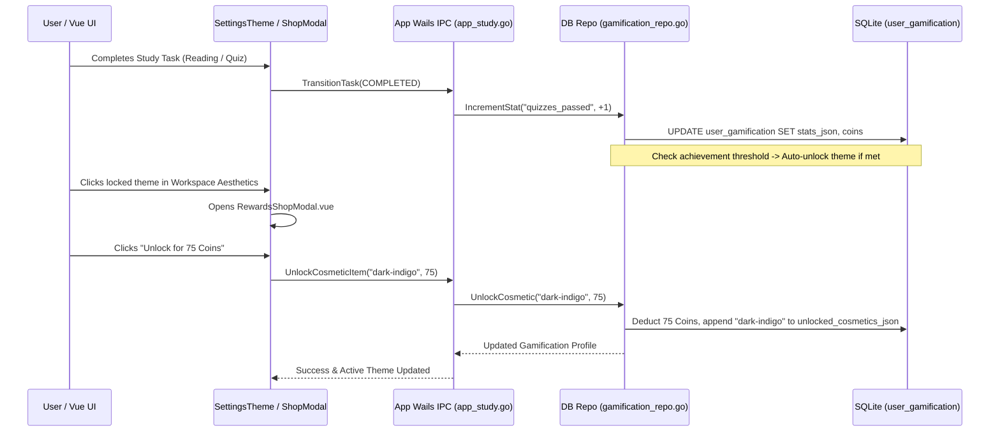

# Gamified Theme Unlocks & Achievement Tracking

## Problem

The gamification system awarded coins and XP for completing study tasks, but coins could only be spent on Streak Freezes. There was no visual outlet or achievement progression system for users to spend coins on customizing their study desk aesthetics or unlocking workspace themes.

## Solution Architecture

We introduced a lightweight **Theme Shop & Achievement System** that connects study rewards to aesthetic desktop customization without compromising performance or modifying core study queue invariants.

### 1. Zero-Lag Achievement Tracking
- Added a `stats_json` column to the `user_gamification` SQLite singleton table (`user_id = 1`).
- On study task transitions (`COMPLETED` event in `queue_transition.go`), incremental counters (`reading_sessions`, `quizzes_passed`, `flashcards_reviewed`) are updated in a single 0.1ms SQLite transaction.
- When stat thresholds are reached, associated rewards (coins, exclusive themes) auto-unlock.

### 2. Workspace Theme Shop & Lock Status
- Default starter themes (`dark-gruvbox`, `light-classic`) remain unlocked by default.
- Additional themes (`dark-indigo`, `dark-emerald`, `light-warm`, `light-sage`) are purchasable for 50–75 Coins.
- Exclusive themes (`dark-obsidian`, `light-monochrome`) are unlocked by completing specific study achievements (*Night Scholar*, *Quiz Master*).
- Theme selection UI (`SettingsTheme.vue`) displays `🔒` lock overlays on locked themes and opens `RewardsShopModal.vue` when clicked.

---

## File Changes Map

| Module / Path | Description |
|---|---|
| `internal/db/schema.go` | Added `stats_json` to `user_gamification` table and default seed `["dark-gruvbox", "light-classic"]` |
| `internal/models/models.go` | Added `StatsJSON` to `GamificationProfile` + `CosmeticItem`, `Achievement`, `GamificationStore` structs |
| `internal/db/gamification_repo.go` | Implemented `UnlockCosmetic`, `IncrementStat`, and `GetGamificationStore` methods |
| `internal/study/queue_transition.go` | Incremented study stats upon task completion (`EventCompleteReading`, `EventSubmitQuiz`, `EventCompleteFlashcards`) |
| `internal/app/app_study.go` | Exposed `UnlockCosmeticItem` and `GetGamificationStore` Wails IPC bindings |
| `frontend/src/components/RewardsShopModal.vue` | Created modal tab interface for Theme Shop purchases and Achievement progress bars |
| `frontend/src/components/SettingsTheme.vue` | Added lock overlays, lock tags, and integration with `RewardsShopModal.vue` |
| `doc/SCHEMA.md` | Documented `stats_json` and updated `user_gamification` table map |

---

## Data Flow Diagram

---

## Verification

- **Unit Tests**: Full test suite (`go test ./internal/...`) passes cleanly. Added unit test cases in `gamification_repo_test.go` covering coin deduction, cosmetic unlocks, and achievement auto-unlocks.
- **Documentation**: Updated `doc/SCHEMA.md` and added this record to `doc/solutions/`.
