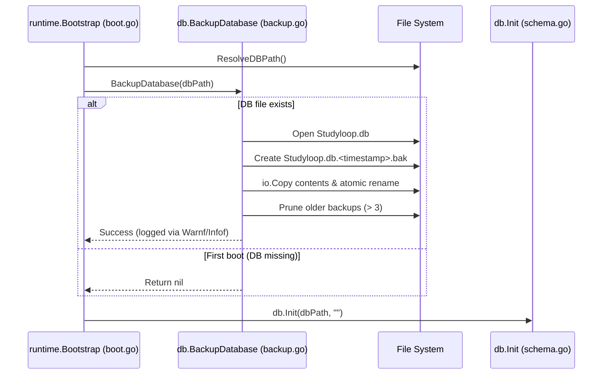

# Startup Database Backup (`Studyloop.db.<timestamp>.bak`)

## Problem

Unexpected system crashes, power loss, or bugs during app operations could potentially corrupt the primary SQLite database (`Studyloop.db`), leading to loss of study progress, flashcards, and user settings. A single static `.bak` file created on each boot risked immediately overwriting a good backup with a corrupted database if the app restarted.

## Solution Architecture

We implemented a lightweight, non-blocking startup database backup mechanism (`db.BackupDatabase`) using a timestamped ring buffer (retaining the last 3 backups) that runs during app bootstrap before any SQLite connections or vec0 extensions are initialized.

### 1. Fail-Safe Startup Backup Function
- In `internal/db/backup.go`, `db.BackupDatabase(dbPath string) error` generates a timestamped copy (e.g. `Studyloop.db.20260915-162831.000.bak`).
- If `Studyloop.db` does not exist (e.g. first app launch), it gracefully returns `nil` without failing.
- Uses atomic temp-file creation and stream copying (`io.Copy`) before placing the backup.
- Automatically prunes older backups using lexical sorting to retain the most recent 3 backups.

### 2. Zero-Lag Boot Integration
- In `internal/runtime/boot.go`, `db.BackupDatabase(dbPath)` is invoked immediately after `ResolveDBPath()` and prior to `db.Init(dbPath, "")`.
- If an error occurs during backup (e.g. permission issues or disk full), it logs a warning via `utils.Warnf` and continues launching the app normally without blocking startup.

---

## File Changes Map

| Module / Path | Description |
|---|---|
| `internal/db/backup.go` | Implemented `BackupDatabase(dbPath)` with timestamped ring buffer & 3-backup retention |
| `internal/db/backup_test.go` | Unit tests for non-existent DB handling, ring buffer creation, and prune retention |
| `internal/runtime/boot.go` | Trigger `db.BackupDatabase` in `runtime.Bootstrap` prior to `db.Init` |

---

## Data Flow Diagram

---

## Verification

- **Unit Tests**:
  - `go test -v ./internal/db -run TestBackupDatabase` verified non-existent file handling and ring buffer pruning.
  - `go test -short ./internal/...` verified repo-wide compilation and test passing.

