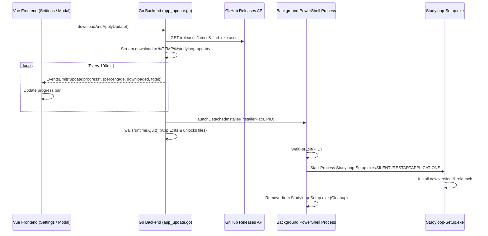

# In-App Auto-Updater & Detached Process Installer

## Problem

Updating Studyloop previously required users to manually open GitHub releases in a browser, download the setup executable, close the app manually, and run the installer. This caused friction and poor user experience.

## Solution Architecture

We implemented a streamlined, self-contained auto-updater system:
1. **GitHub Releases Asset Resolution**: The Go backend queries `https://api.github.com/repos/Vishnuj-n/studyloop/releases/latest` and dynamically matches `.exe` / `Studyloop-Setup.exe` assets.
2. **Chunked Stream Downloader with Live Progress**: Downloads the installer binary to `%TEMP%/studyloop-update/` while emitting real-time percentage progress events (`update:progress`) over the Wails event bus.
3. **Detached Process Spawner & Self-Cleanup**:
   - On Windows, spawns a detached background PowerShell worker (`launchDetachedInstaller`).
   - The detached process waits for the parent Studyloop process PID to terminate (releasing file locks on `Studyloop.exe` and runtime DLLs), runs the setup installer (`/SILENT /CLOSEAPPLICATIONS /RESTARTAPPLICATIONS`), and deletes the installer binary upon completion.
   - The running Studyloop app cleanly triggers `wailsruntime.Quit()`.
4. **Interactive UI**:
   - `SettingsUpdate.vue` provides **"Download & Install Update"** alongside a dynamic progress bar and fallback **"Manual Download (GitHub)"**.
   - `App.vue` startup update modal provides a 1-click **"Update Now"** button with live download tracking.

---

## File Changes Map

| Module / Path | Description |
|---|---|
| `internal/app/app_update.go` | Added `DownloadAndApplyUpdate` method for streaming download, progress emission, and app quit handoff |
| `internal/app/app_update_windows.go` | Windows detached process launcher waiting on parent PID, executing installer, and self-cleaning |
| `internal/app/app_update_other.go` | Cross-platform fallback for non-Windows environments |
| `internal/app/app_update_test.go` | Unit tests for version comparison and GitHub asset candidate filtering |
| `frontend/src/services/appApi.js` | Exported `downloadAndApplyUpdate()` bridge wrapper |
| `frontend/src/components/SettingsUpdate.vue` | Added "Download & Install Update" action button, progress tracking, and event listeners |
| `frontend/src/App.vue` | Added 1-click update flow and progress bar inside the startup update modal |
| `doc/DATA_API.md` | Documented `DownloadAndApplyUpdate` contract |

---

## Data Flow Diagram

---

## Verification & Testing

- **Backend Unit Tests**: `go test -short ./internal/app/...` passed.
- **Whole-Repo Tests**: `go test -short ./internal/...` passed.
- **Frontend Linter**: `npm run lint` passed with 0 errors.
