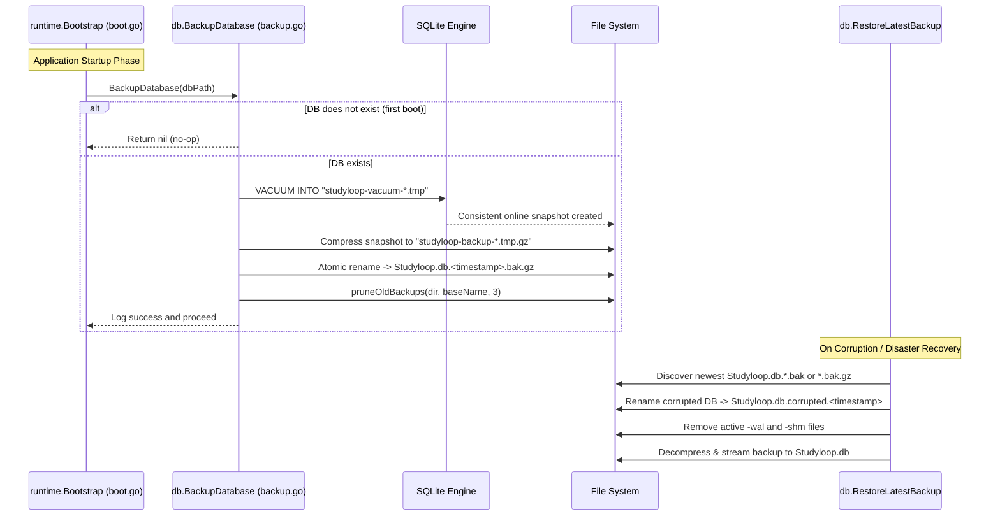

# SQLite Database Backup & Recovery System (`internal/db/backup.go`)

## Overview

Studyloop implements an automated, lightweight startup database backup and disaster recovery subsystem. It produces compressed, timestamped snapshots of `Studyloop.db` using SQLite's online `VACUUM INTO` command, maintains a 3-slot ring buffer retention policy, and provides safe restoration capabilities.

---

## Architecture & Workflow

---

## Detailed Code Operations

### 1. Bootstrap Trigger
- **Location**: [`internal/runtime/boot.go`](file:///c:/Users/vishn/PROJECT/ai-tutor/internal/runtime/boot.go#L59-L63)
- **Lifecycle**: Invoked immediately in `runtime.Bootstrap` after resolving `dbPath` and prior to opening SQLite connection pools or loading native vector (`vec0`) extensions.
- **Fail-Safe**: If backup encounters a non-fatal error (e.g., temporary disk permission), it warns via `utils.Warnf` without interrupting application boot.

### 2. Online Snapshot (`VACUUM INTO`) & Compression
- **Location**: [`internal/db/backup.go:BackupDatabase`](file:///c:/Users/vishn/PROJECT/ai-tutor/internal/db/backup.go#L20-L92) and [`createVacuumSnapshot`](file:///c:/Users/vishn/PROJECT/ai-tutor/internal/db/backup.go#L94-L116)
- **Online Snapshot**: Uses SQLite's `VACUUM INTO ?` against a temporary file to produce a defragmented, consistent point-in-time copy of the database even while WAL mode is active.
- **Graceful Fallback**: If `VACUUM INTO` cannot be executed, it safely falls back to direct read-stream copying from `dbPath`.
- **Gzip Compression**: Streams the snapshot through `compress/gzip` into a staging file (`studyloop-backup-*.tmp.gz`).
- **Atomic Placement**: Renames the staging file atomically to `Studyloop.db.<timestamp>.bak.gz` (`YYYYMMDD-HHMMSS.fff` timestamp format).

### 3. Ring Buffer Pruning
- **Location**: [`internal/db/backup.go:pruneOldBackups`](file:///c:/Users/vishn/PROJECT/ai-tutor/internal/db/backup.go#L118-L137)
- **Pattern Matching**: Discovers all files matching `Studyloop.db.*.bak` and `Studyloop.db.*.bak.gz`.
- **Chronological Sorting**: Sorts filenames lexicographically by timestamp.
- **Retention Limit**: Retains the newest 3 backups (`maxBackups = 3`) and automatically deletes all older backups (`matches[:len(matches)-keep]`).

### 4. Disaster Recovery & Restoration
- **Location**: [`internal/db/backup.go:RestoreLatestBackup`](file:///c:/Users/vishn/PROJECT/ai-tutor/internal/db/backup.go#L140-L192)
- **Candidate Discovery**: Searches for existing `.bak` and `.bak.gz` files and selects the most recent timestamped copy.
- **Corrupted State Preservation**: Moves the existing damaged DB to `Studyloop.db.corrupted.<timestamp>` and purges stale `-wal` and `-shm` sidecar files.
- **Streaming Restoration**: Decompresses (if `.bak.gz`) or stream copies the backup into `Studyloop.db`.

---

## File & Function Reference

| Function / File | Responsibility |
|---|---|
| [`BackupDatabase(dbPath)`](file:///c:/Users/vishn/PROJECT/ai-tutor/internal/db/backup.go#L20) | Orchestrates snapshot generation, gzip compression, atomic file write, and retention pruning. |
| [`createVacuumSnapshot(dbPath, destDir)`](file:///c:/Users/vishn/PROJECT/ai-tutor/internal/db/backup.go#L94) | Runs SQLite `VACUUM INTO` on a temporary path to guarantee database integrity. |
| [`pruneOldBackups(dir, baseName, keep)`](file:///c:/Users/vishn/PROJECT/ai-tutor/internal/db/backup.go#L118) | Enforces 3-file ring buffer retention over both `.bak` and `.bak.gz` archives. |
| [`RestoreLatestBackup(dbPath)`](file:///c:/Users/vishn/PROJECT/ai-tutor/internal/db/backup.go#L140) | Quarantines corrupted files and restores the latest snapshot. |
| [`internal/db/backup_test.go`](file:///c:/Users/vishn/PROJECT/ai-tutor/internal/db/backup_test.go) | Unit tests verifying ring buffer retention, vacuum snapshotting, gzip verification, and database restoration. |
