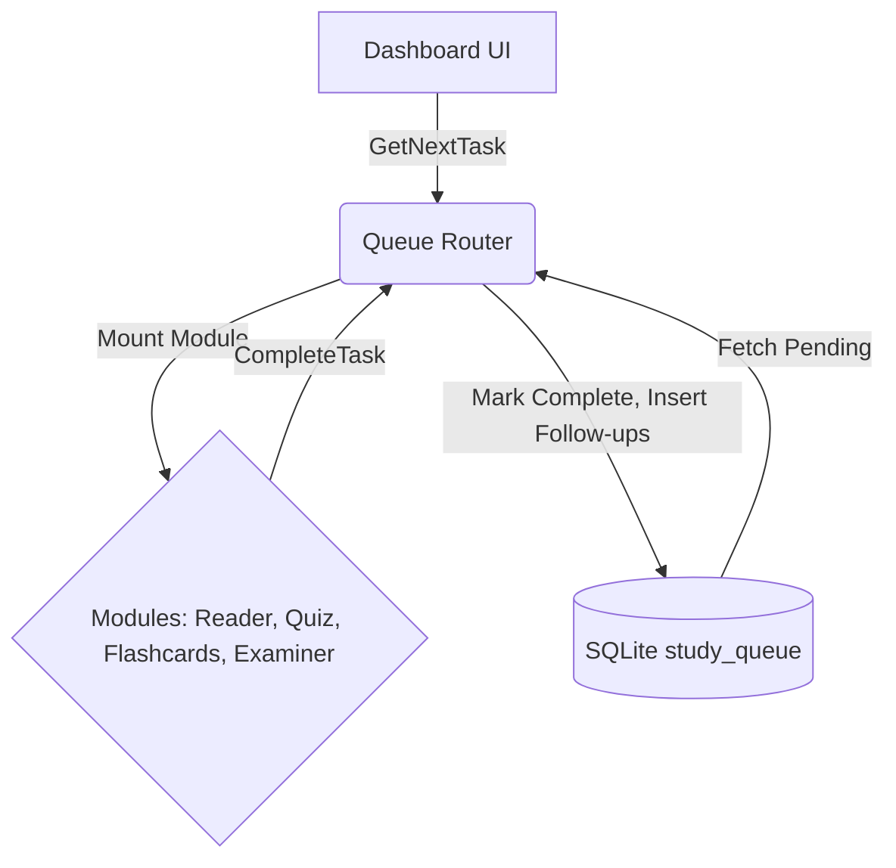
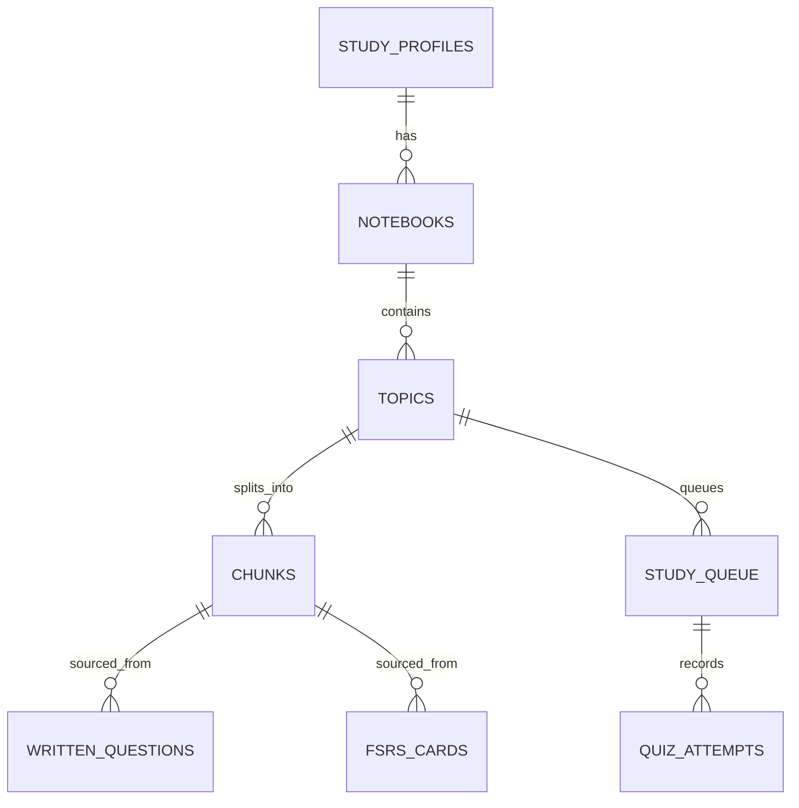

# StudyLoop Technical Documentation

## Executive Summary
StudyLoop is a local-first desktop application designed to serve as a guided tutor system. It is explicitly not an autonomous AI orchestrator, chatbot, or open-ended knowledge retrieval system.
The motivation behind the project is to keep user data private by default, minimize decision fatigue through a deterministic and highly structured daily workflow, and provide an easily maintainable architecture for a solo developer.
Target users include self-directed learners, students, and professionals needing offline-first study materials structured to optimize both immediate comprehension and long-term retention.

Major capabilities:
- **Persistent SQLite-backed study queue**: The core engine of the system (no in-memory orchestrators).
- **Deterministic sliding-window chunking**: Processes PDFs without relying on AI for semantic boundaries.
- **Synchronous LLM-generated quizzes**: Validates immediate comprehension.
- **FSRS-driven flashcard generation and reviews**: Ensures long-term retention (via `go-fsrs`).
- **2-strike Socratic rescue pipeline**: Specialized remediation for failed materials, optionally integrating external LLMs.
- **Local RAG pipeline**: Grounded strictly in the active topic using ONNX Runtime.
- **Secure API key storage**: Via OS keyring and multi-tier LLM configurations (`Fast` vs `Heavy`).

Current maturity:
The MVP is operational for Windows-first environments (via native `.dll` extensions for `onnxruntime` and `sqlite-vec`). It heavily focuses on stability, debuggability, and testable deterministic queue rules.

Completed features:
RAG, queue foundation, AI cleanup fallback, multi-notebook priority, sync quiz generation, 2-strike Socratic rescue, Examiner written assessment, Cloud sync telemetry, adaptive token-budget reading windows, and streak calendar tracking.

Limitations & Work in Progress:
macOS/Linux native platform support constraints (currently requires CGO). No semantic boundary chunking. The rigid lack of autonomous AI flow control is intentional but restricts open-ended exploration.


------------------------------------------------------------

## Problem Statement

Learners working with complex material (textbooks, slides, papers) often suffer from a lack of structured progression and poor long-term retention. Existing solutions typically fall into these failure modes:
1. They require manual, tedious creation of study material (e.g., traditional Anki).
2. They act as overly conversational but distractible AI tutors (chatbots) that lose context, hallucinate, or fail to enforce mastery.
3. They mandate cloud processing, compromising data privacy and requiring constant internet access.

StudyLoop solves this by enforcing a Guided Learning Workflow driven by a deterministic queue.

Design goals include:
1. **"Data, not Engines"**: All flow control is persistent in SQLite. There are no hidden in-memory state machines, daemon auto-balancers, or autonomous agents determining the user's path.
2. **Complete Privacy**: Local storage and inference where possible.
3. **Strict Context Scoping**: AI answers questions based ONLY on the currently active reading material.

Constraints:
Keep the system simple for solo maintainability and keep all interactions bounded by synchronous transitions (Reading → Quiz → Review/Rescue).


------------------------------------------------------------

## Overall System Architecture

StudyLoop adopts a modular architecture separating the frontend Desktop UI from the backend services via a Wails bridge. The entire flow revolves around the SQLite `study_queue`.

High-level Modules:
- **Desktop Shell/Backend (Go + Wails):** Hosts SQLite, local ONNX embedding inference, LLM API client, ingestion tools (PDF CPU), and core business logic.
- **Frontend (Vue 3):** A multi-page SPA acting as a thin presentation layer. State resides strictly on the backend.
- **Queue Router:** The core routing logic. Queries `study_queue`, mounts the Vue component matching the `task_type`, and on completion, processes follow-up tasks according to rigid deterministic rules.
- **RAG & Inference:** Uses `sqlite-vec` (via the `vec0` extension) for vector storage and `yalue/onnxruntime_go` for local embedding computation.
- **Scheduler (FSRS):** Computes spaced repetition due dates. It acts strictly as an algorithm, leaving queue insertion to the core application logic.

Communication Flow:
UI dispatches commands over Wails bridge → Go backend executes database updates / LLM generation → Backend triggers queue insertion → UI refreshes to fetch the next pending task.

Request Lifecycle:
Dashboard queries next task -> Task goes `ACTIVE` -> User completes action in Reader/Quiz/Flashcard -> System marks `COMPLETED` and calculates next deterministic state -> Next task is inserted.




------------------------------------------------------------

## Repository Structure

The repository is structured as a Go Wails application with a Vue 3 frontend.

- `cmd/`: Contains entrypoints for auxiliary services.
  - `cmd/cloud-server/`: Supabase functions testing.
  - `cmd/test-llm/`: CLI tool for testing LLM configurations.
- `doc/`: The canonical source of technical documentation (`ARCHITECTURE.md`, `SCHEMA.md`, `APP_FLOW.md`, `SPRINT.md`, etc.). Used as a reference.
- `internal/`: The Go backend core.
  - `internal/app/`: The Wails application lifecycle (`app.go`), endpoint definitions bridging to Vue (`app_study.go`, `notebook_endpoints.go`).
  - `internal/db/`: All SQLite database operations, schema definitions, and repository logic (`store.go`, `study_queue_repo.go`).
  - `internal/embeddings/`: ONNX runtime integration for local INT8 embedding generation and prompt tokenization (`onnx.go`).
  - `internal/llm/`: LLM provider integrations (OpenAI compatible) and OS keyring credential management (`provider.go`, `keyring.go`).
  - `internal/notebook/`: PDF upload, text extraction (`pdfcpu.go`), and sliding-window chunking (`ingestion.go`).
  - `internal/retrieval/`: The RAG search and retrieval engine mapping queries to vector IDs (`engine.go`, `indexer.go`).
  - `internal/runtime/`: Application bootstrapping, config directory resolution, and RAG asset downloading/staging (`boot.go`, `asset_manager.go`).
  - `internal/scheduler/`: Integration with `go-fsrs` for spaced repetition scheduling (`fsrs.go`).
  - `internal/study/`: Core business logic implementing Reading, Quiz scoring, Remediation loops, and Cloud Sync logic (`service.go`, `quiz_sync.go`, `socratic_rescue.go`).
  - `internal/utils/`: Shared utilities (`hash.go`).
- `frontend/`: The Vue 3 application.
  - `frontend/src/pages/`: Contains thin components mapping to queue tasks (`Dashboard.vue`, `Reader.vue`, `Quiz.vue`, `Flashcards.vue`, `SocraticRescue.vue`, `WrittenAssessment.vue`).
  - `frontend/src/components/`: Reusable Vue components (`BaseButton.vue`, `StudyPageLayout.vue`).
- `cloud-dashboard/`: A separate Vue 3 + Vite project meant for a Supabase-backed teacher/telemetry dashboard.
- `asset/`: Directory for required runtime assets (like `tokenizer.json`, `onnxruntime.dll`, `vec0.dll`).
- `scripts/`: Utilities for building and syncing dependencies.


------------------------------------------------------------

## Technology Stack

- **Language:** Go 1.26 (Backend) / JavaScript (Frontend)
- **Frameworks:** Wails v2 (Desktop binding), Vue 3 (Frontend)
- **Libraries (Go):**
  - `mattn/go-sqlite3`: SQLite driver.
  - `google/uuid`: UUID generation.
  - `open-spaced-repetition/go-fsrs/v4`: Spaced repetition algorithm.
  - `yalue/onnxruntime_go`: Local ONNX inference.
  - `zalando/go-keyring`: OS keyring access.
  - `ledongthuc/pdf`: PDF parsing.
- **Libraries (Vue):** `vue-router`, `markdown-it`, `dompurify`, `vue-pdf-embed`.
- **Database:** SQLite with `sqlite-vec` extension (`vec0`). Single persistent connection pool.
- **AI Libraries:** `onnxruntime` for embeddings. Standard HTTP for LLMs.
- **Embedding Models:** Local INT8 Sentence Transformers model (`model_int8.onnx`).
- **LLMs:** OpenAI-compatible REST API endpoints. Configured as Dual-Tier: `Fast` (Groq/OSS for RAG/Explanations) and `Heavy` (OpenAI/Advanced for Quiz generation).
- **Build System:** Wails build (Vite for frontend bundling). Requires CGO for extensions.
- **Cloud Dependencies:** Optional Supabase Postgres database for telemetry syncing (`handle_cloud_sync` RPC).

### Why each technology was selected:
- **Wails + Go + Vue:** Enables a single-binary, cross-platform native feel with high performance and familiar web UI tooling. Go is excellent for the concurrent backend logic, while Vue 3 provides a reactive, modern frontend.
- **SQLite + sqlite-vec:** Removes the need for running separate vector DB containers or services, perfectly fitting the local-first, privacy-centric ethos.
- **Dual-tier LLM Setup:** Balances cost and speed without requiring heavy local VRAM overhead for generation, allowing users to configure a fast, cheap model for RAG and a smarter, heavier model for quizzes.
- **ONNX Runtime:** Allows local, fast embedding generation on CPU without relying on cloud APIs, ensuring RAG works offline.


------------------------------------------------------------

## Configuration

- `.env.example` / `.env`: Defines LLM API keys (`FAST_LLM_API_KEY`, `HEAVY_LLM_BASE_URL`), Model strings, and optional cloud sync endpoints (`CLOUD_SYNC_URL`, `CLOUD_API_TOKEN`). Used as fallback if DB settings are empty or during development.
- `wails.json`: Configures the Wails build tool, defining the project name (`Studyloop`), output filename, npm commands for frontend building, and explicitly requiring the `sqlite_extension` build tag for CGO.
- `frontend/package.json`: Vite-based Vue project configuration. Scripts for `dev`, `build`, `lint`, and `test` (Vitest). Lists all frontend dependencies.
- `go.mod`: Go module requirements locking specific versions of `go-fsrs`, `onnxruntime_go`, `go-sqlite3`, etc., and setting Go version to 1.26.
- **Database `user_settings` table:** Acts as a singleton configuration for app settings like `rag_enabled`, `default_remedial_strategy`, `theme`, and `max_flashcards_per_session`.
- **Database `llm_settings` table:** Stores tier-specific LLM configurations (Fast/Heavy provider, URL, model string, timeout).


------------------------------------------------------------

## Database Design

The data model relies heavily on SQLite. The schema avoids auto-increment IDs in favor of UUIDs. The `study_queue` table acts as the system's central scheduler.

### ER Diagram Overview


### Core Tables & Relationships

#### `study_queue`
The central queue driving all user flows.
- `id` (TEXT PK): Unique task identifier.
- `task_type` (TEXT): Enum of `READING`, `QUIZ`, `REREAD`, `FLASHCARD_REVIEW`, `MILESTONE_EXAM`, `EXAMINER`, `SOCRATIC_REMEDIAL`, `FLASHCARD_GENERATE`.
- `block_id` (TEXT): Reference to content block (chunk, quiz_set, etc.).
- `related_id` (TEXT): Optional related topic identifier.
- `status` (TEXT): `PENDING`, `ACTIVE`, `COMPLETED`.
- `priority` (INTEGER): Task priority (lower = higher priority).
- `created_at` (INTEGER): Unix timestamp.
- `completed_at` (INTEGER): Unix timestamp.

#### `notebooks`
- `id` (TEXT PK)
- `file_path` (TEXT NOT NULL)
- `priority` (INTEGER DEFAULT 5): Notebook priority bias (higher = more frequent).
- `profile_id` (TEXT): FK -> `study_profiles(id)`.

#### `topics`
- `id` (TEXT PK)
- `title` (TEXT)
- `external_help_required` (BOOLEAN): Flag for topics needing external review after failed Socratic rescue.

#### `chunks` (Legacy: `blocks`)
- `id` (TEXT PK)
- `topic_id` (TEXT): FK -> `topics(id)`.
- `chunk_text` (TEXT)
- `page_num` (INTEGER)
- `token_count` (INTEGER)
- `embedding_ref` (INTEGER): Vector store reference mapping to sqlite-vec virtual table.

#### `fsrs_cards` & `fsrs_review_log`
- Tracks long-term retention. Stores `state_json` holding the FSRS memory state.

#### `user_settings`
- Singleton table (id=1). Contains `rag_enabled`, `default_remedial_strategy`, `theme`, etc.

### Vector Storage (`sqlite_vec`)
- Embeddings are stored in a `vec0` virtual table with integer rowids.
- `chunks.embedding_ref` holds the reference.
- All embeddings are JSON-serialized before DB binding since `database/sql` doesn't support float slices directly.

------------------------------------------------------------

## Data Model

- **Task:** Represents a step in the study loop (`READING`, `QUIZ`, `REREAD`, `FLASHCARD_REVIEW`, `MILESTONE_EXAM`, `SOCRATIC_REMEDIAL`, `EXAMINER`, `FLASHCARD_GENERATE`). Moves from `PENDING` -> `ACTIVE` -> `COMPLETED`/`FAILED`.
- **Notebook:** Represents an uploaded textbook or document.
- **Topic:** A subset/chapter of a Notebook.
- **Chunk (Legacy: Block):** A deterministically sized textual representation of the topic (~2500 words).
- **FSRS Card:** An Anki-style flashcard mapped to a source chunk with FSRS state payload.


------------------------------------------------------------

## Backend Architecture

The system is strictly separated into a Go backend managing the database, local AI, and study business logic, and a Vue frontend rendering the active task.

### Key Backend Components:
- **Dependency Injection:** Services are instantiated in `internal/runtime/boot.go` and passed as dependencies (e.g., `StudyService` receives `Repo`, LLM Providers, and `RetrievalEngine`).
- **Repositories (`internal/db`):** All SQL statements live here. Handled explicitly with `database/sql`. Single connection pool `MaxOpenConns(1)` due to `sqlite-vec` limitations. For instance, `study_queue_repo.go` handles CRUD for tasks.
- **Services (`internal/study`, `internal/notebook`):** Encapsulate business logic. E.g., `CompleteTask` in `internal/study/service.go` handles the state transition of a queue item and inserts follow-up items based on results.
- **LLM Adapters (`internal/llm/provider.go`):** Synchronous HTTP wrappers for OpenAI-compatible APIs, resolving credentials from the keyring.
- **Error Handling & Logging:** Errors are wrapped and logged using `internal/utils` (`utils.Errorf`, `utils.Infof`). They propagate to the Wails bridge to be shown in the UI.

------------------------------------------------------------

## Frontend Architecture

### Key Frontend Components:
- **Pages (`frontend/src/pages`):** Direct maps to task types (Dashboard, Reader, Quiz, Flashcards, SocraticRescue, WrittenAssessment).
- **State Management:** Handled largely by the backend. The frontend queries the backend via Wails auto-generated bindings (`frontend/src/services/appApi`). Pinia is rarely used.
- **Routing:** Governed by the Queue Router pattern. The user clicks a task on the Dashboard, which routes to the corresponding Vue page, passing the `taskId` as a query parameter. The Reader module, for instance, does not route to Quiz. It signals completion to the backend, which inserts the Quiz task, and routing returns to the Dashboard.


------------------------------------------------------------

## AI Pipeline

The AI pipeline is strictly bounded, topic-scoped, and synchronous.

- **Embeddings:** Local ONNX runtime (`internal/embeddings`) utilizing `asset/model_int8.onnx`.
- **Vector Storage:** `sqlite-vec` virtual tables linked via `embedding_ref` in the `chunks` table.
- **Retrieval (RAG):** When a user asks a question in the Reader (Ask AI panel), the query is embedded, and a vector similarity search retrieves the top-K chunks scoped *only* to the currently active `topic_id`. No cross-topic global search exists.
- **Prompt Construction:** Combines the user question, topic metadata, and retrieved chunks within a strict token budget.
- **LLM Calls:** Handled by `internal/llm/provider.go`. Calls are fully synchronous HTTP requests to OpenAI-compatible endpoints. No streaming is implemented to preserve simplicity and deterministic state.
- **Tool Calling/Memory:** Explicitly avoided. This is a guided tutor, not a conversational agent. Memory is handled structurally via FSRS.


------------------------------------------------------------

## Complete Execution Flow

### Application Lifecycle:
1. **Startup (`main.go`):** Wails boots. `runtime.Bootstrap(ctx)` is invoked.
2. **Configuration Loading:** Resolves data directories (`~/.Studyloop` or `dev_data`), loads `.env`.
3. **Dependency Initialization:**
   - `AssetManager` verifies `onnxruntime` and `vec0.dll`.
   - `db.Init` establishes a single SQLite connection and loads the `vec0` extension.
   - Embedder, Retrieval Engine, LLM Providers, Scheduler (FSRS), and StudyService are instantiated.
4. **API Initialization:** Wails binds the `App` struct, exposing its methods to the Vue frontend.
5. **Background Jobs:** `StartCloudSyncLoop` begins polling for unsynced FSRS logs.
6. **User Interaction:** Frontend mounts. Dashboard queries `GetNextTask()`. The queue router dictates the flow.
7. **Task Completion:** User finishes reading. Clicks complete. Backend closes reading task, invokes LLM to generate quiz synchronously (showing a spinner), and inserts `QUIZ` task. Dashboard regains control.
8. **Shutdown:** Wails intercepts window close, safely closing the DB connection to prevent lock issues.


------------------------------------------------------------

## Feature-by-Feature Breakdown

### 1. Ingestion Pipeline
- **Purpose:** Convert uploaded PDFs into deterministic study chunks.
- **Files:** `internal/notebook/ingestion.go`, `pdfcpu.go`
- **How implemented:** Extracts text via PDFCPU, attempts LLM chapter cleanup (with fallback to bookmarks/single chapter), splits text via a sliding window (2500 words, 200 overlap), and inserts `READING` tasks into `study_queue`.
- **Design Decisions:** Deterministic sliding window chosen over semantic AI chunking to ensure speed, predictability, and offline capability.

### 2. Spaced Repetition (Flashcards)
- **Purpose:** Long-term retention of learned concepts.
- **Files:** `internal/scheduler/fsrs.go`, `internal/study/flashcard.go`, `frontend/src/pages/Flashcards.vue`
- **How implemented:** Uses `go-fsrs/v4`. New cards start in a clean "Review" state with day-based offsets (1 day for pass, 3 days for ace) to bypass intraday learning phases.
- **Data Flow:** User rates card (Again, Hard, Good, Easy) -> FSRS math calculates next interval -> `FLASHCARD_REVIEW` task inserted into `study_queue` for the future date. FSRS acts as a math algorithm, not an orchestrator.

### 3. Socratic Rescue (2-Strike Pipeline)
- **Purpose:** Prevent users from endlessly failing quizzes without external help.
- **Files:** `internal/study/quiz_sync.go`, `socratic_rescue.go`, `frontend/src/pages/SocraticRescue.vue`
- **How implemented:** Tracks `reread_attempts`. On 2nd quiz failure, deletes FSRS cards for the topic and inserts a queue-blocking `SOCRATIC_REMEDIAL` task.
- **Design Decisions:** Provides a pre-engineered prompt for the user to copy-paste into an external LLM (like ChatGPT) rather than executing locally. This saves token costs and handles complex remediation gracefully. Unblocks queue after user confirms completion, generating a re-quiz task.

### 4. Milestone Exams
- **Purpose:** Cumulative mastery check.
- **Files:** `internal/study/examiner.go`, API payloads
- **How implemented:** Automatically inserted after 10 completed quizzes for a notebook. Aggregates questions from the previous 10 quiz JSON payloads. Evaluates mastery without requiring new LLM generation. Deduplicates against existing milestone exams.

### 5. Cloud Sync
- **Purpose:** Telemetry and cross-student analytics for teachers.
- **Files:** `internal/study/sync.go`
- **How implemented:** Delta sync of `fsrs_review_log` entries via a Supabase RPC payload. Replaces local UUIDs with stable identifiers (SHA-256 file hashes and page numbers).
- **Fallbacks:** On sync failure, inserts a top-priority `FLASHCARD_GENERATE` (legacy name for sync recovery) task to ensure data isn't lost.


------------------------------------------------------------

## Algorithms

- **Sliding Window Chunking:** Deterministic text splitting. Inputs: Text string. Outputs: Array of chunks (~2500 words, 200 overlap). Design rationale: Simple, fast, non-AI reliant.
- **FSRS (Free Spaced Repetition Scheduler):** Sophisticated spaced repetition algorithm tracking memory stability and retrievability based on user ratings (Again, Hard, Good, Easy).
- **Anti-Starvation Balancing:** Not a complex math algorithm, but a deterministic SQL ordering rule. Ensures `READING` tasks surface after every 5 `FLASHCARD_REVIEW` or `REREAD` tasks to prevent review pileups from halting forward progress. Implemented at query-time in Dashboard logic.
- **Token Budgeting:** Allocates LLM prompt space. Prioritizes the system instructions and user query, then fits as many retrieved RAG chunks as possible up to the configured token limit, dropping lower-ranked chunks.

------------------------------------------------------------

## Important Classes (Go Structs)

- **`App` (`internal/app/app.go`):** The Wails bridge structure. Holds mutexes, the database repository, LLM providers, embedder, and study service. Exposes all frontend-callable methods.
- **`Repository` (`internal/db/store.go`):** Wraps `*sql.DB`. Contains all SQL query strings and executes them safely. Manages the connection pool size (strictly 1). Contains `GetNextTask`, `UpdateUserSettings`, etc.
- **`StudyService` (`internal/study/service.go`):** The core business logic orchestrator. Implements `CompleteTask`, triggering the correct follow-up logic based on task type.
- **`Provider` (`internal/llm/provider.go`):** Abstraction for OpenAI-compatible APIs. Handles synchronous HTTP requests, JSON parsing, and error wrapping.
- **`OnnxEmbedder` (`internal/embeddings/onnx.go`):** CGO wrapper around `onnxruntime`. Loads the INT8 model, tokenizes input via HF format, and returns float32 vectors.
- **`AssetManager` (`internal/runtime/asset_manager.go`):** Responsible for validating the existence of required `asset/` files and staging `.dll`s on Windows.


------------------------------------------------------------

## APIs

The internal API acts via Wails IPC bridging (localhost). The Go methods bound to Wails are the "API".

### Key Wails Endpoints:
- `GetNextTask()`: Returns the highest priority pending task from `study_queue`. No arguments. Returns Task struct or error.
- `CompleteTask(taskID, result)`: Evaluates task payload and inserts required next steps. Validates `taskID` exists and is `ACTIVE`.
- `SkipTask(taskID)`: Marks task as skipped (auditable). No follow-ups inserted.
- `ProcessPDF(filePath)`: Triggers text extraction and chunking. Returns topic ID.
- `AskQuestion(topicID, question)`: Triggers local RAG pipeline. Returns LLM text with citation chunks.
- `GetStreakState(timezoneOffsetMinutes)`: Calculates current/longest streaks using local timezone offsets.
- `CompleteSocraticRescue(taskID)`: Marks `SOCRATIC_REMEDIAL` complete, inserts fresh QUIZ task.
- `CompleteMilestoneExam(taskID, answers)`: Evaluates answers against correctness arrays in the task payload JSON.

Authentication is implicitly handled locally (no auth required for IPC). Errors propagate to the UI as generic strings (`ErrNotFound`, `ErrLLMUnavailable`).


------------------------------------------------------------

## Internal Workflows

- **Background Jobs:** Only one exists—the Cloud Sync loop, which runs periodically to post `fsrs_review_log` deltas to the Supabase endpoint (`handle_cloud_sync`). No other daemon loops are permitted.
- **Processing Pipeline:** PDF Upload → `pdfcpu` Text Extraction → LLM Chapter Cleanup (Fallback: Bookmarks → Fallback: General) → Sliding Window Chunking → `chunks` DB Insert → `study_queue` READING Tasks Insert.
- **Adaptive Token-Budget Reading Windows:** Computes reading minute budgets into token budgets to normalize sparse slides vs dense textbooks.

------------------------------------------------------------

## Design Decisions

1. **SQLite + sqlite-vec natively over a separate vector DB container.**
   - *Problem:* Running Docker or separate services for vector DBs is too complex for a local desktop app.
   - *Chosen Approach:* Compile `sqlite-vec` as a native extension.
   - *Tradeoffs:* Requires strict single connection pool (`MaxOpenConns(1)`) and CGO compilation (hard cross-compilation).
   - *Advantages:* Zero-config local installation for end users. Fast, unified transactional storage.

2. **Deterministic Queue vs AI Orchestration.**
   - *Problem:* AI agents (e.g., LangChain) orchestrating flow can hallucinate, get stuck in loops, or confuse the user.
   - *Chosen Approach:* "Data, not Engines." A strict SQL priority queue where tasks are explicit.
   - *Tradeoffs:* Less flexible to completely open-ended user queries.
   - *Advantages:* Highly debuggable, auditable, and perfectly predictable study flows.

3. **2-Strike Socratic Rescue avoiding local LLMs.**
   - *Problem:* Students failing concepts repeatedly need deep Socratic remediation, which requires heavy, expensive LLMs that might exceed the user's Fast/Heavy API budgets or capabilities.
   - *Chosen Approach:* Provide an engineered prompt alongside the source text, requiring the user to copy it to an external LLM (ChatGPT/Claude), then return to take a re-quiz.
   - *Tradeoffs:* UX disruption (copy-pasting).
   - *Advantages:* Ensures high-quality remediation without bloating the app's token costs or prompt complexity.


------------------------------------------------------------

## Documentation vs Implementation

- **Legacy Table Names:** Documentation (like older architecture charts) frequently refers to `blocks` and `block_vectors`. The codebase (`doc/SCHEMA.md` and Go structs) has migrated to `chunks` and `sqlite-vec` respectively. Current implementation uses `chunks`, though API payloads and frontend components still occasionally use the term `block_id`.
- **RAG Architecture Limits:** While `doc/RAG.md` suggests heuristic scoring for weak-area boosting (V2), the implementation currently relies on basic lexical/vector pass-throughs.
- **FSRS Simulation:** `doc/ARCHITECTURE.md` accurately reflects that FSRS calibration bypasses the intraday learning phase and uses hard-coded offsets based on quiz score (1 day, 3 days) implemented in `internal/study/flashcard.go`.
- **Priority Tiers:** Older docs mention task priority ordering differently, but current `study_queue_repo.go` implements strict `CASE task_type` ordering (Generate=7, Socratic=6, Review=5, Reread=4, Quiz=3, Milestone=2, Reading=1, Examiner=0).

------------------------------------------------------------

## External Dependencies

- **`mattn/go-sqlite3` & `sqlite-vec`:** Storage layer. Core to the entire application.
- **`yalue/onnxruntime_go`:** Local INT8 embedding generation. Enables offline RAG.
- **`open-spaced-repetition/go-fsrs/v4`:** Spaced Repetition math.
- **`ledongthuc/pdf`:** (pdfcpu logic) High performance local PDF parsing.
- **`wailsapp/wails/v2`:** Application windowing and frontend-backend IPC bridging.
- **`vue` / `vite`:** Frontend framework and bundler.
- **Supabase (Optional Cloud):** For telemetry syncing (Postgres backend).


------------------------------------------------------------

## Performance Considerations

- **Memory/VRAM:** Local embedding utilizes ONNX INT8 to keep RAM usage under ~500MB. Text generation is offloaded to remote APIs to avoid requiring heavy GPUs on the student's machine.
- **Database Efficiency:** The `sqlite-vec` implementation enforces a connection pool of 1. While this is slow for high-concurrency web servers, it is perfectly adequate for a single-user desktop application.
- **Startup Time:** Loading the ONNX session and the `vec0` DLL introduces a small startup latency, shielded by Wails initialization screens and the `AssetManager`.
- **Vector Query Complexity:** O(N) where N is the chunks mapped to a single topic, keeping latency under 100ms for topic-scoped RAG.

------------------------------------------------------------

## Security

- **Authentication/Authorization:** The app is local-first, single-user. No complex auth required locally. Cloud Sync endpoints use basic JWT/Token headers (`CLOUD_API_TOKEN`).
- **Secrets:** API keys are securely stored in the native OS keyring via `zalando/go-keyring`. They are not exposed in plain text in config files (unless using `.env` for dev overrides).
- **SQL Injection:** Mitigated entirely by using Go `database/sql` parameterized queries.
- **Prompt Injection:** Not strictly handled given the local-first nature; users prompt injecting themselves only affects their own study flow.
- **Local Isolation:** No open network ports. Wails bridge communicates only within the localized process.


------------------------------------------------------------

## Error Handling

- **LLM Failures (Quiz):** Marked as explicit failure state on the task (`FAILED`). User is presented with a retry button on the Dashboard.
- **LLM Failures (Cleanup):** Silent fallback to bookmark chapters or a single generic chapter to ensure the ingestion pipeline doesn't break.
- **Cloud Sync Failures:** Handled gracefully via retries and the generation of a `FLASHCARD_GENERATE` queue task to prevent silent data loss.
- **Recovery:** Active tasks older than 30 minutes revert to pending on app startup to prevent lockups.

------------------------------------------------------------

## Testing

- **Current Tests:** Unit and integration tests reside alongside packages (e.g., `internal/app/app_test.go`, `internal/study/quiz_flashcard_test.go`). Frontend tests utilize Vitest and Vue Test Utils (`Reader.spec.js`, `Quiz.spec.js`).
- **Coverage:** Core queue deterministic behaviors, FSRS day offsets, and database repositories are highly tested.
- **Missing tests:** Edge cases in ONNX embedding loading across architectures.


------------------------------------------------------------

## Known Limitations

- **Cross-Compilation:** Requires CGO for SQLite extensions, making cross-compilation from macOS/Linux to Windows complex. Windows is the primary MVP platform.
- **Database Concurrency:** The strict 1 connection pool in SQLite can cause deadlocks if a developer inadvertently attempts concurrent transactions.
- **Chunking Context:** Sliding-window chunking breaks semantic meaning across paragraph boundaries, occasionally splitting concepts awkwardly.

------------------------------------------------------------

## Future Work

- **Planned:** macOS and Linux native `.dylib` / `.so` library bundling and build constraints. Schema UUID audit.
- **Possible:** Implementing semantic chunk boundaries instead of sliding windows. Moving generated Quiz state into a dedicated `quiz_sets` table instead of relying on task JSON payloads.
- **Research Ideas:** Integrating fully local Small Language Models (SLMs) for generation to remove the need for external API keys entirely.


------------------------------------------------------------

## IEEE Conference Paper Preparation Notes

- **Research Problem:** Balancing guided instruction, long-term memory retention, and user privacy in AI-assisted educational software without falling back to unstructured chatbot interfaces.
- **Novel Contribution:** A deterministic, SQLite-backed, persistent queue architecture that strictly separates scheduling rules from LLM generative capabilities, eliminating "hallucinated orchestration" in AI tutors.
- **Innovation:** Integrating advanced spaced repetition (FSRS) and RAG natively into a local SQLite queue system to create a self-contained, privacy-preserving study loop.
- **System Architecture Summary:** A Go/Vue local-first application utilizing deterministic sliding-window chunking, on-device vector embeddings (`sqlite-vec`), and explicit state-machine flow control (Reader → RAG → Quiz → Spaced Repetition/Socratic Rescue).
- **Methodology:** Implementation of a strict priority-ordered queue system managing task transitions.
- **Implementation Details:** Wails desktop binding, Go backend, Vue 3 frontend, CGO-compiled `sqlite-vec`, and ONNX runtime for local inference.
- **Experimental Methodology Suggestions:** A/B testing students using the deterministic queue vs. open-ended ChatGPT interactions for material retention. Measuring FSRS recall rates over a semester.
- **Evaluation Metrics:** Quiz pass rates, FSRS retention percentage, time-on-task, and API token cost analysis.
- **Possible Baselines:** Traditional Anki (manual creation), standard ChatGPT (unstructured AI), and standard static PDFs.
- **Threats to Validity:** Chunking strategy relies on sliding windows which might strip context needed by the LLM.
- **Future Work:** Integration of local SLMs.
- **Potential Paper Title Ideas:** "Data, Not Engines: A Deterministic Queue-Driven Architecture for Local-First AI Tutors"
- **Potential Abstract Outline:** Introduction to the problem of AI tutor hallucination and privacy. Description of the StudyLoop architecture (SQLite queue, local ONNX embeddings). Explanation of the study loop (Read, Quiz, Review, Rescue). Discussion of implementation and future local SLM integration.
- **Potential Keywords:** AI Tutor, RAG, Spaced Repetition, FSRS, SQLite-vec, Educational Technology, Local-first, Deterministic Flow.
- **Potential Figures to Include:** The architecture communication flow diagram (Queue Router), ER Diagram of the Study Queue and Topics, UI screenshots of the Reader and Dashboard.
- **Potential Tables to Include:** Task priority ordering rules, LLM prompt token budget allocation.

------------------------------------------------------------

## Appendix

**Glossary**
- **FSRS:** Free Spaced Repetition Scheduler.
- **RAG:** Retrieval-Augmented Generation.
- **Task:** The fundamental unit of the StudyLoop queue.
- **Chunk (Block):** A slice of textbook text used for ingestion and contextual prompting.
- **Queue Router:** The conceptual pattern where the Dashboard fetches the next task and mounts the appropriate UI without direct module-to-module navigation.

**Directory Tree (Abridged)**
```
/cmd
  /cloud-server
  /test-llm
/doc
  ARCHITECTURE.md
  SCHEMA.md
  ...
/internal
  /app
  /db
  /embeddings
  /study
  /retrieval
  /notebook
/frontend
  /src/pages
  /src/components
```

**Configuration Reference**
- `FAST_LLM_API_KEY`: Key for quick reasoning tasks.
- `HEAVY_LLM_API_KEY`: Key for generation tasks (quizzes).
- `APP_ENV`: Deployment environment (`dev` uses `dev_data` folder).


### Full Database Schema (from doc/SCHEMA.md)
# AI Tutor Database Schema

## Overview

SQLite = source of truth. Current schema centered on persistent `study_queue`, with content ingestion, quiz generation, FSRS retention, profile management, + user/LLM settings in explicit tables.

Generated from + must stay synchronized with `internal/db/schema.go`. Every `CREATE TABLE IF NOT EXISTS` + `CREATE INDEX IF NOT EXISTS` in `InitSchema()` must have corresponding documented entry below.

## Table Map

| Layer         | Tables                                                                                  |
| ------------- | --------------------------------------------------------------------------------------- |
| Queue         | `study_queue`, `reading_progress`, `review_task_cards`                                  |
| Content       | `notebooks`, `topics`, `chunks`, `notebook_topics`, `notebook_chunks`, `topic_progress` |
| Assessment    | `quiz_attempts`, `reread_attempts`, `written_questions`, `written_user_answers`         |
| Retention     | `fsrs_cards`, `fsrs_review_log`, `manual_flashcards`                                    |
| Configuration | `user_settings`, `llm_settings`, `study_profiles`                                       |
| Utility       | `internal/utils/hash.go` — `CleanTopicTitle`, `MD5Hex`, `FileSHA256`                    |

## Queue Tables

### `study_queue`

Central task table.

| Field          | Type                                | Description                                                 |
| -------------- | ----------------------------------- | ----------------------------------------------------------- |
| `id`           | TEXT PRIMARY KEY                    | Unique task identifier                                      |
| `notebook_id`  | TEXT NOT NULL                       | Parent notebook. FK → `notebooks(id)`                       |
| `topic_id`     | TEXT                                | Optional task context. FK → `topics(id)`                    |
| `task_type`    | TEXT NOT NULL                       | `READING`, `QUIZ`, `REREAD`, `FLASHCARD_REVIEW`, `MILESTONE_EXAM`, `EXAMINER`, `SOCRATIC_REMEDIAL`, `FLASHCARD_GENERATE` |

**Note:** `MILESTONE_EXAM` is an aggregate exam task composed from multiple past quiz attempts for a notebook. It does not generate new questions — it reuses questions from completed quiz tasks.
| `status`       | TEXT NOT NULL                       | `PENDING`, `ACTIVE`, `COMPLETED`, `SKIPPED`, `FAILED`       |
| `priority`     | INTEGER DEFAULT 0                   | Task priority: lower = higher priority (ASC). Distinct from notebook priority (higher = more frequent). |
| `created_at`   | TIMESTAMP DEFAULT CURRENT_TIMESTAMP | Creation time                                               |
| `activated_at` | TIMESTAMP                           | When task became active                                     |
| `completed_at` | TIMESTAMP                           | When task finished                                          |
| `payload_json` | TEXT                                | Optional task payload                                       |
| `start_page`   | INTEGER                             | Reading start page                                          |
| `end_page`     | INTEGER                             | Reading end page                                            |

**Foreign keys:** `notebook_id` → `notebooks(id)`, `topic_id` → `topics(id)`.

**Indexes**

```sql
CREATE INDEX idx_study_queue_status_priority_created ON study_queue(status, priority, created_at);
CREATE INDEX idx_study_queue_notebook_status ON study_queue(notebook_id, status);
```

### `reading_progress`

Per-task reading cursor.

| Field | Type | Description |
|---|---|---|
| `task_id` | TEXT PRIMARY KEY | FK → `study_queue(id)` |
| `current_page` | INTEGER DEFAULT 0 | Last visited page |
| `last_accessed_at` | TIMESTAMP DEFAULT CURRENT_TIMESTAMP | Last update time |

**Foreign keys:** `task_id` → `study_queue(id)`.

### `review_task_cards`

Links flashcard review task to cards selected for that session.

| Field | Type | Description |
|---|---|---|
| `task_id` | TEXT NOT NULL | FK → `study_queue(id)` ON DELETE CASCADE |
| `card_id` | TEXT NOT NULL | FK → `fsrs_cards(id)` ON DELETE CASCADE |
| `status` | TEXT NOT NULL DEFAULT 'pending' | Per-card session state |

Primary key: `(task_id, card_id)`.

**Indexes**

```sql
CREATE INDEX idx_review_task_cards_task_status ON review_task_cards(task_id, status);
```

## Content Tables

### `notebooks`

Top-level container for uploaded study material.

| Field | Type | Description |
|---|---|---|
| `id` | TEXT PRIMARY KEY | Notebook identifier |
| `title` | TEXT NOT NULL | Notebook title |
| `file_path` | TEXT NOT NULL | Local file path |
| `file_type` | TEXT DEFAULT 'pdf' | File type |
| `topic_id` | TEXT | Primary topic reference. FK → `topics(id)` |
| `priority` | INTEGER DEFAULT 5 | Notebook priority (1-10): higher = more frequent in queue (DESC). Distinct from task priority (lower = higher). |
| `status` | TEXT DEFAULT 'uploaded' | Notebook status |
| `indexing_status` | TEXT DEFAULT 'PENDING' | Ingestion state |
| `page_count` | INTEGER | Page count if known |
| `chunk_count` | INTEGER DEFAULT 0 | Number of chunks created |
| `syllabus_draft_json` | TEXT | Draft syllabus payload |
| `exam_deadline` | TEXT | Exam date string for deadline tracking |
| `profile_id` | TEXT | Owning study profile. FK → `study_profiles(id)` ON DELETE SET NULL |
| `study_status` | TEXT DEFAULT 'dormant' | Lifecycle state (`dormant`, `active`, `completed`) |
| `uploaded_at` | TIMESTAMP DEFAULT CURRENT_TIMESTAMP | Upload time |

**Foreign keys:** `topic_id` → `topics(id)`, `profile_id` → `study_profiles(id)` ON DELETE SET NULL.

### `topics`

Topic or section container.

| Field | Type | Description |
|---|---|---|
| `id` | TEXT PRIMARY KEY | Topic identifier |
| `title` | TEXT NOT NULL | Topic title |
| `status` | TEXT DEFAULT 'reading' | Topic status |
| `start_page` | INTEGER DEFAULT 0 | Start page |
| `end_page` | INTEGER DEFAULT 0 | End page |
| `current_page_cursor` | INTEGER DEFAULT 0 | Latest reading cursor |
| `external_help_required` | BOOLEAN DEFAULT 0 | Whether topic requires external review after failed rescue |
| `created_at` | TIMESTAMP DEFAULT CURRENT_TIMESTAMP | Creation time |
| `updated_at` | TIMESTAMP DEFAULT CURRENT_TIMESTAMP | Update time |

**Indexes**

```sql
CREATE INDEX idx_topics_status_updated_at ON topics(status, updated_at DESC);
CREATE INDEX idx_topics_status_created_at ON topics(status, created_at DESC);
```

### `chunks`

Granular content chunks from source document.

| Field | Type | Description |
|---|---|---|
| `id` | TEXT PRIMARY KEY | Chunk identifier |
| `topic_id` | TEXT NOT NULL | FK → `topics(id)` |
| `chunk_text` | TEXT NOT NULL | Chunk content |
| `page_num` | INTEGER DEFAULT 0 | Source page |
| `token_count` | INTEGER DEFAULT 0 | Token count |
| `importance_score` | REAL DEFAULT 0 | Relative importance |
| `weakness_score` | REAL DEFAULT 0 | Weakness signal |
| `embedding_ref` | TEXT | Reference used by retrieval code |
| `created_at` | TIMESTAMP DEFAULT CURRENT_TIMESTAMP | Creation time |

**Foreign keys:** `topic_id` → `topics(id)`.

**Indexes**

```sql
CREATE INDEX idx_chunks_topic_page_num ON chunks(topic_id, page_num);
```

### `notebook_topics`

Many-to-many link between notebooks + topics.

| Field | Type | Description |
|---|---|---|
| `notebook_id` | TEXT NOT NULL | FK → `notebooks(id)` ON DELETE CASCADE |
| `topic_id` | TEXT NOT NULL | FK → `topics(id)` ON DELETE CASCADE |
| `created_at` | TIMESTAMP DEFAULT CURRENT_TIMESTAMP | Link creation time |

Primary key: `(notebook_id, topic_id)`.

### `notebook_chunks`

Many-to-many link between notebooks + chunks.

| Field | Type | Description |
|---|---|---|
| `id` | TEXT PRIMARY KEY | Link row identifier |
| `notebook_id` | TEXT NOT NULL | FK → `notebooks(id)` |
| `chunk_id` | TEXT NOT NULL | FK → `chunks(id)` |
| `page_num` | INTEGER DEFAULT 0 | Source page |
| `created_at` | TIMESTAMP DEFAULT CURRENT_TIMESTAMP | Link creation time |

Unique constraint on `(notebook_id, chunk_id)` enforced by `idx_notebook_chunk_unique`.

**Indexes**

```sql
CREATE UNIQUE INDEX idx_notebook_chunk_unique ON notebook_chunks(notebook_id, chunk_id);
```

### `topic_progress`

Topic-level learning metadata.

| Field | Type | Description |
|---|---|---|
| `topic_id` | TEXT PRIMARY KEY | FK → `topics(id)` |
| `learned_at` | TIMESTAMP | When topic marked learned |
| `last_read_at` | TIMESTAMP | Last read time |
| `mastery_score` | REAL DEFAULT 0 | Topic mastery score |
| `review_enabled` | INTEGER DEFAULT 0 | Whether review enabled |
| `status` | TEXT DEFAULT 'active' | Topic progress lifecycle state |

## Assessment Tables

### `quiz_attempts`

Rollup of completed quiz task.

| Field | Type | Description |
|---|---|---|
| `id` | TEXT PRIMARY KEY | Attempt identifier |
| `task_id` | TEXT NOT NULL | FK → `study_queue(id)` ON DELETE CASCADE |
| `score` | INTEGER NOT NULL | Final score |
| `passed` | INTEGER NOT NULL | Pass/fail flag |
| `answers_json` | TEXT NOT NULL | Serialized answers |
| `feedback` | TEXT | Attempt-level feedback |
| `completed_at` | INTEGER NOT NULL | Completion timestamp |
| `created_at` | TIMESTAMP DEFAULT CURRENT_TIMESTAMP | Record creation time |

**Indexes**

```sql
CREATE INDEX idx_quiz_attempts_task_completed_at ON quiz_attempts(task_id, completed_at DESC);
```

### `reread_attempts`

Per-topic remediation counter.

| Field | Type | Description |
|---|---|---|
| `topic_id` | TEXT PRIMARY KEY | FK → `topics(id)` ON DELETE CASCADE |
| `attempt_count` | INTEGER NOT NULL DEFAULT 0 | Automatic reread count |
| `last_attempt_at` | TIMESTAMP DEFAULT CURRENT_TIMESTAMP | Last update time |

**Indexes**

```sql
CREATE INDEX idx_reread_attempts_last_attempt_at ON reread_attempts(last_attempt_at DESC);
```

### `written_questions`

Written-response prompts.

| Field | Type | Description |
|---|---|---|
| `id` | TEXT PRIMARY KEY | Prompt identifier |
| `topic_id` | TEXT NOT NULL | FK → `topics(id)` ON DELETE CASCADE |
| `prompt` | TEXT NOT NULL | Written prompt |
| `source_chunk_id` | TEXT | FK → `chunks(id)` ON DELETE SET NULL |
| `source_heading` | TEXT | Source heading |
| `source_page_start` | INTEGER DEFAULT 0 | Source start page |
| `source_page_end` | INTEGER DEFAULT 0 | Source end page |
| `llm_model` | TEXT | Model used for generation |
| `prompt_version` | TEXT | Prompt version |
| `created_at` | TIMESTAMP DEFAULT CURRENT_TIMESTAMP | Creation time |
| `updated_at` | TIMESTAMP DEFAULT CURRENT_TIMESTAMP | Update time |

**Indexes**

```sql
CREATE INDEX idx_written_questions_topic_created_at ON written_questions(topic_id, created_at DESC);
```

### `written_user_answers`

Submitted written responses.

| Field | Type | Description |
|---|---|---|
| `id` | TEXT PRIMARY KEY | Answer identifier |
| `written_question_id` | TEXT NOT NULL | FK → `written_questions(id)` ON DELETE CASCADE |
| `user_answer` | TEXT NOT NULL | Answer text |
| `score` | INTEGER NOT NULL | Evaluation score |
| `feedback` | TEXT | Feedback text |
| `source_heading` | TEXT | Source heading |
| `created_at` | TIMESTAMP DEFAULT CURRENT_TIMESTAMP | Submission time |

## Retention Tables

### `fsrs_cards`

Flashcards with FSRS state.

| Field | Type | Description |
|---|---|---|
| `id` | TEXT PRIMARY KEY | Card identifier |
| `topic_id` | TEXT NOT NULL | FK → `topics(id)` ON DELETE CASCADE |
| `source_chunk_id` | TEXT | FK → `chunks(id)` ON DELETE SET NULL |
| `prompt` | TEXT NOT NULL | Card front |
| `answer` | TEXT NOT NULL | Card back |
| `state_json` | TEXT | FSRS state payload |
| `due_at` | INTEGER | Next due timestamp |
| `suspended` | BOOLEAN DEFAULT 0 | Whether card suspended |
| `created_at` | TIMESTAMP DEFAULT CURRENT_TIMESTAMP | Creation time |
| `updated_at` | TIMESTAMP DEFAULT CURRENT_TIMESTAMP | Update time |

**Indexes**

```sql
CREATE UNIQUE INDEX idx_fsrs_cards_topic_prompt ON fsrs_cards(topic_id, prompt);
CREATE INDEX idx_fsrs_cards_suspended_due_at ON fsrs_cards(suspended, due_at);
```

**Initial State (Simplified Calibration):**
- New flashcards start in clean Review state (`StateCode: 2`, `Reps: 0`)
- Initial `due_at` set based on quiz performance:
  - Ace (100%): 3-day offset
  - Pass (<100%): 1-day offset
  - Default: Tomorrow offset (1 day)
- Bypasses FSRS intraday learning phase for predictable initial intervals

### `fsrs_review_log`

Immutable review log for flashcards.

| Field | Type | Description |
|---|---|---|
| `id` | TEXT PRIMARY KEY | Log identifier |
| `topic_id` | TEXT NOT NULL | FK → `topics(id)` ON DELETE CASCADE |
| `activity_type` | TEXT NOT NULL | Review activity type |
| `reference_id` | TEXT NOT NULL | Activity reference |
| `reviewed_at` | INTEGER NOT NULL | Review timestamp |
| `rating` | INTEGER NOT NULL | Review rating |
| `scheduled_days` | INTEGER NOT NULL | Scheduled interval |
| `state_before_json` | TEXT NOT NULL | State before review |
| `state_after_json` | TEXT NOT NULL | State after review |
| `created_at` | TIMESTAMP DEFAULT CURRENT_TIMESTAMP | Record creation time |

**Indexes**

```sql
CREATE INDEX idx_fsrs_review_log_activity_ref_reviewed_at ON fsrs_review_log(activity_type, reference_id, reviewed_at DESC);
CREATE INDEX idx_fsrs_review_log_topic_reviewed_at ON fsrs_review_log(topic_id, reviewed_at DESC);
```

### `manual_flashcards`

User-created manual flashcards.

| Field | Type | Description |
|---|---|---|
| `id` | TEXT PRIMARY KEY | Card identifier |
| `notebook_id` | TEXT NOT NULL | FK → `notebooks(id)` ON DELETE CASCADE |
| `prompt` | TEXT NOT NULL | Card front |
| `answer` | TEXT NOT NULL | Card back |
| `created_at` | TIMESTAMP DEFAULT CURRENT_TIMESTAMP | Creation time |

**Indexes**

```sql
CREATE INDEX idx_manual_flashcards_notebook_id ON manual_flashcards(notebook_id);
```

## Configuration Tables

### `user_settings`

Singleton table for global preferences.

| Field | Type | Description |
|---|---|---|
| `id` | INTEGER PRIMARY KEY CHECK (id = 1) | Singleton row key |
| `max_flashcards_per_session` | INTEGER NOT NULL DEFAULT 30 | Max flashcards per session |
| `study_start_time` | TEXT DEFAULT '17:00' | Study window start time (HH:MM format) |
| `study_end_time` | TEXT DEFAULT '18:00' | Study window end time (HH:MM format) |
| `reminders_enabled` | BOOLEAN DEFAULT 1 | Whether study reminders enabled |
| `active_profile_id` | TEXT | Active study profile. FK → `study_profiles(id)` ON DELETE SET NULL |
| `skip_to_reading_active` | BOOLEAN DEFAULT 0 | Skip dashboard to active reading |
| `cloud_sync_url` | TEXT DEFAULT '' | Remote sync endpoint URL |
| `cloud_api_token` | TEXT DEFAULT '' | Remote sync auth token |
| `theme` | TEXT DEFAULT 'light-classic' | UI theme selector |
| `rag_enabled` | BOOLEAN DEFAULT 0 | Master RAG toggle |
| `rag_notebook_chapter` | BOOLEAN DEFAULT 1 | RAG over notebook chapters |
| `rag_entire_notebook` | BOOLEAN DEFAULT 1 | RAG over entire notebook |
| `rag_queue_study` | BOOLEAN DEFAULT 1 | RAG over queued study content |
| `default_remedial_strategy` | TEXT DEFAULT 'CLASSIC' | User preference for quiz failure handling (`CLASSIC` or `FAST`) |
| `classroom_code` | TEXT DEFAULT '' | Classroom code for teacher-student association in cloud sync |
| `last_synced_at` | INTEGER DEFAULT 0 | Timestamp of last successful cloud sync |
| `updated_at` | TIMESTAMP DEFAULT CURRENT_TIMESTAMP | Last update time |

**Foreign keys:** `active_profile_id` → `study_profiles(id)` ON DELETE SET NULL.

**Bootstrap:** Single row with default settings `(id=1, max_flashcards_per_session=30, study_start_time='17:00', study_end_time='18:00', reminders_enabled=1)` inserted on initial schema creation.

### `llm_settings`

LLM provider config per performance tier.

| Field | Type | Description |
|---|---|---|
| `tier` | TEXT PRIMARY KEY CHECK (tier IN ('fast', 'heavy')) | Performance tier identifier |
| `provider` | TEXT NOT NULL DEFAULT 'groq' | Provider name (e.g. `groq`, `openai`) |
| `base_url` | TEXT NOT NULL DEFAULT '' | API base URL |
| `model` | TEXT NOT NULL DEFAULT '' | Model identifier string |
| `timeout_ms` | INTEGER NOT NULL DEFAULT 30000 | Request timeout in milliseconds |
| `api_key_source` | TEXT NOT NULL DEFAULT 'keyring' | Key storage backend |
| `has_api_key` | BOOLEAN DEFAULT 0 | Whether API key configured |
| `updated_at` | TIMESTAMP DEFAULT CURRENT_TIMESTAMP | Last update time |

**Bootstrap:** Two rows inserted on initial schema creation:

```
('fast',  'groq', 'https://api.groq.com/openai', 'openai/gpt-oss-120b', 60000, 'keyring', 0)
('heavy', 'groq', 'https://api.groq.com/openai', 'openai/gpt-oss-120b', 90000, 'keyring', 0)
```

### `study_profiles`

Named study profiles with deadline tracking. Referenced by `user_settings.active_profile_id` + `notebooks.profile_id`.

| Field | Type | Description |
|---|---|---|
| `id` | TEXT PRIMARY KEY | Profile identifier |
| `name` | TEXT NOT NULL | Human-readable profile name |
| `deadline_at` | INTEGER NOT NULL | Unix timestamp of target deadline |
| `created_at` | TIMESTAMP DEFAULT CURRENT_TIMESTAMP | Creation time |

**Referenced by:** `user_settings.active_profile_id` (FK → `id` ON DELETE SET NULL), `notebooks.profile_id` (FK → `id` ON DELETE SET NULL).

## Key Relationships

### Foreign Key Graph

| Source Table | Source Column(s) | Target Table | Cascade Behavior |
|---|---|---|---|
| `study_queue` | `notebook_id` | `notebooks(id)` | None |
| `study_queue` | `topic_id` | `topics(id)` | None |
| `reading_progress` | `task_id` | `study_queue(id)` | None |
| `review_task_cards` | `task_id` | `study_queue(id)` | ON DELETE CASCADE |
| `review_task_cards` | `card_id` | `fsrs_cards(id)` | ON DELETE CASCADE |
| `chunks` | `topic_id` | `topics(id)` | None |
| `topic_progress` | `topic_id` | `topics(id)` | None (implicit) |
| `quiz_attempts` | `task_id` | `study_queue(id)` | ON DELETE CASCADE |
| `reread_attempts` | `topic_id` | `topics(id)` | ON DELETE CASCADE |
| `written_questions` | `topic_id` | `topics(id)` | ON DELETE CASCADE |
| `written_questions` | `source_chunk_id` | `chunks(id)` | ON DELETE SET NULL |
| `written_user_answers` | `written_question_id` | `written_questions(id)` | ON DELETE CASCADE |
| `notebooks` | `topic_id` | `topics(id)` | None |
| `notebooks` | `profile_id` | `study_profiles(id)` | ON DELETE SET NULL |
| `notebook_topics` | `notebook_id` | `notebooks(id)` | ON DELETE CASCADE |
| `notebook_topics` | `topic_id` | `topics(id)` | ON DELETE CASCADE |
| `notebook_chunks` | `notebook_id` | `notebooks(id)` | None |
| `notebook_chunks` | `chunk_id` | `chunks(id)` | None |
| `fsrs_cards` | `topic_id` | `topics(id)` | ON DELETE CASCADE |
| `fsrs_cards` | `source_chunk_id` | `chunks(id)` | ON DELETE SET NULL |
| `fsrs_review_log` | `topic_id` | `topics(id)` | ON DELETE CASCADE |
| `manual_flashcards` | `notebook_id` | `notebooks(id)` | ON DELETE CASCADE |
| `user_settings` | `active_profile_id` | `study_profiles(id)` | ON DELETE SET NULL |

### Semantic Relationships

- `notebooks` → `topics` through `notebook_topics` (M:N).
- `notebooks` → `chunks` through `notebook_chunks` (M:N).
- `topics` own `chunks`, `written_questions`, `fsrs_cards`, `fsrs_review_log` rows.
- `written_questions` + `fsrs_cards` can optionally reference specific `chunk` for source context.
- `quiz_attempts` records outcome of `study_queue` QUIZ task.
- `review_task_cards` binds `FLASHCARD_REVIEW` queue task to exact cards reviewed in session.
- `topic_progress` stores per-topic learning metadata (mastery, last read, review toggle).
- `study_profiles` own `notebooks` (via `profile_id`) + selected as active profile in `user_settings`.
- `llm_settings` referenced by application code at runtime to configure model providers per tier.

## Legacy Terms Removed From Current Schema

Live schema no longer uses legacy table names. Mapping (old → current):

- `blocks` → `chunks` (granular content chunks)
- `quiz_sets` → dynamically generated questions (stored in task payload JSON)
- `sources` → `notebooks` (source documents stored in `notebooks` + linked via `notebook_chunks` / `notebook_topics`)
- `app_config` → `user_settings` (singleton configuration stored in `user_settings`)
- `block_vectors` → embeddings managed by RAG embedding store; `chunks.embedding_ref` holds references to external/vector storage

These mappings documentation-only: code + live schema already use current table names. Before removing any legacy migration scripts or external references, verify no external systems (backups, ETL jobs, CI scripts) still depend on legacy names.

## Data Flow Summary

1. Ingestion creates `notebooks`, `topics`, `chunks`.
2. Study work queued through `study_queue`.
3. Quiz generation uses `written_questions` + inline payload quiz questions; answers/attempts land in `quiz_attempts` + `written_user_answers`.
4. Quiz completion rolled up in `quiz_attempts`, with `reread_attempts` tracking repeated remediation. After 1 failed reread, `SOCRATIC_REMEDIAL` rescue task inserted.
5. Socratic rescue uses `external_help_required` flag on `topics` to prevent infinite rescue cycles.
6. Long-term retention handled by `fsrs_cards`, `fsrs_review_log`, `manual_flashcards`.
7. Cloud sync failures insert `FLASHCARD_GENERATE` tasks at highest queue priority.
8. Session-specific review mappings live in `review_task_cards`, per-task reading cursors live in `reading_progress`.


### Full Data API Contracts (from doc/DATA_API.md)
# Data API Contracts

All communication synchronous and explicit.

---

## Queue Router API

### GetNextTask
Returns next pending task.

**Response:**
```json
{
  "id": "task-uuid",
  "task_type": "READING",
  "block_id": "block-uuid",
  "related_id": "topic-uuid",
  "status": "PENDING",
  "priority": 1,
  "created_at": 1234567890,
  "context": {
    "topic_title": "Neural Networks",
    "word_count": 2500,
    "progress": 0
  }
}
```

**Errors:** `ErrNoPendingTasks` — queue empty.

### CompleteTask
Marks task complete + triggers follow-ups.

**Result Types:**

| Type | Use Case | Data |
|------|----------|------|
| `quiz_result` | Quiz completion | `score`, `passed`. No FSRS update. |
| `read_complete` | Reading completion | `pages_read` (informational) |
| `flashcard_review` | Flashcard session | `cards_reviewed`, `ratings`. Updates FSRS. |
| `milestone_exam_result` | Milestone exam completion | `score`, `passed`, `answers_json`. Aggregated from last 10 quizzes. |
| `skip` | User skips task | `reason` (optional) |

**Side effects:** Updates status, may insert follow-ups, skipped tasks preserve audit trail.

### SkipTask
Marks task as skipped (auditable). No follow-ups inserted.

### GetTaskContext
Returns full context: task, block content, topic info.

---

## Reader Module API

### GetBlockContent
Returns content for a reading block: id, content, word_count, start_page, end_page, order_index, topic_id.

### MarkBlockRead
Records reading progress (block_id, progress percentage).

---

## Quiz Module API

### GetQuizSet
Returns quiz questions for a block: questions array, threshold.

### SubmitQuiz
Submits answers, returns score/passed/feedback. Backend evaluates for follow-up behavior.

---

## Flashcard Module API

### GetDueCards
Returns cards due for review (id, prompt, answer, due_at).

### RateCard
Records rating (1=Again, 2=Hard, 3=Good, 4=Easy). Updates FSRS state.

### GenerateFlashcardsForQuizTask
Generates FSRS flashcards after passed quiz. Clean Review state (StateCode: 2), day-based `due_at` offsets:
- Ace (100%): 3-day offset
- Pass (<100%): 1-day offset
- Default: tomorrow

---

## FSRS Service API

### CalculateNextReview
Pure function: FSRSState + rating → next interval + new state.

### GetDueCards
Returns all due cards for a topic.

---

## RAG / Ask AI API

### AskQuestion
Topic-scoped retrieval. Input: topic_id + question. Output: answer, context_blocks, confidence.

---

## SuspendFlashcard
Suspends a card (removed from future reviews). Returns remaining pending card count.

---

## Milestone Exam API

### CompleteMilestoneExam
Completes an active MILESTONE_EXAM task. Returns score and pass/fail result.

### GetQuestionsForQuizAttempts
Retrieves all quiz questions from original study_queue payload_json for given quiz attempt IDs. Used by milestone exam to reconstruct questions from past attempts.

---

## Milestone Exam API

### CompleteMilestoneExam
Completes an active MILESTONE_EXAM task. Validates task type, evaluates answers against correctness arrays in `payload_json`, records attempt, and returns score/passed.

**Trigger:** Auto-inserted after every 10th completed quiz per notebook (`count % 10 == 0`).

**Payload format:** `{"quizzes": {"<attempt_id>": [1,0,1,0]}, "passing_score": 70}` — correctness arrays computed at insert time.

---

## GetTopicSectionsContent
Returns joined text of all sections in a topic (used by SocraticRescue).

---

## SocraticRescue API

### CompleteSocraticRescue
Completes rescue session, inserts fresh QUIZ task with `"source": "socratic_rescue_requiz"`. Queue unblocks.

### DevForceSocraticRescue
Dev-only: forces topic into SOCRATIC_REMEDIAL state. Requires `APP_ENV=dev`.

---

## Settings API

### GetRemedialStrategy / SetRemedialStrategy
Get/set user's quiz failure preference: `CLASSIC` (reread first) or `FAST` (direct rescue).

---

## Ingestion API

### ProcessPDF
Extracts text, creates chunks. Returns topic_id, title, chunks_created, tasks_inserted.

---

## Type Definitions

### Task Types
```go
type TaskType string
const (
  TaskTypeReading         TaskType = "READING"
  TaskTypeQuiz            TaskType = "QUIZ"
  TaskTypeReread          TaskType = "REREAD"
  TaskTypeFlashcardReview TaskType = "FLASHCARD_REVIEW"
  TaskTypeMilestoneExam   TaskType = "MILESTONE_EXAM"
  TaskTypeExaminer        TaskType = "EXAMINER"
  TaskTypeSocraticRemedial TaskType = "SOCRATIC_REMEDIAL"
  TaskTypeFlashcardSync   TaskType = "FLASHCARD_GENERATE"
)
```

### Milestone Exam Payload
```go
type MilestoneExamPayload struct {
    Quizzes      map[string][]int `json:"quizzes"`      // attempt_id → correctness flags
    PassingScore int              `json:"passing_score"` // e.g. 70
    QuizCount    int              `json:"quiz_count"`    // number of quizzes aggregated
}
```

### Task Status
```go
type TaskStatus string
const (
  StatusPending   TaskStatus = "PENDING"
  StatusActive    TaskStatus = "ACTIVE"
  StatusCompleted TaskStatus = "COMPLETED"
  StatusSkipped   TaskStatus = "SKIPPED"
  StatusFailed    TaskStatus = "FAILED"
)
```

| Status | Terminal |
|--------|----------|
| `PENDING` | No |
| `ACTIVE` | No |
| `COMPLETED` | Yes |
| `SKIPPED` | Yes (auditable, can resurface) |
| `FAILED` | Yes (can retry) |

### Generation Status (Quiz Tasks)
`GENERATING` → `READY` or `FAILED`

---

## Dashboard Streak API

### GetStreakState
Returns current_streak, longest_streak, active_dates[] for calendar widget. Timezone-aware.

---

## Cloud Sync Payload

```json
{
  "user_token": "<api_token>",
  "classroom_code": "CLS101",
  "notebooks": [
    {
      "file_hash": "a1b2c3...",
      "filename": "textbook_chapter3.pdf",
      "title": "My Notebook",
      "study_status": "active",
      "external_help_required": false
    }
  ],
  "logs": [
    {
      "file_hash": "a1b2c3d4e5f6...",
      "page_number": 15,
      "activity_type": "review",
      "reference_id": "card-uuid",
      "reviewed_at": 1234567890,
      "rating": 3,
      "scheduled_days": 5,
      "state_before_json": "{}",
      "state_after_json": "{}"
    }
  ]
}
```

Data chain: `reference_id → flashcards.id → chunks.id → notebook_topics.topic_id → notebooks.file_path → filepath.Base()`

---

## Error Handling

| Error | Code | Description |
|-------|------|-------------|
| ErrNotFound | 404 | Resource not found |
| ErrNoPendingTasks | 204 | Queue empty |
| ErrInvalidInput | 400 | Invalid request |
| ErrLLMUnavailable | 503 | LLM service down |
| ErrQuizGenerationFailed | 500 | Quiz generation error |
| ErrMaxRereadsReached | 409 | Max reread attempts exceeded |

---

## Standard Flow

```text
Dashboard → GetNextTask() → User clicks → Router mounts module
→ Module calls API (GetBlockContent, GetQuizSet, etc.)
→ User completes → CompleteTask(taskID, result)
→ Queue router marks complete + inserts follow-ups
→ Dashboard refreshes, shows next task
```

All calls synchronous. No callbacks, event listeners, webhooks, or background polling.

## Authentication

Local-only app. All APIs run on localhost via Wails bridge. No auth, no CORS, no tokens.


### Full App Flow (from doc/APP_FLOW.md)
# AI Tutor App Flow

**Legacy note:** `blocks` → `chunks`. API still uses `block_id`. See `doc/SCHEMA.md`.

Queue-driven progression is deterministic. Manual entry points also supported. Both use SQLite as source of truth.

**Canonical flow:** Dashboard → Reader → Quiz → Dashboard

---

## 1. Queue Loop (Primary Flow)

```
Dashboard fetches next PENDING task
→ User clicks → status ACTIVE
→ Mount correct module
→ User completes/skips
→ Mark COMPLETED/SKIPPED/FAILED
→ Insert follow-up tasks
→ Repeat
```

**Multi-Notebook Priority:** Notebooks have `priority INTEGER DEFAULT 5` (1-10). Higher = more frequent. This is a deterministic bias, not adaptive scheduling.

**Queue Ordering:**

| Order | Task Type |
|-------|-----------|
| 1 | `FLASHCARD_GENERATE` |
| 2 | `SOCRATIC_REMEDIAL` |
| 3 | `FLASHCARD_REVIEW` |
| 4 | `REREAD` |
| 5 | `QUIZ` |
| 6 | `MILESTONE_EXAM` |
| 7 | `READING` |
| 8 | `EXAMINER` |

Then apply notebook priority bias within each tier.

**How:**
1. Dashboard queries `study_queue` for next PENDING task
2. User clicks → status ACTIVE, `activated_at` set
3. Router opens module with context
4. Module renders content from `task_type` + `block_id`
5. User completes → `CompleteTask(taskID, result)`
6. Backend marks status, inserts follow-ups
7. Dashboard refreshes

**Task Lifecycle:**
```
PENDING → ACTIVE → COMPLETED
           ↓
        SKIPPED / FAILED
```

Crash recovery: ACTIVE tasks > 30 min revert to PENDING on startup.

---

## 2. Ingestion Pipeline

PDF upload → Chapter selection → Sliding window chunking → READING tasks inserted

1. PDF Upload: user uploads, system extracts text
2. Chapter Selection: user reviews/prunes chapters
3. Sliding Window: 2500-word chunks, 200-word overlap, deterministic
4. READING tasks inserted (one per chunk)

---

## 3. Reading Flow

Reading completion → Backend generates QUIZ task

**Trust-based:** User decides when done. Complete Session button always enabled. No page-completion validation. No timers or tracking.

1. User clicks Complete Session
2. Frontend shows loading spinner
3. Backend calls LLM synchronously
4. Reading closes reading task only (not mastery signal)
5. Backend inserts + activates QUIZ task
6. Dashboard surfaces quiz as next task

**Quiz Generation States:** `GENERATING` → `READY` or `FAILED`

Reader does not route to Quiz. Only generated follow-up quiz tasks transition through queue.

---

## 4. Quiz Flow & Remediation

**Pass:**
```
QUIZ → COMPLETED
→ Insert FLASHCARD_REVIEW or move to next task
→ If 10th quiz for notebook: insert MILESTONE_EXAM
→ Dashboard shows next
```

**Fail (below threshold):**

Depends on `default_remedial_strategy`:

**Classic (default):**
```
QUIZ → COMPLETED → Insert REREAD task (if under max attempts)
→ Generate AI feedback → Dashboard shows REREAD
```

**Fast (direct rescue):**
```
QUIZ → COMPLETED → Skip REREAD, insert SOCRATIC_REMEDIAL directly
→ Delete FSRS flashcards → Dashboard shows Concept Rescue
```

User can complete or skip REREAD. No forced loops.

---

## 4a. Socratic Rescue (2-Strike)

**Strike 1 (quiz fail):**
```
QUIZ → COMPLETED → Insert REREAD (if reread_attempt ≤ max)
→ Dashboard shows REREAD
```

**Strike 2 (quiz fail again):**
```
QUIZ → COMPLETED → Insert SOCRATIC_REMEDIAL (blocks queue)
→ Delete FSRS flashcards → Dashboard shows Concept Rescue
```

**Rescue session:**
1. Student opens SocraticRescue page → source text + Socratic prompt
2. Option A: In-app Socratic tutor (interactive chat)
3. Option B: Copy prompt to external LLM
4. Clicks "I've Completed the Session"
5. SOCRATIC_REMEDIAL → COMPLETED, fresh QUIZ task inserted

**Re-quiz:** Pass → flashcards generated, topic mastered. Fail → `external_help_required` flag set, queue unblocks.

Key behaviors: SOCRATIC_REMEDIAL blocks queue, single rescue cycle only, no flashcards for failed concepts, `external_help_required` prevents further rescue.

---

## 4b. FLASHCARD_GENERATE (Cloud Sync Recovery)

On sync failure after retries → `FLASHCARD_GENERATE` task inserted (priority tier 7). Resolved when sync succeeds. Prevents data loss.

---

## 5. Flashcards & FSRS

**FSRS = scheduling algorithm only** for long-term retention. Quizzes do NOT update FSRS state.

**One `FLASHCARD_REVIEW` task = one review session per block** (not per flashcard). Prevents queue explosion.

1. Reviews become due (per FSRS) → `FLASHCARD_REVIEW` task inserted
2. Dashboard fetches review task
3. User reviews all due cards in block
4. FSRS calculates next interval
5. New task scheduled for future due date

---

## 6. Milestone Exam

Aggregate exam from past quiz attempts for a notebook. Triggered every 10 completed quizzes per notebook.

**Flow:**
1. After quiz completion, backend counts completed quizzes for the notebook
2. If count is a multiple of 10 (`count % 10 == 0`) → `MILESTONE_EXAM` task inserted
3. Milestone exam reuses questions from last 10 quiz attempts (no new LLM generation)
4. User completes the aggregate exam → score computed from embedded correctness arrays
5. Pass → topic/notebook progression. Fail → standard remediation flow.

**Key behaviors:**
- Reuses existing quiz questions (no LLM call for generation)
- Deduplicates: prevents duplicate milestone exams for same quiz attempt
- Priority tier 2 (between QUIZ at tier 3 and READING at tier 1)
- Skips corrupt quiz attempts gracefully

---

## 6a. Examiner Mode

Optional written assessments. Triggered after mastery (e.g., quiz > 80%). Lowest queue priority (tier 0). Reviews/reading not blocked. User-triggered, not hidden.

---

## 6b. Dashboard Streak Calendar

Monthly calendar widget tracks study consistency. Timezone-aware, highlights active days, shows current/longest streak, fire icon pulses on today's completion.

---

## 6c. Cloud Sync

Stable SHA-256 file hashes + page numbers replace local IDs for cross-student analytics. Delta sync (only unsent logs). `classroom_code` for teacher-student association.

---

## 7. Navigation

Left sidebar: Dashboard, Reader, Notebooks, Quiz, Flashcards, Examiner, Tutor, Settings, Sync. Dashboard queue is primary workflow.

---

## 8. Synchronous Generation

All AI generation sync. Click Complete → Spinner → LLM call → Response → Task inserted.

---

## 9. Error and State Feedback

- Loading: spinner for LLM calls
- Empty queue: "All caught up! Upload a new PDF."
- AI unavailable: explicit error, no fallback
- Queue state: always visible via SQLite
- AI cleanup failed: graceful fallback to bookmark chapters or single "General" chapter
- Quiz gen failed: explicit error, retry available

**Skip semantics:**
| Status | Can Resurface |
|--------|---------------|
| COMPLETED | No |
| SKIPPED | Yes (manual retry) |
| FAILED | Yes (can retry) |

---

## 10. Module Boundaries

**Reader:** Renders PDF, trust-based completion, no orchestration, no completion gating.

**Quiz:** Displays quiz, scores, drives follow-up through queue results, no orchestration.

**Flashcards:** Renders cards, captures ratings, no orchestration.

**Examiner:** Renders assessments, no orchestration.

**SocraticRescue:** Source text preview + prompt, "Copy to Clipboard", "I've Completed" → `CompleteSocraticRescue(taskID)`, inserts QUIZ.

**Queue Router only:** fetch next task, mount module, mark complete, insert follow-ups.


### Full Architecture Details (from doc/ARCHITECTURE.md)
# AI Tutor Architecture

## 1. Architecture Goals: Persistent Queue Model

### What

**Persistent Guided Study Queue** — NOT autonomous AI tutor, hidden orchestration engine, or proactive scheduling system. Queue is recommended guided progression path, but manual/exploratory entry points supported when reusing same canonical bootstrap + topic ownership semantics.

Advanced learning systems = **"Data, not Engines."** Create queue tasks but no orchestration control.

- **Reading Layer**: Validates immediate comprehension + progression readiness (Reading → Quiz → pass/fail → reread or progress).
- **Retention Layer**: Long-term retention via spaced retrieval (Flashcards / Examiner → FSRS update → adaptive review scheduling).
- **Rescue Layer**: 2-strike Socratic rescue for repeated quiz failures (Quiz fail #1 → REREAD → Quiz fail #2 → SOCRATIC_REMEDIAL → re-quiz → mastery or external help).

Canonical checkpoint flow:
Dashboard -> Reader -> Quiz -> Dashboard

Reader completes reading task only. Backend generates + activates QUIZ follow-up task. Dashboard regains ownership after quiz submission + evaluation. Reader → Quiz transition allowed only for generated follow-up quiz tasks and only through queue loop.

**SQLite = source of truth.**

### Why

- **Deterministic**: Predictable, inspectable flow
- **Debuggable**: Queue state = queryable SQL
- **Resumable**: No runtime-only state vanishes on restart
- **Simple**: Solo dev requires low-complexity architecture

### How

- Go + Wails host core services + desktop runtime
- Vue multi-page UI invokes typed backend commands
- **SQLite `study_queue` table drives all user flows**
- SQLite + sqlite-vec store topic-scoped embeddings locally
- ONNX Runtime for local embedding inference via `yalue/onnxruntime_go`
- OpenAI-compatible API for reasoning tasks only

---

## 1.1 The Queue Loop (Core Pattern)

```
┌─────────────┐     ┌──────────────┐     ┌─────────────┐
│  Dashboard  │────▶│  Fetch Next  │────▶│  Mount      │
│             │     │  PENDING Task│     │  Module     │
└─────────────┘     └──────────────┘     └─────────────┘
                                                 │
                    ┌──────────────┐            ▼
                    │  Insert      │◄────┌─────────────┐
                    │  Follow-up   │     │  Complete   │
                    │  Tasks       │     │  Task       │
                    └──────────────┘     └─────────────┘
```

Queue router ONLY, for queue-driven progression:
- Fetches next pending task from `study_queue` (deterministic ordering)
- Mounts correct module/view based on `task_type`
- Marks tasks complete
- Inserts follow-up queue tasks (explicit rules only)

Reading task producing quiz checkpoint → generated QUIZ task may activate immediately as next queue item. Queue transition, not direct module-to-module orchestration.

Manual study entry points may invoke same module bootstrap + retrieval helpers directly. Must not introduce separate lifecycle implementations.

Router does NOT:
- Manage hidden state machines
- Proactively schedule flows
- Own remediation logic
- Run autonomous pipelines
- Mutate queue in background without trigger

## 2. High-Level Component Design

### What

Core components:
- Desktop shell + backend services
- Frontend pages + sidebar navigation
- Local data layer (SQLite + embedding index)
- LLM provider adapter
- Scheduler services (Reading follow-up + Retention/FSRS)

### Why

Separates concerns while keeping boundaries simple.

### How

- UI sends command-style requests to backend
- Backend executes retrieval, scheduling, + persistence
- AI requests stateless, scoped to current topic only

## 3. Frontend Structure (Vue Multi-Page)

### What

Sidebar sections:

1. Dashboard
2. Reader
3. Notebooks
4. Quiz
5. Flashcards
6. Examiner (WrittenAssessment)
7. Tutor (Socratic)
8. Settings (bottom)
9. Sync (bottom)

Pages open from queue task or manual exploratory action; both converge on same initialization pipeline.

Reader followed immediately by Quiz when backend generates follow-up quiz task. Only Reader → Quiz path allowed.

### Why

Enforces guided flow, keeps AI contextual rather than conversational.

### How

- Dashboard reads daily task queue from scheduler service
- Reader renders parsed sections + Ask AI panel
- Quiz loads topic quiz sets + shows generation status
- Flashcards run FSRS reviews + optional Explain
- Settings stores provider config securely in local app config
- Notebooks manage uploaded PDFs + processing status
- Examiner provides written assessments for long-term retention
- Socratic Tutor enables conversational learning mode

## 4. Data Model

### What

Relational structure with JSON extensions, centered on **persistent queue**.

### Why

- SQL tables → strong queryability for scheduling + progress
- JSON → flexible quiz + card payloads
- **Queue persistence** → resumable, debuggable flows

### Core Tables

**Legacy term note:** Older docs used `blocks` / `block_vectors`. Live schema uses `chunks` + embedding store; see `doc/SCHEMA.md` for exact mappings.

**study_queue (NEW - The Central Queue)**
| Field | Type | Description |
|-------|------|-------------|
| `id` | TEXT PK | Unique task identifier |
| `task_type` | TEXT | `READING`, `QUIZ`, `REREAD`, `FLASHCARD_REVIEW`, `MILESTONE_EXAM`, `EXAMINER`, `SOCRATIC_REMEDIAL`, `FLASHCARD_GENERATE` |
| `block_id` | TEXT | Reference to content block (chunk, quiz_set, etc.) |
| `related_id` | TEXT | Optional related topic identifier |
| `status` | TEXT | `PENDING`, `ACTIVE`, `COMPLETED` |
| `priority` | INTEGER | Task priority: lower = higher priority (ASC). Note: notebook priority uses opposite convention (higher = more frequent, DESC). |
| `created_at` | INTEGER | Unix timestamp |
| `completed_at` | INTEGER | Unix timestamp (NULL if pending) |

**Supporting Tables**

- `topics` - id, title, status, start_page, end_page, current_page_cursor, created_at, updated_at
- `chunks` - id, topic_id, chunk_text, page_num, token_count, importance_score, weakness_score, embedding_ref, created_at
- `written_questions` - id, topic_id, prompt, source_chunk_id, source_heading, source_page_start, source_page_end
- `written_user_answers` - id, written_question_id, user_answer, score, feedback
- `fsrs_cards` - id, topic_id, source_chunk_id, prompt, answer, state_json, due_at, suspended
- `manual_flashcards` - id, notebook_id, prompt, answer
- `external_help_required` (on `topics` table) - boolean flag for topics needing external review after failed Socratic rescue

### What Queue Replaces

- Runtime-only queues
- Hidden orchestrators
- In-memory session engines
- Proactive scheduling systems
- Complex state machines

## 5. Chunking: Sliding Window (Deterministic)

### What

**Sliding Window Chunking** — deterministic, inspectable, sufficient for MVP.

### Why

Intentionally removed:
- Semantic topic chunking
- AI-generated chunk boundaries
- Advanced syllabus graphing
- Autonomous chunk orchestration

**Reason**: Deterministic chunking simpler, inspectable, sufficient for MVP.

### How

**Sliding Window Parameters:**
- **Chunk size**: 2500 words
- **Overlap**: 200 words between chunks

**Pipeline:**

1. PDF Upload → Extract text with page numbers
2. Chapter Selection → User reviews/prunes extracted chapters (AI cleanup with graceful fallback)
3. Sliding Window Chunking → Deterministic boundaries (no AI)
4. **Insert READING tasks** → One task per chunk into `study_queue`

**AI Cleanup Fallback (2026-07-11):**
When user clicks "AI Clean Up" on notebook chapters, three-tier fallback on LLM failure:
1. Try LLM — if it works, use LLM chapters
2. If LLM fails/unavailable, try bookmark-based chapters (call `DraftSyllabusChapters` with nil provider)
3. If no bookmarks either, create single "General" chapter covering all pages
Status always ends `"draft_ready"`. No error returned to frontend.

**CleanTopicTitle Utility (`internal/utils/hash.go`):**
Formats raw topic IDs like `nb-uuid-ch-01-chapter-1` into clean user-facing titles like "Chapter 1: Chapter 1". Used across repository layer, scheduler, and app_study.go for consistent display.

**Block Storage (chunks table):**

| Field | Purpose |
|-------|---------|
| `id` | Unique chunk identifier |
| `topic_id` | Topic reference |
| `chunk_text` | Text content |
| `page_num` | Page provenance |
| `token_count` | Word/token count |
| `embedding_ref` | Vector store reference |

### Retrieval

RAG pipeline remains topic-scoped:
1. Validate active topic context
2. Embed user query
3. Retrieve top-k chunks within `block_id` scope
4. Build prompt with retrieved context
5. Execute one LLM request

## 6. RAG Pipeline (Topic-Scoped)

### What

Deterministic single-turn pipeline for Ask AI + Explain use cases.

### Why

Maintains control, cost, + predictable behavior.

### How

1. Validate active topic context
2. Embed user query
3. Retrieve top-k chunks within topic scope
4. Build structured prompt with:
   - User question
   - Topic metadata
   - Retrieved context chunks
   - Output constraints
5. Execute one LLM request
6. Return response with citations

Constraints:
- No global retrieval by default
- Strict token budget at prompt assembly stage
- Stateless requests, no conversation memory

## 6.1 Local Embedding Runtime Dependencies

### What

Embedding pipeline depends on local model/runtime assets in `asset/` folder.

### Why

Embedding generation must be deterministic + available without external vector services.

### How

- Required assets (must exist in `asset/` folder):
  - `asset/tokenizer.json`
  - `asset/model_int8.onnx`
  - `asset/onnxruntime.dll` (Windows runtime)
  - `asset/vec0.dll` (sqlite-vec extension on Windows builds)
- Validate assets at startup before enabling ingestion/retrieval features.
- Missing dependency → explicit setup guidance + clear failure.

## 6.2 SQLite Connection Pool + vec0 Extension Management

### What

SQLite maintains single persistent connection with sqlite-vec (vec0) extension loaded.

### Why

SQLite extensions are connection-scoped. Multiple DB connections → only first has extension loaded. Subsequent connections fail with "no such module: vec0" errors.

### How

- **Single Connection Pool:** `SetMaxOpenConns(1)` + `SetMaxIdleConns(1)` enforce exactly one active DB connection.
- **Extension Loading:** At `db.Init()`, SQLite connection loads vec0 via driver-level `sqliteConn.LoadExtension()` (not SQL `LOAD_EXTENSION`).
- **Vector Table Storage:** All vectors stored in vec0 virtual table with integer rowids (not string IDs). Chunk IDs mapped to SQLite rowids before insert/query.
- **Vector Serialization:** Float32 embedding vectors serialized to JSON strings before binding to DB parameters, since `database/sql` doesn't support slice types directly.

**Architectural Constraints:**
- Never increase `MaxOpenConns` from 1; permanent requirement.
- All vector ops must resolve string chunk IDs → integer rowids first (via `lookupChunkRowID()`).
- All embeddings must be JSON-serialized before DB binding (via `vectorToJSON()`).

**Resource Cleanup:**
- Call `db.Close()` in test cleanup handlers to release connection before temp directory removal (prevents Windows file lock errors).
- On shutdown, connection automatically closed by DB driver.

## 7. Scheduling: Queue-Driven (Simplified)

### What

**FSRS = scheduling algorithm ONLY** — not orchestrator, session manager, or hidden engine.

### Multi-Notebook Priority System

Officially supports multiple notebooks with deterministic biasing:

- Notebooks have `priority INTEGER DEFAULT 5` (1-10 scale)
- Higher priority notebooks surface more frequently
- Lower priority notebooks still eventually appear
- Notebook priority = **bias**, NOT absolute control

### Queue Ordering Rules

**Ordering: deterministic → priority-biased → anti-starvation balanced**

**NOT:** adaptive scheduling, autonomous pacing, or AI-driven prioritization.

Explicit priority hierarchy with notebook biasing:

| Order | Task Type | Rationale |
|-------|-----------|-----------|
| 7 | `FLASHCARD_GENERATE` (cloud sync) | Sync pending flashcard data |
| 6 | `SOCRATIC_REMEDIAL` (concept rescue) | Blocks queue after 2nd quiz failure; requires intervention |
| 5 | `FLASHCARD_REVIEW` (due reviews) | Spaced repetition is time-sensitive (Retention Layer) |
| 4 | `REREAD` (remediation) | Timely follow-up on failed material (Reading Layer) |
| 3 | `QUIZ` | Assessment after reading (Reading Layer) |
| 2 | `MILESTONE_EXAM` | Cumulative mastery exam every 10 quizzes (Reading Layer) |
| 1 | `READING` | New material after obligations (Reading Layer) |
| 0 | `EXAMINER` | Optional advanced assessment (Retention Layer) |

**Deterministic Query-Time Rules:**
- Same `study_queue` state → same task order always
- No runtime adaptation based on user behavior
- No AI-driven dynamic reprioritization
- Notebook priority = static bias coefficient, not adaptive weighting

**Ordering Query:**
```sql
SELECT * FROM study_queue sq
LEFT JOIN notebooks n ON sq.notebook_id = n.id
WHERE sq.status = 'PENDING'
ORDER BY
  CASE sq.task_type
    WHEN 'FLASHCARD_GENERATE' THEN 7
    WHEN 'SOCRATIC_REMEDIAL' THEN 6
    WHEN 'FLASHCARD_REVIEW' THEN 5
    WHEN 'REREAD' THEN 4
    WHEN 'QUIZ' THEN 3
    WHEN 'MILESTONE_EXAM' THEN 2
    WHEN 'READING' THEN 1
    WHEN 'EXAMINER' THEN 0
    ELSE 0
  END DESC,
  n.priority DESC,
  sq.priority ASC,
  sq.created_at ASC;
```

### How Retention Layer (FSRS) Integrates with Queue

**Important**: FSRS for long-term retention (Flashcards, Examiner). Quizzes = short-term comprehension, do NOT update FSRS state.

1. Cards become **due** (per FSRS calculation):
   - Insert `FLASHCARD_REVIEW` task into `study_queue` (one task per block)
   - Set `priority` based on overdue duration

2. Dashboard queries `study_queue` with ordering rules above

3. User completes flashcard session → FSRS calculates next interval

4. New `FLASHCARD_REVIEW` task scheduled for future due date

### FSRS Calibration (Simplified)

**New flashcards start in clean Review state** with day-based offsets based on quiz performance:

- **Ace (100% quiz score):** 3-day offset before first review
- **Pass (<100% quiz score):** 1-day offset before first review
- **Default (no quiz attempt):** Tomorrow offset (1 day)

**Implementation:**
- All new FSRS cards start with `StateCode: 2` (Review state) to bypass FSRS intraday learning phase
- Initial `due_at` calculated based on latest quiz attempt score for topic
- Clean state ensures predictable initial review intervals without simulation overhead

**Changes Made (2026-06-28):**
- Removed `scheduler.NextFSRSState` review simulation from `internal/study/flashcard.go`
- Initialized all flashcards with `StateCode: 2` (Review state) to bypass FSRS intraday learning phase
- Set initial `due_at` based on quiz score:
  - **Ace (100%):** 3 days offset
  - **Pass (<100%):** 1 day offset
- Updated `TestFSRSCalibrationEasyAndDoubleGood` in `quiz_flashcard_test.go` to assert clean Review state (Reps = 0, StateCode = 2) + day-based offsets

### Dashboard Streak Calendar (2026-06-28)

**Monthly Streak Calendar widget** in dashboard sidebar tracks study consistency:

**Implementation:**
- **Database Layer**: `GetCompletedTaskTimes()` in `internal/db/study_queue_repo.go` queries all completed task timestamps
- **Backend Logic**: `GetStreakState(timezoneOffsetMinutes int)` in `app_study.go` computes streaks with timezone alignment
- **Frontend**: Calendar widget in `Dashboard.vue` with dynamic month layout, active day highlighting, streak metrics

**Features:**
- Highlights days with completed study tasks (reading, quiz, socratic tutor, review sessions)
- Tracks `current_streak` + `longest_streak`
- Timezone-aware: converts UTC timestamps to local day boundaries
- Glowing fire icon pulses when user completes task today
- Custom tooltip overlays showing activity details on hover

**Dashboard Layout Optimizations:**
- Flashcard Reviews Hero Card: High-priority widget showing due count + overdue deck size
- Action Contexts: "Continue Reading" titles with "Resume" buttons for active readings
- Telemetry Widget Relocation: Profile Study Pacing moved to bottom of main column

### Cloud Sync with Stable Identifiers (2026-06-28)

**Cloud sync payload uses stable identifiers** instead of local database IDs for cross-student analytics:

**Changes:**
- **SyncPayload.Logs** now uses `[]SyncLogEntry` with `FileHash` (SHA-256 file hash) + `Filename` (plain filename from `filepath.Base()`) + `PageNumber` fields
- Replaces `[]FSRSReviewLog` with local IDs (`topic_id`, `reference_id`)
- Local `FSRSReviewLog` struct unchanged for internal use
- Server receives stable identifiers for dashboard analytics

**Data Chain for File Identification:**
`review_log.reference_id` → `flashcards.id` (get `source_chunk_id`) → `chunks.id` (get `page_num`) → `notebook_topics.topic_id` (get `notebook_id`) → `notebooks.file_path` (get `filepath.Base()`)

**Delta Sync:**
- `GetUnsentReviewLogs()` in `internal/db/fsrs_review_log_repo.go` fetches only unsent events
- Eliminates duplicates + provides file hash + page number for cloud sync
- `SetLastSyncedAt()` updates timestamp after successful sync

**Classroom Integration:**
- `classroom_code` field in sync payload for teacher-student association
- Clerk authentication support for cloud dashboard access

### Task Lifecycle Semantics

Explicit state transitions:

```
PENDING → ACTIVE (when user opens task)
ACTIVE → COMPLETED (on successful completion)
ACTIVE → SKIPPED (on user bypass)
ACTIVE → FAILED (on quiz generation error)
```

**Crash Recovery:**
- ACTIVE tasks older than 30-minute timeout revert to PENDING on startup
- Ensures restart-safe queue recovery
- `activated_at` timestamp tracks activation time

### Dashboard Starvation Protection

Prevents review monopolization (e.g., 500 flashcards blocking reading):

**Deterministic Balancing Rule (Query-Time Only):**
After 5 review tasks (`FLASHCARD_REVIEW` or `REREAD`), surface 1 `READING` task.

- Implemented as SQL query logic, not background process
- No autonomous queue rebalancing
- No hidden scheduling daemon
- Explicit, inspectable, reproducible behavior

**Anti-Drift Safeguard:** Balancing rules = static SQL ordering constraints, not adaptive runtime systems. No behavioral learning, no dynamic pacing, no runtime adaptation.

### Reread Loop Protection

Maximum reread attempts: **1** (default)

- `reread_attempt` counter tracked per topic (topic_id PK in `reread_attempts`)
- After max reached: SOCRATIC_REMEDIAL rescue task inserted (see Socratic Rescue Pipeline below)
- No infinite reread loops
- Continue queue progression via intervention flow

### Quiz Generation States

Explicit generation lifecycle for QUIZ tasks:

| State | Meaning |
|-------|---------|
| `GENERATING` | LLM call in progress |
| `READY` | Quiz ready for user |
| `FAILED` | Generation error |

**Flow:**
1. User signals reading complete (trust-based)
2. Reading completion closes reading task only; does not determine mastery or remediation quality
3. QUIZ task inserted with `GENERATING` state
4. LLM called synchronously
5. On success: `generation_status = READY`
6. On failure: `generation_status = FAILED` (dashboard surfaces explicitly)

**MVP Simplification Note:**
Generation status colocated on QUIZ task row. Intentionally mixes:
- Task lifecycle (`PENDING` → `ACTIVE` → `COMPLETED`)
- Generation lifecycle (`GENERATING` → `READY`/`FAILED`)

Acceptable for MVP. Future refactoring may separate generation state to `quiz_sets` table.

### Flashcard Review Granularity

**One `FLASHCARD_REVIEW` task = one review session for a block/chunk.**

- Do NOT create one queue task per flashcard
- Single task = "review all due cards in this block"
- Prevents queue explosion with many cards

### Task Priority Order (Legacy Reference)

**⚠️ OUTDATED.** Actual priority ordering defined by SQL query above (Section 7). Two priority conventions exist:
- **Task type tiers** (CASE statement): higher number = more important task type
- **`sq.priority`** (task field): lower number = higher priority (ASC)
- **`n.priority`** (notebook field): higher number = more frequent (DESC)

Canonical ORDER BY: `task_type_tier DESC, n.priority DESC, sq.priority ASC, created_at ASC`

| Legacy Priority | Task Type | Source |
|----------|-----------|--------|
| 7 | FLASHCARD_GENERATE | Cloud sync pending |
| 6 | SOCRATIC_REMEDIAL | 2nd quiz failure rescue |
| 5 | FLASHCARD_REVIEW | FSRS due date passed |
| 4 | REREAD (remediation) | Failed quiz |
| 3 | QUIZ | Reading completion |
| 2 | MILESTONE_EXAM | After 10th quiz per notebook |
| 1 | READING | New material ingestion |
| 0 | EXAMINER | Mastery threshold met |

### Adaptive Token-Budget Reading Windows

Problem:
Fixed page-count scheduling produced inconsistent workloads because page density varies across textbooks, slides, OCR PDFs, technical content.

Solution:
Scheduler uses token-budget-driven adaptive page windows.

Core flow:
reading minutes
    -> token budget
    -> adaptive page accumulation
    -> page window
    -> token-aware workload estimation

Key behaviors:
- Dense pages -> fewer pages
- Sparse slides -> more pages
- OCR/query failures -> page-based fallback

Constants:
- WordsPerMinute = 200
- TargetSessionWords = 2500
- MinMinutesPerPage = 1.0
- MinutesPerPage = 2.5 (legacy fallback only)

Adaptive Window Logic:
1. Convert reading budget into token budget
2. Incrementally accumulate pages using per-page token counts
3. Stop once accumulated tokens approach target workload
4. Preserve ClampWindowPages behavior near topic end
5. Fall back to page heuristics if token data unavailable

Estimation Logic:
- Actual task minutes estimated from extracted token counts
- Sparse content uses minimum page floors
- OCR/query failures use legacy page heuristics

Determinism:
- Same chunk data -> same adaptive windows
- No AI/runtime learning
- Pure query-driven scheduling

### Examiner Task Policy

EXAMINER tasks:
- Inserted after mastery thresholds met (e.g., quiz scores > 80%)
- Assigned elevated queue priority (appear naturally in flow)
- Remain optional (user can skip)
- Appear through deterministic queue ordering, NOT hidden orchestration

Prevents starvation: EXAMINER tasks tier 7 in priority hierarchy, ensuring reviews + reading not blocked.

### Socratic Rescue Pipeline (2-Strike)

Student fails quiz twice on same topic → guided rescue flow:

**Strike 1**: REREAD task inserted (standard remediation)
**Strike 2**: SOCRATIC_REMEDIAL task inserted, QUIZ marked COMPLETED, FSRS cards deleted

**Flow:**
```plaintext
[Quiz Fail #1] → REREAD task → Student re-reads → Quiz again
                                                    ↓
                                            [Quiz Fail #2]
                                                    ↓
                                    SOCRATIC_REMEDIAL task (blocks queue)
                                                    ↓
                                    Student completes external Socratic prompt
                                                    ↓
                                        Re-quiz (one shot)
                                       ↙                ↘
                              [Pass]                    [Fail]
                               ↓                          ↓
                        Flashcards generated        EXTERNAL_HELP_REQUIRED
                        Topic mastered              Queue unblocks
                                                   Notice shown
```

**Key behaviors:**
- SOCRATIC_REMEDIAL sits at priority tier 6 (between FLASHCARD_REVIEW at tier 5 + FLASHCARD_GENERATE at tier 7)
- Student cannot skip — must complete rescue session
- Re-quiz pass → flashcards generated, topic mastered
- Re-quiz fail → `external_help_required` flag set on topic, queue unblocks, notice shown
- No flashcards generated for failed concepts at any point
- Single rescue cycle only — no infinite loops

**External prompt mode:** Rescue UI provides pre-engineered Socratic prompt template with source text that student copies to external LLM. No local LLM integration required.

**Database changes:**
- `topics.external_help_required` boolean column tracks topics needing external review
- `study_queue.task_type` accepts `SOCRATIC_REMEDIAL`
- Re-quiz tasks include `"source": "socratic_rescue_requiz"` in payload for identification

### FLASHCARD_GENERATE Task

Cloud sync operations use dedicated `FLASHCARD_GENERATE` task type:

- Inserted when cloud sync fails (after retry exhaustion)
- Resolved (COMPLETED) when sync succeeds on next attempt
- Priority tier 7 (highest, above all other task types)
- Prevents data loss by ensuring pending sync data not forgotten

### MILESTONE_EXAM Task

Cumulative mastery exam aggregated from recent quiz history:

- Auto-inserted every 10 completed quizzes per notebook (`count % 10 == 0 && count > 0`)
- Priority tier 2 (between QUIZ at tier 3 and READING at tier 1)
- Payload format: `{"quizzes": {"<attempt_id>": [1,0,1,0]}, "passing_score": 70, "quiz_count": 10}`
- Correctness arrays computed at insert time (not query time) for self-contained research queries
- Deduplicates against existing MILESTONE_EXAM tasks for same notebook
- Gracefully skips corrupt quiz attempts (nil correctness flags)
- Reuses questions from past quiz attempts — no LLM generation needed
- EXAMINER remains separate for written short-answer assessments

### Reading Completion (Trust-Based)

Reading tasks use trust-based completion:

- User decides when reading complete
- Complete Session button stays enabled during active reading task
- StartPage authoritative for opening context
- EndPage informational only
- No enforced page-completion validation
- No surveillance logic, reading timers, or engagement tracking
- Lightweight MVP approach

Reading completion does not measure quality or mastery. Only closes reading task + allows backend to generate follow-up quiz checkpoint.

### Skip Semantics

Explicit terminal states preserve audit trail:

| Status | Meaning | Resurfacing |
|--------|---------|-------------|
| `COMPLETED` | Successfully finished | No |
| `SKIPPED` | User bypassed | Possible (manual retry) |
| `FAILED` | Error/generation failure | Can retry |

Skipped tasks auditable, can resurface if needed. Do NOT silently mark skipped tasks as completed.

### No Proactive Scheduling

- No background workers scanning for "what's next"
- No autonomous flow engines
- Queue = **only** source of next actions
- Deterministic MVP > premature optimization

## 8. LLM Layer: Synchronous Only

### What

Minimal provider interface for OpenAI-compatible APIs. **All generation synchronous.** Dual-tier LLM system with Fast + Heavy models.

### Why

- No background workers
- No async orchestration
- No hidden goroutines
- Deterministic MVP > premature optimization
- Cost optimization via model tiering

### How

**Provider presets:**
- Groq (fast, free tier)
- OpenAI (balanced)
- OpenRouter (flexible)
- Custom (user-configured)

**Dual-tier LLM:**
- **Fast**: Quick responses for RAG, explanations, simple tasks
- **Heavy**: Complex reasoning, quiz generation, detailed analysis

**Provider config fields:**
- base_url
- api_key (stored in OS keyring)
- model
- timeout_ms

**Synchronous Flow:**

| Step | Action |
|------|--------|
| 1 | User clicks Complete |
| 2 | Frontend shows loading spinner |
| 3 | Backend calls LLM synchronously |
| 4 | Content returned in response |
| 5 | Task inserted into `study_queue` |

**Interface operations:**
- `generate_answer(prompt)` - RAG responses
- `generate_quiz(topic_context)` - Quiz creation

**Debug Logging (2026-06-26):**
- All LLM calls flow through `Provider.GenerateAnswer()`
- Single debug write at `provider.go:277-279` covers all call sites
- Writes to `dev_data/logs/llm_prompt.log` with timestamp + model name
- Format: `[TIMESTAMP] MODEL_NAME\nPROMPT\n---\n`
- Enables prompt inspection for debugging + optimization

**Non-goals:**
- No LangChain
- No autonomous agents
- No multi-step orchestration framework
- No async job queues

## 9. Offline Strategy

### What

Offline-first core with explicit online-only AI operations.

### Why

Users must keep studying even without network access.

### How

**Offline enabled:**
- Reading from `chunks` table
- FSRS review cycles (queue-driven)
- Queue progress tracking

**Online required:**
- Ask AI (RAG + LLM)
- Quiz generation (synchronous LLM call)

**Failure mode:**
- Immediate, explicit UI error
- No hidden fallback models
- No synthetic placeholder answers

**Queue Persistence Enables Offline:**
- `study_queue` local SQLite
- Task state survives app restarts
- No runtime-only queues that vanish

## 10. Retention Policy

### What

Keep durable learning state, prune transient operational artifacts.

### Why

Preserves learning continuity while controlling local growth.

### How

Retain:
- FSRS card state
- Topic progress
- User-facing summaries

Prune:
- Debug logs
- Intermediate AI outputs
- Temporary retrieval traces

## 10. Queue Router (Thin Task Router)

### What

Queue router = **query-and-route layer**, not flow engine or orchestration system.

### Responsibilities

Router ONLY:
1. **Fetch next pending task** from `study_queue` (deterministic ordering rules)
2. **Mount correct module** based on `task_type`
3. **Pass context** (`block_id`, `related_id`) to module
4. **Mark tasks complete** when module signals completion
5. **Insert follow-up tasks** based on explicit completion rules

Generated follow-up quiz tasks may mount immediately after Reader completion if next pending queue item. Router still owns transition; Reader does not.

### What It Does NOT Do

- Manage hidden state machines
- Proactively schedule flows
- Own remediation logic
- Run autonomous pipelines
- Control dual timer engines
- Manage event buses

### Hard Invariant: No Background Queue Mutation

**"No background queue mutation without explicit trigger."**

All queue mutations MUST originate from:
- Explicit user actions (clicking complete, skip)
- Deterministic startup recovery (timeout stale ACTIVE tasks)
- Synchronous completion flows (task A completes → task B inserted)

**Prohibited:**
- Daemon loops scanning + modifying queue
- Auto-balancers running on timers
- Hidden startup repair jobs
- Autonomous queue injectors
- Event-driven queue mutation

### Example: Quiz Completion Flow

```
Quiz Module reports score: 60% (below threshold)
→ Queue router marks QUIZ task COMPLETED
→ Queue router inserts REREAD task + other follow-up tasks as needed
→ Dashboard regains ownership + shows next pending task
```

User can complete or skip REREAD task. Queue router does NOT force loops.

---

## 11. Technical Debt Strategy

### Context

Previous architecture review identified `app.go` + `notebook_endpoints.go` as potentially oversized coordination files.

### Current State

After cleanup + modularization:
- `app.go`: ~600-700 lines (acceptable MVP scale)
- `notebook_endpoints.go`: ~600-700 lines (acceptable MVP scale)

### Decision

**Do NOT aggressively split further during Sprint 1.**

Extract further only if:
- Duplication increases
- Navigation degrades
- Responsibilities become unclear

**Avoid premature fragmentation.**

### Acceptance Criteria

- Files remain under ~800 lines
- Clear separation of concerns maintained
- No action required unless complexity metrics degrade

---

## 12. Task-to-Page Execution Contract

### What

Dashboard tasks open target pages with context preloaded.

### Why

Guided tutor must convert queue tasks into immediate action.

### How

1. Dashboard queries `study_queue` for next `PENDING` task
2. Task card displays `task_type` + context
3. User clicks task → Router navigates to module
4. Module receives `block_id` + `related_id` from task
5. Module loads content + renders

Reader completion may immediately surface generated Quiz task as next queue item. Dashboard/queue-router handoff, not direct Reader-to-Quiz module route.

**Example:**
- Task: `QUIZ` with `block_id: "quiz-set-123"`
- Click → Quiz module mounts
- Quiz module loads quiz_set by `block_id`
- User completes → Queue router marks complete → Next task appears


### Full Module Responsibilities (from doc/AGENT_MAP.md)
# Agent Map: Component Responsibilities
- **Legacy term note:** `blocks` replaced by `chunks`. API still uses `block_id` for chunk identifier. See `doc/SCHEMA.md` for mapping.

## Overview

Strict module boundaries for Persistent Queue Architecture. Each module has exactly one responsibility. Queue router intentionally thin — task routing only, no orchestration engine.

Canonical checkpoint flow:
Dashboard -> Reader -> Quiz -> Dashboard

Reader completes reading task only. Backend generates + activates QUIZ follow-up task. Dashboard regains ownership after quiz submission + evaluation. Any Reader → Quiz handoff queue-owned, applies only to generated follow-up quiz tasks.

- **Reading Layer**: Reading, Quiz, Reread (immediate comprehension validation).
- **Retention Layer**: Flashcards, Examiner, FSRS (long-term retention scheduling).

**Orchestration Constraints:** See Queue Router section for comprehensive list of prohibited orchestration behaviors. Individual modules focus on specific responsibilities only.

---

## Queue Router (Thin Task Router)

**File:** `internal/study/service.go`

**Responsibility:** Route tasks between queue + modules. Lightweight query-and-route layer, not flow engine.

**Does:**
- Query `study_queue` for next pending task (deterministic ordering rules)
- Set task status to `ACTIVE` with `activated_at` timestamp when opened
- Mount correct module based on `task_type`
- Pass `block_id` + `related_id` to modules
- Mark tasks `COMPLETED`, `SKIPPED`, or `FAILED` on module signal
- Insert follow-up tasks per explicit rules (respecting max reread attempts)
- Crash recovery: reset stale ACTIVE tasks on startup (30-min timeout)
- Allow immediate activation of generated QUIZ follow-up tasks after Reader completion when next pending queue item
- Handle SOCRATIC_REMEDIAL tasks (concept rescue) with queue-blocking semantics
- Handle FLASHCARD_GENERATE tasks for cloud sync recovery
- Handle MILESTONE_EXAM tasks (aggregate exams from past quiz attempts)
- Branch quiz failure logic based on user's `default_remedial_strategy` (Classic vs Fast track)

**Explicitly Deterministic:**
- No adaptive scheduling
- No hidden state machines
- All behavior defined by query-time rules in SQL

**Does NOT:**
- Manage hidden state machines
- Proactively schedule flows
- Own remediation logic
- Run autonomous pipelines
- Control dual timers
- Manage event buses
- Route arbitrary module-to-module transitions

**API:**
```go
func GetNextTask() (*Task, error)
func CompleteTask(taskID string, result TaskResult) error
func GetTaskContext(taskID string) (*TaskContext, error)
```

---

## Reader Module

**File:** `frontend/src/pages/Reader.vue` + `internal/study/reader_ai.go`

**Responsibility:** Render PDF content for reading (execution surface only, Reading Layer)

**Does:**
- Display content from `block_id`
- Open to `start_page` (authoritative entry point)
- Show assigned page range (`start_page` to `end_page`)
- Track reading progress (`current_page_cursor` for information only)
- Provide "Complete Session" button (always enabled during active task)
- Call "Complete" when user signals completion (trust-based)
- Provide "Ask AI" panel (RAG)
- Complete reading task only

**Does NOT:**
- Generate quizzes
- Schedule next tasks
- Know about other modules
- Validate or gate completion
- Own progression semantics
- Enforce page-completion validation
- Route to other modules
- Require returning to Dashboard before generated QUIZ task is mounted

Generated follow-up QUIZ tasks may activate immediately after Reader completion through queue loop only.

**API:**
```go
func GetBlockContent(blockID string) (*BlockContent, error)
func MarkBlockRead(blockID string, progress int) error
```

**Props from Queue Router:**
- `block_id`: Content to display
- `related_id`: Topic context
- `start_page`: Page to open (authoritative)
- `end_page`: Informational page bound

---

## Quiz Module

**File:** `frontend/src/pages/Quiz.vue` + `internal/study/quiz_sync.go`

**Responsibility:** Display + score quizzes (execution surface only, Reading Layer)

**Does:**
- Load quiz from `block_id` (quiz_set reference)
- Display questions
- Collect answers
- Calculate score
- Return pass/fail
- Handle `GENERATING`, `READY`, `FAILED` generation states
- Show explicit error for `FAILED` generation
- Drive queue follow-up outcomes after submission/evaluation (e.g., reread insertion)

**Important**: Quizzes validate immediate comprehension, do NOT update FSRS memory state.

**Does NOT:**
- Generate quizzes (synchronous LLM call happens before task creation)
- Insert follow-up tasks
- Know about Reader module
- Silently handle generation failures
- Own workflow orchestration

**API:**
```go
func GetQuizSet(blockID string) (*QuizSet, error)
func SubmitQuiz(blockID string, answers []Answer) (*QuizResult, error)
```

**Props from Queue Router:**
- `block_id`: Quiz set to display
- `related_id`: Topic for context

**Returns to Queue Router:**
- Score (0-100)
- Passed (boolean)

---

## Flashcard Module

**File:** `frontend/src/pages/Flashcards.vue` + `internal/study/flashcard.go`

**Responsibility:** Render + rate flashcards (execution surface only, Retention Layer)

**Does:**
- Load cards for review from `block_id` (one task = all due cards in block)
- Display card front
- Flip to show answer
- Capture rating (Again/Hard/Good/Easy)
- Send ratings to FSRS
- Complete task after reviewing all due cards in block

**Does NOT:**
- Calculate next review dates (FSRS does this)
- Create one task per flashcard
- Know about other modules

**API:**
```go
func GetDueCards(blockID string) ([]Card, error)
func RateCard(cardID string, rating Rating) error
func SuspendFlashcard(taskID string, cardID string) (int, error)
```

**Props from Queue Router:**
- `block_id`: Card set to review

---

## FSRS Service

**File:** `internal/scheduler/fsrs.go`

**Responsibility:** Scheduling algorithm for long-term retention (Retention Layer)

**Does:**
- Calculate next review intervals
- Update card state
- Determine when cards are due
- Provide due card list

**Does NOT:**
- Orchestrate review sessions
- Insert queue tasks
- Manage UI state

**Note:** FSRS = scheduling algorithm only. Queue coordination + task insertion handled by Queue Router.

**API:**
```go
func CalculateNextReview(currentState FSRSState, rating int) FSRSResult
func GetDueCards(topicID string) ([]Card, error)
func LogReview(cardID string, rating int) error
```

**Called By:**
- Queue Router (when creating review tasks)
- Flashcard module (when rating cards)

---

## Examiner Module

**File:** `frontend/src/pages/WrittenAssessment.vue` + `internal/study/examiner.go`

**Responsibility:** Written assessments (Retention Layer)

**Does:**
- Display written assessment questions
- Capture written answers
- Submit for evaluation
- Show results

**Does NOT:**
- Trigger automatically
- Know about other modules

**API:**
```go
func GetAssessment(blockID string) (*Assessment, error)
func SubmitAssessment(blockID string, answers []Answer) (*AssessmentResult, error)
```

**Props from Queue Router:**
- `block_id`: Assessment to display

---

## SocraticRescue Module

**File:** `frontend/src/pages/SocraticRescue.vue` + `internal/study/socratic_rescue.go`

**Responsibility:** 2-strike rescue for repeated quiz failures (Rescue Layer)

**Does:**
- Display source text preview for topic's page range
- Show pre-engineered Socratic prompt for copy-to-clipboard
- Provide "I've Completed the Session" button
- Call `CompleteSocraticRescue(taskID)` on completion
- Redirect to dashboard (fresh QUIZ task appears in queue)

**Does NOT:**
- Integrate local LLM (external clipboard only)
- Generate flashcards (re-quiz does that)
- Skip or bypass queue ordering

**API:**
```go
func (s *StudyService) CompleteSocraticRescue(taskID string) error
```

**Backend behavior:**
- Validates task is SOCRATIC_REMEDIAL + ACTIVE
- Marks task COMPLETED
- Inserts fresh QUIZ task for same topic with `source: "socratic_rescue_requiz"` in payload
- Transactional — both complete + insert happen atomically

**Props from Queue Router:**
- `task_id`: SOCRATIC_REMEDIAL task to complete

**Triggered by:**
- Quiz fail #2 (after 1 reread attempt) → SOCRATIC_REMEDIAL task inserted
- `external_help_required` flag on topic prevents further rescue cycles

**Flow:**
1. Student opens rescue page → sees source text + Socratic prompt
2. Copies prompt to external LLM (e.g., ChatGPT)
3. Completes Socratic tutoring session externally
4. Clicks "I've Completed the Session"
5. Fresh QUIZ task inserted into queue

---

## Ingestion Pipeline

**File:** `internal/notebook/` (upload.go, ingestion.go, pdfcpu.go, syllabus.go)

**Responsibility:** PDF → Chunks → Queue

**Does:**
- Extract text from PDF
- Extract chapter boundaries
- Sliding window chunking (2500 words, 200 overlap)
 - Create chunks in database (legacy docs may call these `blocks`)
- Insert READING tasks into queue
- AI cleanup with graceful fallback (LLM failure → bookmark chapters → single "General" chapter)
- Format topic titles via `CleanTopicTitle` utility

**Does NOT:**
- Use AI for chunking
- Use semantic boundaries

**API:**
```go
func ProcessPDF(filePath string) (*ProcessingResult, error)
func CreateChunks(text string, topicID string) ([]Chunk, error)
func InsertReadingTasks(chunks []Chunk) error
```

---

## Dashboard Module

**File:** `frontend/src/pages/Dashboard.vue`

**Responsibility:** Display pending tasks with starvation protection + streak calendar

**Does:**
- Query queue router for next task (multi-notebook priority biasing)
- Render task card with priority + notebook context
- Handle task click → route to module
- Show empty state when queue clear
- Apply starvation protection (after N reviews, show reading)
- Surface quiz generation failures explicitly
- Regain ownership after quiz submission + evaluation
- Display Monthly Streak Calendar widget with active day highlighting
- Show current + longest streak metrics
- Render Flashcard Reviews Hero Card with due count
- Provide "Continue Reading" action contexts with "Resume" buttons

**Does NOT:**
- Calculate priorities (follows queue ordering rules)
- Schedule tasks
- Know about module internals

**API:**
```go
func GetNextTask() (*Task, error)
func GetStreakState(timezoneOffsetMinutes int) map[string]interface{}
```

**Starvation Protection:**
- After 5 review tasks, surface 1 READING task
- Lightweight query-time bias (NOT autonomous orchestration)

**Streak Calendar:**
- Timezone-aware streak computation
- Dynamic month layout with weekday alignment
- Active day highlighting with tooltip overlays
- Glowing fire icon for today's completion

---

## RAG / Ask AI Service

**File:** `internal/retrieval/engine.go`

**Responsibility:** Topic-scoped retrieval + answering

**Does:**
- Embed user query
- Retrieve chunks within topic scope
- Build prompt with context
- Call LLM
- Return answer

**Does NOT:**
- Cross-topic retrieval
- Maintain conversation memory

**API:**
```go
func AskQuestion(topicID string, question string) (*Answer, error)
func RetrieveContext(topicID string, query string, limit int) ([]Context, error)
```

---

## Database Layer

**File:** `internal/db/`

**Responsibility:** Data persistence

**Does:**
- CRUD for all tables
- Transaction management
- Query execution

**Does NOT:**
- Business logic

---

## Module Interaction Diagram

```
┌─────────────┐
│  Dashboard  │
└──────┬──────┘
       │ GetNextTask()
       ▼
┌─────────────┐     ┌─────────────────────────────────────┐
│   Queue     │────▶│ study_queue (SQLite source of     │
│    Router   │     │              truth)                 │
└──────┬──────┘     └─────────────────────────────────────┘
       │ Route by task_type
       ▼
┌─────────────┐  ┌─────────────┐  ┌─────────────┐  ┌─────────────┐  ┌─────────────────┐
│   Reader    │  │    Quiz     │  │ Flashcards  │  │  Examiner   │  │ SocraticRescue  │
│             │  │  (+Milestone│  │             │  │             │  │                 │
│ (No routing │  │   Exam)     │  │ (No routing │  │ (No routing │  │ (No routing     │
│  logic)     │  │ (No routing │  │  logic)     │  │  logic)     │  │  logic)         │
│             │  │  logic)     │  │             │  │             │  │                 │
└──────┬──────┘  └──────┬──────┘  └──────┬──────┘  └──────┬──────┘  └──────┬──────────┘
       │                │                │                │                 │
       │ MarkComplete() │ SubmitQuiz()   │ RateCard()     │ Submit()        │ CompleteRescue()
       │                │ CompleteMilestoneExam()          │                 │
       └────────────────┴────────────────┴────────────────┴─────────────────┘
                          │
                          ▼
                   ┌─────────────┐
                   │   Queue     │
                   │    Router   │
                   │ (mark task  │
                   │  complete,  │
                   │  insert     │
                   │  follow-up) │
                   └─────────────┘
```

Generated Reader → Quiz handoffs flow through queue router only; not direct module-to-module routes.

---

## Communication Rules

### Allowed

1. **Module → Queue Router:**
   - "I am complete"
   - "Here is my result"
   - "I need context"

1. **Queue Router → Module:**
   - "Mount with this context"
   - "Here is your task data"

3. **Service → Database:**
   - CRUD operations
   - Queries

### NOT Allowed

1. **Module → Module:** Direct communication
2. **Module → Database:** Bypass queue router
3. **Service → Module:** Services stateless
4. **Router → Router:** No self-routing

---

## Code Organization

```
internal/
  study/             # Study session logic
    service.go       # Core study service
    flashcard.go     # Flashcard review session
    examiner.go      # Written assessment session
    quiz_sync.go     # Synchronous quiz generation + 2-strike rescue logic
    reader_ai.go     # Reader AI interactions
    socratic.go       # Socratic tutor session
    socratic_rescue.go # SOCRATIC_REMEDIAL completion handler (re-quiz insertion)
    review_session.go # Review session management
    sync.go           # Cloud sync + FLASHCARD_GENERATE task management
  scheduler/         # Scheduling algorithms
    fsrs.go          # FSRS spaced repetition algorithm
    service.go       # Scheduler service wrapper
  notebook/          # Upload + ingestion
    upload.go        # PDF upload handling
    ingestion.go     # PDF processing pipeline
    pdfcpu.go        # PDF text extraction
    syllabus.go      # Chapter boundary detection
  embeddings/        # Local embedding inference
    onnx.go          # ONNX Runtime embedding model
    text.go          # Text preprocessing
  retrieval/         # RAG retrieval pipeline
    engine.go        # Search + retrieval engine
    indexer.go       # Index management
    queue.go         # Queue-based retrieval
  llm/               # LLM provider adapter
    provider.go      # OpenAI-compatible client
    keyring.go       # OS keyring for API keys
  runtime/           # Application bootstrap
    boot.go          # Startup initialization
    asset_manager.go # Asset validation
  models/            # Domain types
    models.go        # Task, Block, Quiz types
  utils/             # Shared utilities
    hash.go          # CleanTopicTitle, MD5Hex, FileSHA256
  db/                # Data persistence
    store.go         # Database initialization
    schema.go        # Table definitions
    study_queue_repo.go # Queue CRUD operations

frontend/src/pages/
  Dashboard.vue      # Task display + metrics
  Reader.vue         # Reading module
  Quiz.vue           # Quiz module + milestone exam UI
  Flashcards.vue     # Flashcard module
  WrittenAssessment.vue # Written assessment (Examiner)
  Socratic.vue       # Socratic tutor
  SocraticRescue.vue # Concept rescue (2-strike Socratic prompt)
  Notebook.vue       # Notebook management + AI cleanup fallback
  Onboarding.vue     # First-time setup
  Settings.vue       # Provider config
```

---

## Testing Boundaries

Each module tested independently:

- **Reader:** Mock block content, test rendering
- **Quiz:** Mock quiz set, test scoring
- **Flashcards:** Mock cards, test rating flow
- **Queue Router:** Mock database, test routing
- **FSRS:** Pure algorithm, test scheduling math
